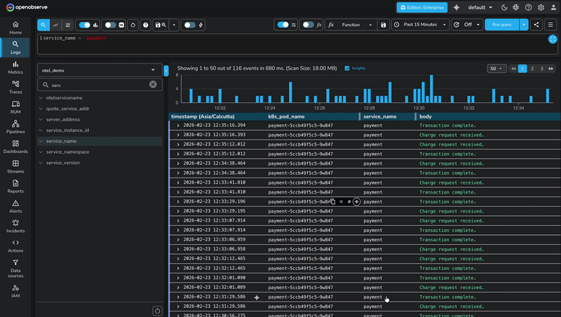
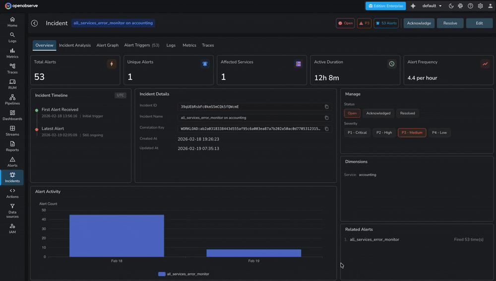

## Overview

The O2 SRE Agent is a background service that powers AI-driven features in OpenObserve Enterprise. It handles AI request processing, tool execution, and intelligence for observability workflows.


## Features Enabled by SRE Agent

### 1. AI Assistant
- Natural language querying of logs, metrics, and traces
- Automated SQL/PromQL/VRL query generation
- Resource creation (dashboards, alerts) via chat
- Multi-data source correlation and troubleshooting
- Script generation (Python/VRL)
- Query validation before execution

### 2. Incident Management & RCA
- Automated incident detection and grouping
- AI-powered Root Cause Analysis
- Alert correlation and event tracking
- Incident lifecycle management

## Prerequisites

1. **OpenObserve Enterprise License** (v0.60.0+)
2. **AI Provider API Key** 

## Configuration Methods

### Method 1: Helm Chart Deployment (Recommended)

If you're deploying OpenObserve using the official Helm charts, the SRE Agent is already included. You just need to enable and configure it.

**Official Helm Charts:**
- [Multi-node (HA)](https://github.com/openobserve/openobserve-helm-chart/tree/main/charts/openobserve)

- [Standalone](https://github.com/openobserve/openobserve-helm-chart/tree/main/charts/openobserve-standalone)

#### Step 1: Add Helm Repository

```bash
helm repo add openobserve https://charts.openobserve.ai
helm repo update
```

#### Step 2: Update Values File

Update your `values.yaml` with the following configuration:

**Minimal Configuration (Direct API - No Gateway):**

```yaml
enterprise:
  enabled: true

  # IMPORTANT: Must be set to true if O2_AI_ENABLED is "true"
  sreagent:
    enabled: true
    config:
      O2_SRE_HOST: "0.0.0.0"
      O2_SRE_PORT: "8000"
      O2_SRE_LOG_LEVEL: "INFO"
      ADK_ENABLE_JSON_SCHEMA_FOR_FUNC_DECL: "true"
      O2_AI_GATEWAY_ENABLED: "false"
      O2_AI_PROVIDER: "anthropic"  # Options: anthropic, openai, gemini
      O2_AI_MODEL: "claude-3-5-sonnet-20241022"
      O2_AI_GATEWAY_URL: ""  # Leave empty when not using gateway
      O2_AGENT_URL: ""  # Leave empty - auto-generated
      O2_TOOL_API_URL: ""  # Leave empty - auto-generated
      # MCP validation settings
      O2_MCP_VALIDATION_ENABLED: "true"
      O2_MCP_VALIDATION_RETRY: "true"
      O2_MCP_CONTENT_VALIDATION_ENABLED: "true"
      O2_MCP_CONTENT_VALIDATION_MODE: "hybrid"
      O2_MCP_RESPONSE_VALIDATION_ENABLED: "true"

  # IMPORTANT: Requires sreagent.enabled to be true
  parameters:
    O2_AI_ENABLED: "true"
    O2_AGENT_URL: ""  # Leave empty - auto-generated
    O2_TOOL_API_URL: ""  # Leave empty - auto-generated

# AI API Key (REQUIRED)
auth:
  O2_AI_API_KEY: "your-api-key-here"
```

**Configuration with AI Gateway:**

```yaml
# Enable AI Gateway
aiGateway:
  enabled: true
  gatewayServiceName: "ai-gateway"
  port: 80

enterprise:
  enabled: true

  sreagent:
    enabled: true
    config:
      O2_SRE_HOST: "0.0.0.0"
      O2_SRE_PORT: "8000"
      O2_SRE_LOG_LEVEL: "INFO"
      ADK_ENABLE_JSON_SCHEMA_FOR_FUNC_DECL: "true"
      O2_AI_GATEWAY_ENABLED: "true"  # Auto-set when aiGateway.enabled: true
      O2_AI_PROVIDER: "anthropic"  # Can be omitted when using gateway
      O2_AI_MODEL: "claude-3-5-sonnet-20241022"
      O2_AI_GATEWAY_URL: ""  # Auto-configured when aiGateway.enabled: true
      O2_AGENT_URL: ""
      O2_TOOL_API_URL: ""
      O2_MCP_VALIDATION_ENABLED: "true"
      O2_MCP_VALIDATION_RETRY: "true"
      O2_MCP_CONTENT_VALIDATION_ENABLED: "true"
      O2_MCP_CONTENT_VALIDATION_MODE: "hybrid"
      O2_MCP_RESPONSE_VALIDATION_ENABLED: "true"

  parameters:
    O2_AI_ENABLED: "true"
    O2_AGENT_URL: ""
    O2_TOOL_API_URL: ""

auth:
  O2_AI_API_KEY: "your-api-key-here"
```

**With Incidents & RCA:**

```yaml
enterprise:
  enabled: true

  sreagent:
    enabled: true
    config:
      O2_SRE_HOST: "0.0.0.0"
      O2_SRE_PORT: "8000"
      O2_SRE_LOG_LEVEL: "INFO"
      ADK_ENABLE_JSON_SCHEMA_FOR_FUNC_DECL: "true"
      O2_AI_GATEWAY_ENABLED: "false"
      O2_AI_PROVIDER: "anthropic"
      O2_AI_MODEL: "claude-3-5-sonnet-20241022"
      O2_AI_GATEWAY_URL: ""
      O2_AGENT_URL: ""
      O2_TOOL_API_URL: ""
      O2_MCP_VALIDATION_ENABLED: "true"
      O2_MCP_VALIDATION_RETRY: "true"
      O2_MCP_CONTENT_VALIDATION_ENABLED: "true"
      O2_MCP_CONTENT_VALIDATION_MODE: "hybrid"
      O2_MCP_RESPONSE_VALIDATION_ENABLED: "true"

  parameters:
    # AI Features
    O2_AI_ENABLED: "true"
    O2_AGENT_URL: ""
    O2_TOOL_API_URL: ""

    # Incidents and RCA
    O2_INCIDENTS_ENABLED: "true"
    O2_INCIDENTS_RCA_ENABLED: "true"
    O2_INCIDENTS_AUTO_RESOLVE_AFTER_MINUTES: "-1"
    O2_INCIDENTS_ALERT_GRAPH_ENABLED: "true"

auth:
  O2_AI_API_KEY: "your-api-key-here"
  # Optional: MCP Authentication
  O2_MCP_USERNAME: "root@example.com"
  O2_MCP_PASSWORD: "SecurePassword123"
```

#### Step 3: Deploy

**Multi-node deployment:**
```bash
helm upgrade --install openobserve openobserve/openobserve \
  -f values.yaml \
  --namespace openobserve \
  --create-namespace
```

**Standalone deployment:**
```bash
helm upgrade --install openobserve openobserve/openobserve-standalone \
  -f values.yaml \
  --namespace openobserve \
  --create-namespace
```

#### Step 4: Verify Deployment

```bash
# Check SRE Agent pod
kubectl get pods -n openobserve | grep sreagent

# View logs
kubectl logs -n openobserve deployment/openobserve-sreagent --tail=50

# Check health
kubectl exec -n openobserve deployment/openobserve-router -- \
  curl -s http://openobserve-sreagent:8000/health
```

### Method 2: Manual Deployment

For deployments not using the official Helm charts. Requires deploying two components separately.

**Docker Image:** `public.ecr.aws/zinclabs/o2-sre-agent:latest`

#### Step 1: Create Kubernetes Secret

```yaml
apiVersion: v1
kind: Secret
metadata:
  name: o2-sre-agent-secrets
  namespace: openobserve
type: Opaque
stringData:
  ai-api-key: "your-api-key-here"
  # Optional
  mcp-username: "root@example.com"
  mcp-password: "SecurePassword123"
```

```bash
kubectl apply -f secret.yaml
```

#### Step 2: Deploy SRE Agent

```yaml
apiVersion: apps/v1
kind: Deployment
metadata:
  name: o2-sre-agent
  namespace: openobserve
spec:
  replicas: 2
  selector:
    matchLabels:
      app: o2-sre-agent
  template:
    metadata:
      labels:
        app: o2-sre-agent
    spec:
      containers:
      - name: o2-sre-agent
        image: public.ecr.aws/zinclabs/o2-sre-agent:latest
        ports:
        - containerPort: 8000
          name: http

        env:
        # Server Configuration
        - name: O2_SRE_HOST
          value: "0.0.0.0"
        - name: O2_SRE_PORT
          value: "8000"
        - name: O2_SRE_LOG_LEVEL
          value: "INFO"

        # AI Provider Configuration
        - name: O2_AI_PROVIDER
          value: "anthropic"
        - name: O2_AI_MODEL
          value: "claude-sonnet-4-5-20250929"
        - name: O2_AI_API_KEY
          valueFrom:
            secretKeyRef:
              name: o2-sre-agent-secrets
              key: ai-api-key

        # MCP Tool Server URL (points to OpenObserve)
        - name: O2_TOOL_API_URL
          value: "http://openobserve-router.openobserve.svc.cluster.local:5080/api/default/mcp"

        # MCP Validation
        - name: O2_MCP_VALIDATION_ENABLED
          value: "true"
        - name: O2_MCP_CONTENT_VALIDATION_ENABLED
          value: "true"

        # Optional: MCP Authentication
        - name: O2_MCP_USERNAME
          valueFrom:
            secretKeyRef:
              name: o2-sre-agent-secrets
              key: mcp-username
              optional: true
        - name: O2_MCP_PASSWORD
          valueFrom:
            secretKeyRef:
              name: o2-sre-agent-secrets
              key: mcp-password
              optional: true

        resources:
          requests:
            memory: "256Mi"
            cpu: "250m"
          limits:
            memory: "512Mi"
            cpu: "500m"

---
apiVersion: v1
kind: Service
metadata:
  name: o2-sre-agent
  namespace: openobserve
spec:
  type: ClusterIP
  ports:
  - port: 8000
    targetPort: http
    name: http
  selector:
    app: o2-sre-agent
```

```bash
kubectl apply -f deployment.yaml
```

#### Step 3: Configure OpenObserve

Update your OpenObserve deployment configuration:

```yaml
# OpenObserve configuration
enterprise:
  enabled: true
  parameters:
    # AI Features
    O2_AI_ENABLED: "true"
    O2_AGENT_URL: "http://o2-sre-agent.openobserve.svc.cluster.local:8000"
    O2_TOOL_API_URL: "http://openobserve-router.openobserve.svc.cluster.local:5080/api/default/mcp"

    # Optional: Incident Management
    O2_INCIDENTS_ENABLED: "true"
    O2_INCIDENTS_RCA_ENABLED: "true"
    O2_INCIDENTS_ALERT_GRAPH_ENABLED: "true"
```

Restart OpenObserve services to apply changes.

## Environment Variables Reference

For detailed information about all available environment variables and their configurations, refer to the official documentation:

- [SRE Agent Configuration](https://openobserve.ai/docs/environment-variables/#sre-agent-configuration)
- [AI Integration](https://openobserve.ai/docs/environment-variables/#ai-integration)
- [Incidents and RCA](https://openobserve.ai/docs/environment-variables/#incidents-and-rca)

## AI Provider Selection

| Provider | Model | Use Case |
|----------|-------|----------|
| **Anthropic** | `claude-3-5-sonnet-20241022` | Best reasoning, complex analysis (Recommended) |
| **OpenAI** | `gpt-4-turbo`, `gpt-4o` | Wide compatibility, strong performance |
| **Google Gemini** | `gemini-1.5-pro` | Cost-effective option |

**Configuration:**
```yaml
O2_AI_PROVIDER: "anthropic"  # or "openai", "gemini"
O2_AI_MODEL: "claude-3-5-sonnet-20241022"
O2_AI_API_KEY: "your-api-key"
```

## AI Gateway Configuration

An AI Gateway provides rate limiting, response caching, load balancing, and usage tracking. Use it for production deployments, high query volumes (>100/day), or cost-sensitive environments. Development/testing can skip the gateway for simplicity.

### Configuration Flows

**Flow 1: OpenObserve Built-in Gateway (Recommended)**

Uses the [O2 Envoy Gateway](https://github.com/openobserve/o2-envoy-gateway) for AI request management.

```yaml
aiGateway:
  enabled: true
  gatewayServiceName: "ai-gateway"
  port: 80

enterprise:
  sreagent:
    enabled: true
    # O2_AI_PROVIDER not needed
    # Gateway settings auto-configured
```

**Flow 2: External/Self-hosted Gateway**

```yaml
enterprise:
  sreagent:
    enabled: true
    config:
      O2_AI_GATEWAY_ENABLED: "true"
      O2_AI_GATEWAY_URL: "http://my-gateway.custom.svc.cluster.local:80"
      # O2_AI_PROVIDER not needed
```

**Flow 3: Direct API (No Gateway)**

```yaml
enterprise:
  sreagent:
    enabled: true
    config:
      O2_AI_PROVIDER: "anthropic"
      O2_AI_MODEL: "claude-sonnet-4-5-20250929"
      # No gateway configuration
```

## MCP Validation & Security

Model Context Protocol (MCP) handles communication between the SRE Agent and OpenObserve. Validation ensures secure and reliable AI tool execution.

**Recommended for Production:**
- Enable all validation settings (`O2_MCP_VALIDATION_ENABLED: "true"`)

- Use `hybrid` validation mode for 
balanced security and flexibility

- Configure MCP authentication for multi-tenant environments

**Development:** Can disable validation (`O2_MCP_VALIDATION_ENABLED: "false"`) for faster iteration.

**MCP Authentication** (optional):
```yaml
O2_MCP_USERNAME: "root@example.com"
O2_MCP_PASSWORD: "SecurePassword123"
```

## Using the AI Assistant

### Access

1. Log into OpenObserve
2. Click the AI Assistant icon in the sidebar



3. Navigate to Incidents page in OpenObserve side-menu



### Example Queries

**Log Analysis:**
```
Show me all error logs from the payment service in the last hour
Find authentication failures grouped by IP address
```

**Metrics:**
```
What's causing high CPU usage on the API pods?
Show me latency trends for the checkout endpoint
```

**Resource Creation:**
```
Create a dashboard for monitoring the payment service
Set up an alert for when error rate exceeds 5%
```

**Troubleshooting:**
```
Analyze the root cause of the recent outage
Why is the database connection pool exhausted?
```

## Troubleshooting

### 1. SRE Agent Pod Not Starting

**Check pod status:**
```bash
kubectl get pods -n openobserve | grep sreagent
kubectl logs -n openobserve deployment/openobserve-sreagent --tail=100
```

**Common causes:**
- Invalid API key
- Incorrect AI provider name
- Network connectivity issues

**Verify configuration:**
```bash
# Check API key exists
kubectl get secret -n openobserve openobserve-auth -o jsonpath='{.data.O2_AI_API_KEY}' | base64 -d

# Check environment variables
kubectl exec -n openobserve deployment/openobserve-sreagent -- env | grep O2_
```

### 2. AI Assistant Not Responding

**Check connectivity:**
```bash
# Health check
kubectl exec -n openobserve deployment/openobserve-router -- \
  curl -s http://openobserve-sreagent:8000/health

# Check logs
kubectl logs -n openobserve deployment/openobserve-sreagent --tail=50
```

**Common causes:**
- `O2_AI_ENABLED` not set to `"true"`
- Network policy blocking communication
- AI provider API rate limiting
- Service misconfiguration

### 3. MCP Tool Execution Failures

**Verify MCP endpoint:**
```bash
# Check O2_TOOL_API_URL
kubectl exec -n openobserve deployment/openobserve-sreagent -- env | grep O2_TOOL_API_URL

# Test connectivity
kubectl exec -n openobserve deployment/openobserve-sreagent -- \
  curl -s http://openobserve-router:5080/api/default/mcp
```

**Common causes:**
- Incorrect `O2_TOOL_API_URL` format
- Wrong organization name in URL
- Missing MCP credentials
- Service not reachable

**Correct URL format:**
```
http://<service-name>.<namespace>.svc.cluster.local:<port>/api/<org-name>/mcp
```

### 4. AI Gateway Issues

**Check gateway:**
```bash
# Verify gateway service
kubectl get svc -n <gateway-namespace> | grep ai-gateway

# Test connectivity
kubectl exec -n openobserve deployment/openobserve-sreagent -- \
  curl -s http://ai-gateway:80
```

**Common causes:**
- Gateway not deployed
- Conflicting configuration (both `O2_AI_PROVIDER` and `O2_AI_GATEWAY_ENABLED` set)
- Wrong gateway URL or port

**Fix:**
- With gateway: Remove `O2_AI_PROVIDER`, set `O2_AI_GATEWAY_ENABLED="true"`
- Without gateway: Remove all `O2_AI_GATEWAY_*` variables, set `O2_AI_PROVIDER`

### 5. Incident Management Not Working

**Check configuration:**
```bash
kubectl get configmap -n openobserve openobserve-config -o yaml | grep O2_INCIDENTS
```

**Required settings (in OpenObserve, not SRE Agent):**
```yaml
O2_AI_ENABLED: "true"
O2_INCIDENTS_ENABLED: "true"
O2_INCIDENTS_RCA_ENABLED: "true"
```

## Best Practices

- **API Key Security**: Store in Kubernetes Secrets; use secret managers (Vault, AWS Secrets Manager) for production; rotate every 90 days
- **MCP Validation**: Enable in production (`O2_MCP_VALIDATION_ENABLED: "true"`); use MCP authentication for multi-tenant setups
- **Network Security**: Apply network policies to restrict traffic; enable TLS for service communication
- **High Availability**: Deploy with 2+ replicas; enable HPA for auto-scaling in production
- **Logging**: Use `INFO` level for production, `DEBUG` only when troubleshooting
- **Cost Optimization**: Use AI Gateway with caching to reduce API calls; choose cost-effective models for simple queries
- **Updates**: Keep SRE Agent image updated; test in non-production environments first

## Support


- [Community Slack](https://short.openobserve.ai/community) 

- [GitHub](https://github.com/openobserve/openobserve)


**Before contacting support, verify:**
- SRE Agent pod is running and healthy

- AI API key is valid with available quota

- `O2_AI_ENABLED="true"` in OpenObserve config

- Services can communicate (SRE Agent ↔ OpenObserve)

- No conflicting AI Gateway configuration

**Support diagnostics:**
```bash
# Check pod and logs
kubectl get pods -n openobserve | grep sreagent
kubectl logs -n openobserve deployment/openobserve-sreagent --tail=100

# Verify configuration (redact sensitive data)
kubectl get configmap -n openobserve openobserve-config -o yaml | grep O2_
```

---
