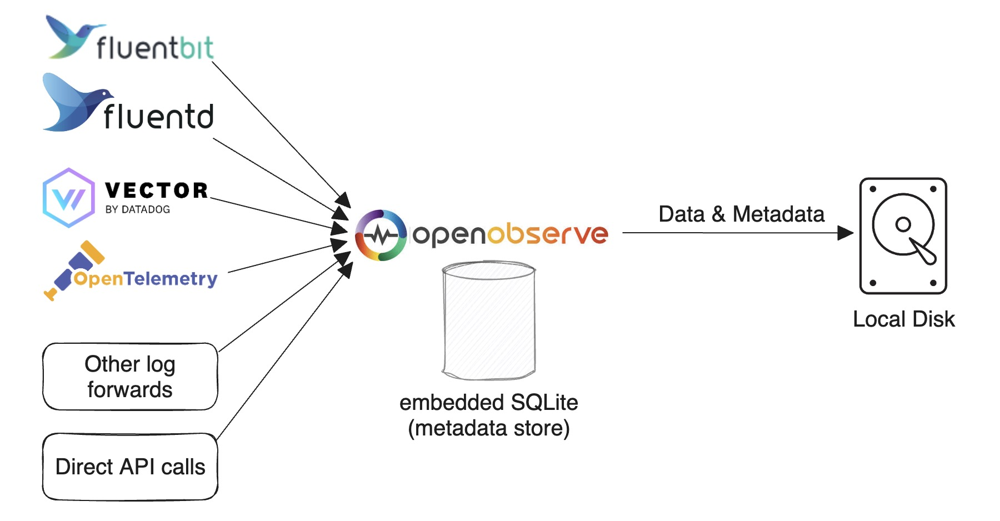
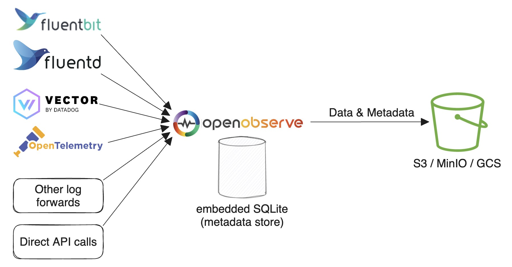
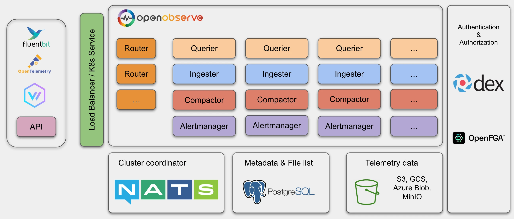
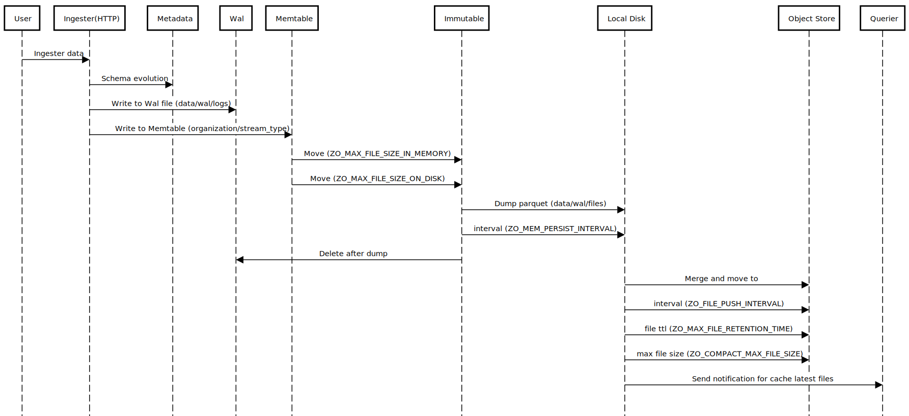
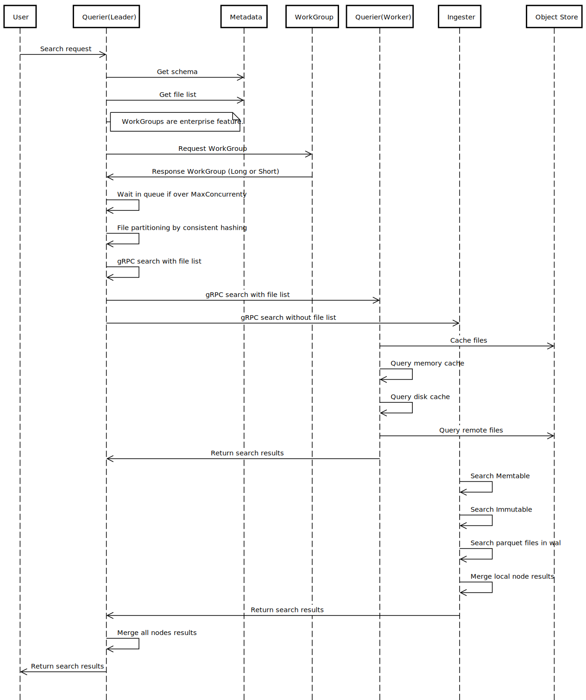

# OpenObserve Architecture and Deployment Modes

OpenObserve is an observability platform with a distributed architecture composed of five node types — Router, Ingester, Compactor, Querier, and AlertManager — that runs in either single-node mode (SQLite with local disk or object storage) or high-availability mode (NATS, PostgreSQL, and object storage).

This page explains how OpenObserve is structured: the deployment modes you can run it in, what each component does, how data flows from ingest to query, and how the system keeps your data durable. It is useful if you are sizing a deployment, troubleshooting a cluster, or evaluating OpenObserve against other observability backends.

## Single-Node Mode

Please refer to the [Quickstart](./getting-started.md) for single-node deployments.

### SQLite and Local Disk

Single-node mode with SQLite and local disk is the default way to run OpenObserve. Use it for light usage and testing or if you don't require HA. You can still ingest and search over 2 TB on a single machine per day. 

Based on our tests (using an Apple M2 chip), you can ingest data at approximately 31 MB per second with the default configuration. This is equivalent to 1.8 GB per minute or 2.6 TB per day. 

The [Quickstart](./getting-started.md) describes various ways to set up this configuration.

{ width="60%" }

### SQLite and Object Storage

Single-node mode with SQLite and object storage runs OpenObserve on one node but stores parquet files in durable object storage (for example, Amazon S3, GCS, MinIO, or Azure Blob) instead of local disk. Use it when you want the simplicity of a single node but need the durability and elasticity of object storage — for example, so data survives the loss of the node's local volume, or to keep local disk small. Compared with the local-disk variant, it trades slightly higher read latency and a storage dependency for much higher durability and effectively unbounded capacity. Configure the object-storage backend with the `ZO_LOCAL_MODE_STORAGE` and related S3/GCS environment variables; see [Environment variables](administration/configuration/environment-variables.md) for the full list.

{ width="60%" }

## High Availability (HA) Mode

HA mode does not support local disk storage. Please refer to [HA Deployment](administration/deployment/ha-deployment.md) for cluster-mode deployment.

**Requirements.** Running OpenObserve in HA mode requires:

- Kubernetes (with Helm) to orchestrate the nodes
- Object storage (Amazon S3, GCS, MinIO, or Azure Blob) for parquet files
- PostgreSQL for metadata
- NATS for cluster coordination
- At least one node of each type (Router, Ingester, Compactor, Querier, AlertManager)

{ width="80%" }

In OpenObserve HA mode, the following node types can be scaled horizontally to accommodate higher traffic:

- Router
- Querier
- Ingester
- Compactor
- AlertManager

HA mode uses NATS as a cluster coordinator as well as for cluster events and storing the nodes' information.

It uses PostgreSQL to store metadata, such as the organization, users, functions, alert rules, stream schema and file list (an index of parquet files).

Object storage (for example, Amazon S3, MinIO or GCS) stores all the parquet files data.

## Durability

**The short answer:** ingesters batch data briefly in memory and on local disk before flushing it to highly durable object storage. That window of single-copy data sounds risky, but modern infrastructure makes it safe in practice.

**Why a single in-flight copy is fine.** Most distributed systems were built in an era when storage was much less reliable than it is today, requiring users to make two or three copies of files to ensure they didn't lose data. Not only is storage more reliable today, you may face penalties for replicating data. In environments like AWS, replicating data across multiple Availability Zones (AZs) results in a cross-AZ data transfer penalty of 2 cents per GB (1 cent in each direction). Amazon EBS volumes are already replicated within an AZ, and object storage is more durable still. Typical storage durability:

- **Amazon EBS GP3:** 99.8%
- **Amazon EBS io2** (used by OpenObserve Cloud): 99.999%
- **Amazon S3:** 99.999999999% (11 nines)

At the EBS levels, additional in-app replication mostly adds cost and complexity without meaningfully reducing risk. Once data lands in S3, it is effectively permanent.

**What this means for you.** Building the system this way lets us offer a simpler and more cost-effective product, with no ongoing data replication to manage.

## Components

At a high level, data and requests move through these components:

Router → Ingester → Compactor → Querier → AlertManager.

| Component | Role | Stateful? | Scales horizontally? |
| --- | --- | --- | --- |
| Router | Proxies requests to ingesters or queriers and serves the GUI | No | Yes |
| Ingester | Receives ingest requests, converts data to parquet, and writes it to object storage | Yes (buffers in WAL, Memtable, and local parquet) | Yes |
| Compactor | Merges small files into big files, enforces retention, and updates file list indices | No | Yes |
| Querier | Executes search queries | No (fully stateless) | Yes |
| AlertManager | Runs alert queries and report jobs and sends notifications | No | Yes |

### Router

The Router node dispatches requests to an ingester or a querier. It also responds with the GUI in the browser. A router is a super simple proxy for sending appropriate requests between an ingester and a querier.

### Ingester

OpenObserve uses Ingester nodes to receive ingest requests, to convert data into Parquet format and to store it in object storage. Parquet is a columnar, compressed on-disk file format optimized for analytical queries. Ingesters store data temporarily in a WAL (write-ahead log — an append-only file on disk that lets in-flight data be recovered after a crash) before transferring it to object storage.

The data ingestion flow is as follows:

{ width="90%" }

1. Receive data from an HTTP or gRPC API request.
1. Parse data line by line.
1. Check whether there are any functions (ingest functions) used to transform data, then call each ingest function by the function order.
1. Check for a timestamp field and either convert the timestamp to microseconds or, if no timestamp field is present in the record, set it to the current timestamp.
1. Check the stream schema to identify whether the schema needs evolution. If the schema needs to be updated (to add new fields or change the data type of existing fields), acquire `lock` to update the schema.
1. Evaluate real time alerts, if any are defined for the stream.
1. Write to WAL file by timestamp in hourly buckets. Then, convert records in a request to Arrow RecordBatch and write into the Memtable (an in-memory, writable buffer of recently ingested records).

    1. Create one Memtable per `organization/stream_type`. If data is being ingested only for `logs`, there would be only one Memtable.
    1. The WAL file and Memtable are created in a pair. One WAL file has one Memtable. The WAL files are located at `data/wal/logs`.

1. As the Memtable size reaches `ZO_MAX_FILE_SIZE_IN_MEMORY=256` MB or the WAL file reaches `ZO_MAX_FILE_SIZE_ON_DISK=128` MB, move the Memtable to an Immutable (a read-only, sealed snapshot of a Memtable that is waiting to be flushed to disk) and create a new Memtable and WAL file for writing data.
1. Every `ZO_MEM_PERSIST_INTERVAL=5` seconds, dump Immutable to local disk. One Immutable will result in multiple parquet files, as it may contain multiple streams and multiple partitions. The parquet files are located at `data/wal/files`.
1. Every `ZO_FILE_PUSH_INTERVAL=10` seconds, check local parquet files. If any partition's total size is above `ZO_MAX_FILE_SIZE_ON_DISK=128` MB or any file has been retained for `ZO_MAX_FILE_RETENTION_TIME=600` seconds, merge all such small files in a partition into a big file (each big file will be maximum `ZO_COMPACT_MAX_FILE_SIZE=2048 MB (2 GB)`) and move that file to object storage.

**Ingesters store data in three parts:**

1. Data in Memtable
1. Data in Immutable
1. Parquet files in `wal` that haven't been uploaded to object storage

All of these need to be queried.

### Compactor

The Compactor node merges small files into big files to make searches more efficient. Compactors also enforce the data retention policy, carry out full stream deletions and update file list indices.

### Querier

OpenObserve uses Querier nodes to query data. Queriers are fully stateless.

The data query flow is as follows:

{ width="90%" }

1. Receive the search request using HTTP or API. The node receiving the query request becomes `LEADER querier for the query` and other queriers become `WORKER queriers for query`.
1. `LEADER` parses and verifies SQL.
1. `LEADER` finds the data time range and gets the file list from the file list index.
1. `LEADER` fetches querier nodes from cluster metadata.
1. `LEADER` partitions the list of files to be queried by each querier. For example, if 100 files need to be queried and there are five querier nodes, each querier gets to query 20 files: `LEADER` works on 20 files, and the four `WORKERS` work on 20 files each.
1. `LEADER` calls the gRPC service running on each `WORKER` querier to dispatch the search query to the Querier node. Inter-querier communication happens using gRPC.
1. `LEADER` collects, merges and sends the result back to the user.

!!! tip "Querier caching"
    - The queriers will cache parquet files in memory by default. Use the `ZO_MEMORY_CACHE_MAX_SIZE` environment variable to configure how much memory a querier uses for caching. By default, queriers use 50% of their available memory for caching.
    - In a distributed environment, each querier node will just cache a part of the data.
    - You also have the option to enable caching the latest parquet files in memory. The ingester will notify queriers to cache the file when an ingester generates a new parquet file and uploads it to object storage.

#### Federated Search

!!! info "Applies to"
    Enterprise version only.

The federated search spans over multiple OpenObserve clusters:

1. Receive the search request on one of the clusters. The node receiving the query request becomes `LEADER cluster for the query` and other clusters become `WORKER clusters for that query`.
2. `LEADER cluster` finds all the clusters using super cluster metadata.
3. `LEADER cluster` calls a gRPC service on each `WORKER cluster` with the same query payload as input.
4. `WORKER clusters` execute the query as described above. One of the nodes in each cluster becomes a `LEADER querier` and calls other `WORKER queriers` in the same cluster. The results from all workers and leaders are merged by `LEADER cluster`.
5. `LEADER cluster` collects, merges and sends the result back to the user.

### AlertManager

The AlertManager node runs the standard alert queries, reports jobs and sends notifications.

## Next steps

- [Quickstart](./getting-started.md): get a single-node instance running.
- [HA Deployment](administration/deployment/ha-deployment.md): deploy a production HA cluster.
- [Performance tuning](./enterprise-setup/performance.md): sizing, caching, and configuration for high-throughput deployments.

**Need some help?**

- Join our [Community Slack](https://short.openobserve.ai/community) 
- Or [Contact support](https://openobserve.ai/contactus/)
