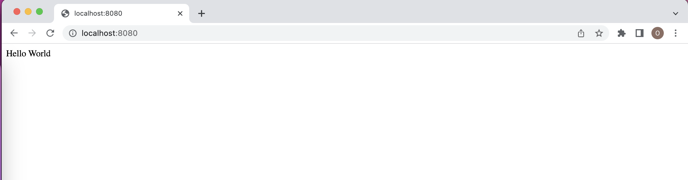
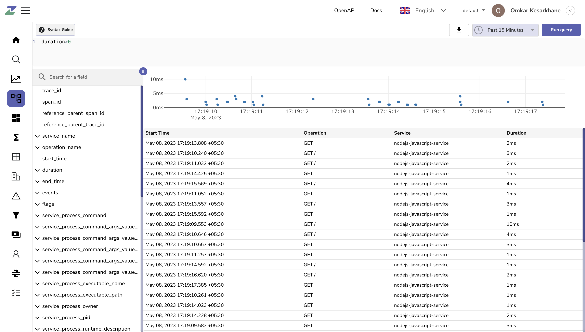
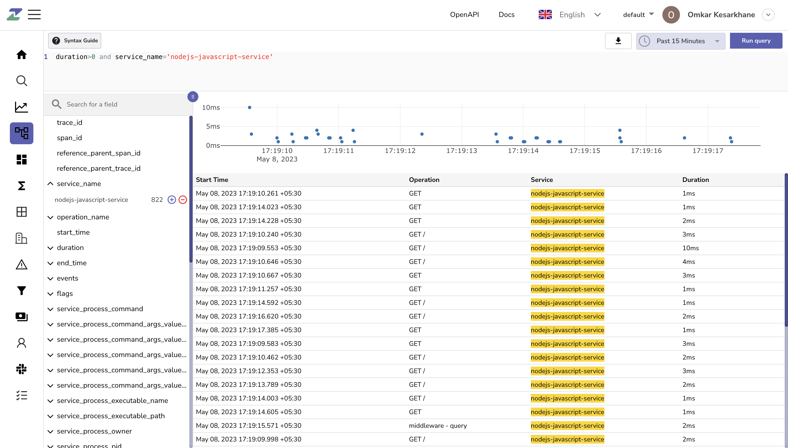

# Typescript

You can setup tracing for your Node.js application. Check sample configuration on how to setup traces.

##Clone </br>
```

git clone https://github.com/zinclabs/sample-tracing-nodejs-javascript

```

If you don't have node.js installed, please install it and then follow below steps.

Open `tracing.js` file from that repository.
```javascript linenums="1" hl_lines="17 19"

const opentelemetry = require("@opentelemetry/sdk-node");
const {
  getNodeAutoInstrumentations,
} = require("@opentelemetry/auto-instrumentations-node");
const { diag, DiagConsoleLogger, DiagLogLevel } = require("@opentelemetry/api");
const {
  OTLPTraceExporter,
} = require("@opentelemetry/exporter-trace-otlp-http");

// For troubleshooting, set the log level to DiagLogLevel.DEBUG
diag.setLogger(new DiagConsoleLogger(), DiagLogLevel.INFO);

const sdk = new opentelemetry.NodeSDK({
  // traceExporter: new opentelemetry.tracing.ConsoleSpanExporter(),
  traceExporter: new opentelemetry.tracing.ConsoleSpanExporter(),
  traceExporter: new OTLPTraceExporter({
    url: "https://api.zinc.dev/api/default/traces",
    headers: {
      Authorization: "Authorization",
    },
  }),
  instrumentations: [getNodeAutoInstrumentations()],
  serviceName: "nodejs-javascript-service",
});

sdk.start();
```
</br>
##Setup up credentials </br>

You will get `url` and `Authorization` key here [http://observe.zinc.dev/ingestion/traces/](http://observe.zinc.dev/ingestion/traces/)

Replace the `url` and `Authorization` key in the `tracing.js` file

##Setup Service/Application </br>
Run commands
```

npm install

```
```

node --require './tracing.js' app.js

```

The server is now running on 8080, navigate to [http://localhost:8080](http://localhost:8080) </br>
Refresh page couple of times to get more traces exported.


</br>
</br>

Traces are captured, you can check these captured traces here [https://observe.zinc.dev/traces](https://observe.zinc.dev/traces)
</br>


</br>
</br>

Filter traces with your service name `nodejs-javascript-service`
</br>


