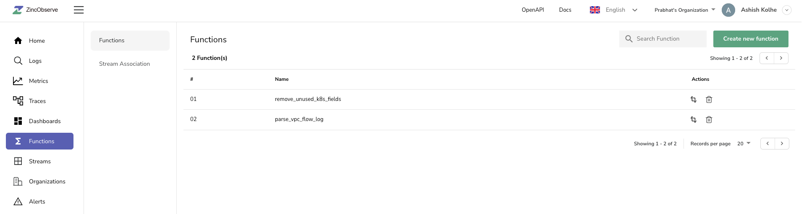
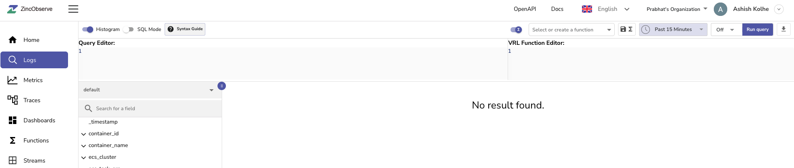

# Functions

## What are functions?

Functions in ZincObserve are defined using Vector Remap Language ([vrl](https://vector.dev/docs/reference/vrl/functions/)) & can used during ingestion or query to aid advanced capabilities like enrichment, redaction, log reduction, compliance, etc. 

There are also inbuilt query functions like match_all, match_all_ignore_case which can be used for full text search based on users settings for stream or default settings.Please refer [SQL functions reference](../../functions.md) for complete list of inbuilt functions.

To navigate to functions in ZincObserve , select preferred organization using organization selection control, then click on `Functions` menu , which will take one to  functions list screen. The screen lists all the functions for selected organization.  

<kbd>

</kbd>

List screen details :

- Search in listed functions
- Create new function
- Name of existing function
- Action - update & delete function

One can use function during query in two ways :

- Function with row as input
- Function with specified input columns/fields

To use functions during data ingestion please refer section :[Stream Association](./stream-association.md)

## Function with row as input

On logs search page , one can select existing function or write new function using vrl function editor to apply function on row , the results returned would be based on function being applied.

Please note functions on rows help one experience result of a function on rows of specific stream , however applying functions at query time is costly operation .Hence if applicable , after exploration & desired outcome of function during query time , we encourage users to apply such function at ingest time by [associating function with stream](./stream-association.md).

<kbd>

</kbd>

## Function with specified input columns/fields
These are like sql functions, which are defined by user & act on specified input columns/fields.

## Example
Let's try a function on logs page to parse vpc flow logs ,mentioned below is sample vpc flow log record in ZincObserve.

```json
{
  "_timestamp": 1683089619868496,
  "message": "2 058694856476 eni-03c0f5ba79a66ef17 10.3.166.71 10.3.35.163 443 53672 6 49 12973 1680838556 1680838578 ACCEPT OK"
}
```
Let's create a vrl function which retains the _timestamp field from original record & parses message field to multiple fields like account_id , action etc :

```ruby
ts = ._timestamp  # store value of _timestamp in ts
. = parse_aws_vpc_flow_log!(.message) # assign value of object resulting from parse_aws_vpc_flow_log to current record
._timestamp = ts #set value of _timestamp from ts
. # return record
```

The function results is record as below :
```json
{
  "_timestamp": 1683097426943815,
  "account_id": 58694856476,
  "action": "ACCEPT",
  "bytes": 12973,
  "dstaddr": "10.3.35.163",
  "dstport": 53672,
  "end": 1680838578,
  "interface_id": "eni-03c0f5ba79a66ef17",
  "log_status": "OK",
  "packets": 49,
  "protocol": 6,
  "srcaddr": "10.3.166.71",
  "srcport": 443,
  "start": 1680838556,
  "version": 2
}
```

The function can be saved using save button on top of vrl function editor,additional one can select existing function to try.

The same function can be associated with a stream to get applied at ingestion. 
