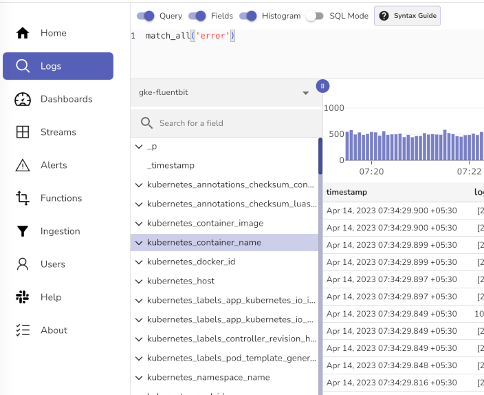

# Install OpenObserve Enterprise on Google Kubernetes Engine (GKE)

Install OpenObserve Enterprise on GKE using GCS for object storage and CloudNativePG for the metadata database.

> For support, reach out in the [Slack channel](/marketing-opt-in/){:target="_blank" rel="noopener noreferrer"}.

!!! info "Architecture overview"
    OpenObserve Enterprise Edition depends on these components:

    - **Object Storage** (Google Cloud Storage via the S3-compatible interoperability API): Holds all telemetry data in Parquet format.
    - **PostgreSQL** (CloudNativePG): Tracks metadata such as dashboards, stream configurations, users, and the filelist table.
    - **NATS**: Coordinates communication between ingestion and query nodes.
    - **OpenFGA** (enabled by default): Powers [Role-Based Access Control (RBAC)](../user-guide/account-administration/identity-and-access-management/role-based-access-control.md).
    - **Dex** (optional, disabled by default): Powers [Single Sign-On (SSO)](../user-guide/account-administration/identity-and-access-management/sso.md).

This page covers the **Google GKE** install. For other Kubernetes platforms, see [Amazon EKS](amazon-eks.md) or [Azure AKS](azure-aks.md).

**Time required:** 30-45 minutes on a fresh GCP project.

??? info "Prerequisites"

    Complete every item in this section before starting Step 1.

    ### Required CLI tools

    All commands in this guide assume these are on your `PATH`:

    | Tool | macOS | Linux | Verify |
    |---|---|---|---|
    | gcloud CLI | `brew install --cask google-cloud-sdk` | [install guide](https://cloud.google.com/sdk/docs/install) | `gcloud version` |
    | kubectl | `gcloud components install kubectl` | `gcloud components install kubectl` | `kubectl version --client` |
    | Helm v3 | `brew install helm` | [install guide](https://helm.sh/docs/intro/install/) | `helm version` |
    | gke-gcloud-auth-plugin | `gcloud components install gke-gcloud-auth-plugin` | `gcloud components install gke-gcloud-auth-plugin` | `gke-gcloud-auth-plugin --version` |

    ### GCP project and authentication

    Create a GCP project with billing enabled and these APIs enabled (Cloud Console → APIs and Services):

    - Kubernetes Engine API
    - Compute Engine API
    - Cloud Storage API

    Then authenticate and select the project:

    ```sh
    gcloud auth login
    gcloud config set project <PROJECT_ID>
    gcloud config set compute/region us-central1
    ```

    ### Compute Engine SSD quota

    Ensure you have a quota of at least **1000 GB** of `SSD_TOTAL_GB` in your target region. New projects start with 500 GB, which causes silent failures in this setup (two pods stay `Pending` after install with no obvious error).

    Check your current quota:

    ```sh
    gcloud compute regions describe us-central1 \
      --format="value(quotas)" | tr ';' '\n' | grep SSD_TOTAL_GB
    ```

    If the limit is below 1000, raise it: Cloud Console → IAM & Admin → Quotas & System Limits → filter `SSD_TOTAL_GB`, your region → **Edit Quotas** → request 2000 GB. Small or new accounts may not get auto-approval.

    ### Environment variables

    ```sh
    export CLUSTER_NAME=oo-cluster
    export REGION=us-central1
    export NAMESPACE=openobserve
    ```

??? "Step 1. Create the GKE cluster"

    Choose **Standard** mode (not Autopilot). On a regional cluster, `--num-nodes 1` provisions **1 node × 3 zones = 3 nodes total**. Takes 5-8 minutes.

    Three `e2-standard-4` nodes running 24/7 cost approximately $290/month in `us-central1` (on-demand, list price, May 2025). Disks and egress are extra. Run the [Teardown](#teardown) when finished.

    === "CLI (recommended)"

        ```sh
        gcloud container clusters create oo-cluster \
          --region us-central1 \
          --num-nodes 1 \
          --machine-type e2-standard-4 \
          --release-channel regular \
          --enable-ip-alias
        ```

    === "Google Cloud Console"

        1. Open **Kubernetes Engine → Clusters → Create**.
        2. Configure cluster:

            - **Mode:** Standard
            - **Name:** `oo-cluster`
            - **Location:** Region = `us-central1` (regional, NOT zonal)
            - **Default pool:** at least 3 nodes of `e2-standard-4`
            - **Release channel:** Regular
        3. Leave the rest at defaults → **Create**.

    ??? note "Verify"

        **Verification step**

        ```sh
        gcloud container clusters list --filter="name=oo-cluster"
        ```

        **Expected output**

        After 5-8 minutes:

        ```
        NAME        LOCATION     MASTER_VERSION   ...   STATUS
        oo-cluster  us-central1  1.x.x-gke.xxxx   ...   RUNNING
        ```

??? "Step 2. Connect kubectl to the cluster"

    Use `--region` for regional clusters and `--zone` for zonal. Mixing them up gives a confusing `404 Not found` even when the cluster exists.

    ### Command

    ```sh
    gcloud container clusters get-credentials oo-cluster --region us-central1
    ```

    ??? note "Verify"

        **Verification step**

        ```sh
        kubectl get nodes
        ```

        **Expected output**

        ```
        Fetching cluster endpoint and auth data.
        kubeconfig entry generated for oo-cluster.

        NAME                                       STATUS   ROLES    AGE   VERSION
        gke-oo-cluster-default-pool-xxxxxxxx-aaaa  Ready    <none>   6m    v1.x.x-gke.xxxx
        gke-oo-cluster-default-pool-yyyyyyyy-bbbb  Ready    <none>   6m    v1.x.x-gke.xxxx
        gke-oo-cluster-default-pool-zzzzzzzz-cccc  Ready    <none>   6m    v1.x.x-gke.xxxx
        ```

??? "Step 3. Create the GCS bucket and HMAC credentials"

    OpenObserve talks to GCS over the **S3-compatible interoperability API** using HMAC keys, not native GCP service-account JSON. Step 6 depends on this. Remember it.

    === "CLI (recommended)"

        **Create the bucket:**

        ```sh
        BUCKET=oo-$(date +%s)
        gcloud storage buckets create gs://$BUCKET --location=us-central1
        echo "Save this bucket name: $BUCKET"
        ```

        **Create HMAC keys via service account.** (CLI HMAC creation only works for service accounts. For user-account keys, use the Console.)

        ```sh
        PROJECT=$(gcloud config get-value project)

        gcloud iam service-accounts create openobserve-gcs \
          --display-name="OpenObserve GCS access"

        SA_EMAIL=openobserve-gcs@${PROJECT}.iam.gserviceaccount.com

        gcloud storage buckets add-iam-policy-binding gs://$BUCKET \
          --member="serviceAccount:$SA_EMAIL" \
          --role="roles/storage.objectAdmin"

        gcloud storage hmac create $SA_EMAIL
        ```

    === "Google Cloud Console"

        **Create the bucket:**

        1. Open Cloud Storage → **Buckets** → **Create**.
        2. **Name:** unique, e.g. `oo-<your-suffix>`.
        3. **Location type:** Region. **Region:** `us-central1` (match your cluster).
        4. Leave the rest at defaults → **Create**.

        **Generate HMAC interoperability keys:**

        1. Cloud Storage → **Settings** → **Interoperability** tab.
        2. Enable interoperability if not already enabled.
        3. **Create a new HMAC key** for either your user account or a dedicated service account (recommended: service account).
        4. Note the **Access key**, **Secret**, and the **Server URL**. You'll paste these into `values.yaml` in Step 6.

    !!! warning "Save your HMAC secret immediately"
        The HMAC `secret` is shown exactly once. Copy it into a password manager now. It cannot be retrieved later. The `accessId` is recoverable via `gcloud storage hmac list`; the secret is not.

    ??? note "Verify"

        **Verification step**

        ```sh
        gcloud storage buckets list --filter="name=$BUCKET"
        gcloud storage hmac list --service-account=$SA_EMAIL
        ```

        **Expected output**

        ```
        accessId: GOOGXXXXXXXXXXXXXXXXXXXX
        secret:   YYYYYYYYYYYYYYYYYYYYYYYYYYYYYYYYYYYYYYYY
        state:    ACTIVE
        ```

        - The S3-compatible server URL for GCS is always `https://storage.googleapis.com`.

??? "Step 4. Install the CloudNativePG operator"

    OpenObserve uses Postgres for metadata. The chart provisions it via CNPG, which must be installed cluster-wide first.

    ### Command

    ```sh
    kubectl apply --server-side -f \
      https://raw.githubusercontent.com/cloudnative-pg/cloudnative-pg/release-1.22/releases/cnpg-1.22.1.yaml
    ```

    ??? note "Verify"

        **Verification step**

        Wait ~30 seconds, then:

        ```sh
        kubectl get pods -n cnpg-system
        ```

        **Expected output**

        ```
        NAME                                       READY   STATUS    RESTARTS   AGE
        cnpg-controller-manager-xxxxxxxxxx-yyyyy   1/1     Running   0          30s
        ```

??? "Step 5. Add the Helm repo and fetch `values.yaml`"

    ### Command

    ```sh
    helm repo add openobserve https://charts.openobserve.ai
    helm repo update
    curl -O https://raw.githubusercontent.com/openobserve/openobserve-helm-chart/main/charts/openobserve/values.yaml
    ```

    ??? note "Verify"

        **Verification step**

        ```sh
        helm repo list | grep openobserve
        ls -lh values.yaml
        ```

        **Expected output**

        ```
        "openobserve" has been added to your repositories
        ...Successfully got an update from the "openobserve" chart repository
        Update Complete. ⎈Happy Helming!⎈
        ```

        - `openobserve` repo listed
        - `values.yaml` present in the current directory

??? "Step 6. Configure `values.yaml`"

    Open `values.yaml`. Line numbers below match chart version `1.7.x`; if yours differs, search by key name.

    ### 6a. Root user credentials (~line 178)

    ```yaml
    auth:
      ZO_ROOT_USER_EMAIL: "your-email@example.com"
      ZO_ROOT_USER_PASSWORD: "supercomplexpass12"     # change me
    ```

    ### 6b. GCS HMAC credentials (~lines 183-184)

    ```yaml
      ZO_S3_ACCESS_KEY: "GOOG...accessId from Step 3..."
      ZO_S3_SECRET_KEY: "secret from Step 3"
    ```

    ### 6c. GCS storage configuration (~lines 378-381)

    ```yaml
    config:
      ZO_S3_PROVIDER:    "s3"
      ZO_S3_SERVER_URL:  "https://storage.googleapis.com"
      ZO_S3_REGION_NAME: "auto"
      ZO_S3_BUCKET_NAME: "<your-bucket-name-from-step-3>"
    ```

    `ZO_S3_PROVIDER` must stay `"s3"` even though we're using GCS. See the troubleshooting entry below if you're tempted to change it.

    ### 6d. (Optional) Enable RBAC and SSO (~lines 870-882)

    ```yaml
    enterprise:
      openfga:
        enabled: true      # default. Leave on for RBAC
      dex:
        enabled: true      # default is false; set to true for SSO
    ```

    If you enable Dex, you'll later need to set `enterprise.dex.parameters.O2_CALLBACK_URL` to your real ingress hostname. For the initial port-forward test, root user login works regardless.

    ??? note "Verify"

        **Verification step**

        ```sh
        grep -E "ZO_ROOT_USER_EMAIL|ZO_S3_PROVIDER|ZO_S3_BUCKET_NAME|ZO_S3_SERVER_URL" values.yaml
        ```

        **Expected output**

        ```
          ZO_ROOT_USER_EMAIL: "your-email@example.com"
          ZO_S3_PROVIDER:    "s3"
          ZO_S3_SERVER_URL:  "https://storage.googleapis.com"
          ZO_S3_BUCKET_NAME: "<your-bucket-name>"
        ```

??? "Step 7. Install OpenObserve"

    ### Command

    ```sh
    kubectl create namespace openobserve

    helm install oo openobserve/openobserve \
      --namespace openobserve \
      -f values.yaml
    ```

    ??? note "Verify"

        **Verification step**

        Confirm the release deployed, then wait ~2 minutes for pods to come up:

        ```sh
        helm list -n openobserve
        kubectl get pods -n openobserve -w   # Ctrl+C once everything is Running
        ```

        **Expected output**

        `helm list` shows release `oo` with `STATUS: deployed`. After ~2 minutes, `kubectl get pods` should look like:

        ```
        NAME                                       READY   STATUS    RESTARTS   AGE
        oo-nats-0                                  2/2     Running   0          2m
        oo-nats-1                                  2/2     Running   0          2m
        oo-nats-2                                  2/2     Running   0          2m
        oo-nats-box-...                            1/1     Running   0          2m
        oo-openobserve-alertmanager-0              1/1     Running   0          2m
        oo-openobserve-compactor-...               1/1     Running   0          2m
        oo-openobserve-dex-...                     1/1     Running   0          2m
        oo-openobserve-ingester-0                  1/1     Running   0          2m
        oo-openobserve-openfga-...                 1/1     Running   0          2m
        oo-openobserve-postgres-1                  1/1     Running   0          2m
        oo-openobserve-postgres-2                  1/1     Running   0          1m
        oo-openobserve-querier-0                   1/1     Running   0          2m
        oo-openobserve-router-...                  1/1     Running   1          2m
        ```

        The router shows **1 restart**. Its readiness probe runs before its dependencies are ready. That's expected and resolves itself.

??? "Step 8. Open the OpenObserve UI"

    ### Command

    The router service is named `oo-openobserve-router` (release prefix + chart's router name).

    ```sh
    kubectl -n openobserve port-forward svc/oo-openobserve-router 5080:5080
    ```

    ??? note "Verify"

        **Verification step**

        ```sh
        kubectl get svc -n openobserve | grep router
        # In a second terminal:
        curl -sI http://localhost:5080 | head -1
        ```

        **Expected output**

        ```
        Forwarding from 127.0.0.1:5080 -> 5080
        Forwarding from [::1]:5080 -> 5080
        ```

        - `kubectl get svc` shows `oo-openobserve-router`
        - `curl` returns `HTTP/1.1 200 OK` (or `302 Found`)

        Open <http://localhost:5080> and log in with the email + password from Step 6a.

## Load Sample Data

??? "Step 1: Download Sample Data"

    ```bash
    # Download and extract sample Kubernetes logs
    curl -L https://zinc-public-data.s3.us-west-2.amazonaws.com/zinc-enl/sample-k8s-logs/k8slog_json.json.zip -o k8slog_json.json.zip
    unzip k8slog_json.json.zip
    ```

    **What's in the sample data**: This file contains real Kubernetes application logs with various log levels (info, warning, error) and structured JSON fields.

??? "Step 2: Load Data into OpenObserve"

    **For OpenObserve Cloud**:
    ```bash
    # Use the cURL command from your Ingestion page
    curl -u your-email@domain.com:your-password \
    -H "Content-Type: application/json" \
    https://api.openobserve.ai/api/YOUR_ORG/default/_json \
    -d "@k8slog_json.json"
    ```

    **For Self-Hosted Installation**:
    ```bash
    # Replace credentials with the values you set in Step 6a.
    curl -u "your-email@example.com:supercomplexpass12" \
    -H "Content-Type: application/json" \
    http://localhost:5080/api/default/default/_json \
    -d "@k8slog_json.json"
    ```

??? "Step 3: Verify Data Upload"

    You should see output similar to:
    ```json
    {"code":200,"status":[{"name":"default","successful":1000,"failed":0}]}
    ```

    If you see errors, check:

    - Your credentials are correct
    - The JSON file was downloaded completely
    - OpenObserve is running and accessible

## Search Your Data

??? "Step 1: Access the Logs Interface"

    1. Navigate to your OpenObserve instance
    2. Click on **Logs** in the left sidebar
    3. Select **default** from the stream dropdown (top-left)

    

??? "Step 2: Try These Sample Searches"

    **Basic searches** (click the **Run Query** button after each):

    1. **View all logs**: Leave search box empty and click search
    2. **Find errors**: `level='error'` or `match_all('error')`

## Next Steps - Send Your Own Data

- **Application logs**: Use our [logging libraries](../ingestion/logs/otlp.md) for your applications
- **Metrics**: Set up [Prometheus integration](../ingestion/metrics/prometheus.md)
- **Traces**: Configure [OpenTelemetry](../ingestion/traces/opentelemetry.md) for distributed tracing

??? "Teardown"

    Run these commands in order. **Order matters**. Skipping `helm uninstall` before deleting the cluster leaves orphaned persistent disks that quietly accumulate cost.

    ```bash
    # 1. Release Kubernetes resources (frees PVCs → releases GCE persistent disks)
    helm uninstall oo -n $NAMESPACE
    kubectl delete pvc -n $NAMESPACE --all
    kubectl delete namespace $NAMESPACE

    # 2. Delete the GKE cluster (~5 min)
    gcloud container clusters delete $CLUSTER_NAME --region $REGION --quiet

    # 3. Empty and delete the GCS bucket
    gcloud storage rm --recursive gs://$BUCKET
    gcloud storage buckets delete gs://$BUCKET

    # 4. Delete the HMAC key and service account used for GCS access
    ACCESS_ID=$(gcloud storage hmac list --service-account=$SA_EMAIL --format='value(accessId)')
    gcloud storage hmac update --deactivate $ACCESS_ID
    gcloud storage hmac delete $ACCESS_ID
    gcloud iam service-accounts delete $SA_EMAIL --quiet

    # 5. Confirm no leftover compute resources
    gcloud container clusters list --filter="name=$CLUSTER_NAME"        # cluster gone
    gcloud compute disks list --filter="zone~$REGION"

    # If any pvc-* disks remain:
    gcloud compute disks list --filter="name~^pvc-" --format="value(name,zone)" | \
      while read name zone; do
        gcloud compute disks delete "$name" --zone="${zone##*/}" --quiet
      done
    ```

    `pvc-*` orphans appear when `helm uninstall` or `kubectl delete pvc` failed earlier. Typically because kubectl was pointing at the wrong cluster. The block above sweeps them up.

??? note "Troubleshooting reference"

    Issues are grouped by theme. Each entry notes the step where it tends to surface.

    **Tooling and prerequisites**

    - **`gcloud: command not found`.** Google Cloud SDK not installed. See the [Required CLI tools](#required-cli-tools) table in Prerequisites.

    - **`gcloud: command not found` after Homebrew install.** Homebrew drops gcloud into its share directory but doesn't add it to `PATH`. **Fix:** add to `~/.zshrc` or `~/.bashrc`, then reload the shell:

        ```sh
        source "$(brew --prefix)/share/google-cloud-sdk/path.zsh.inc"
        source "$(brew --prefix)/share/google-cloud-sdk/completion.zsh.inc"
        ```

    - **`kubectl get nodes` fails with `executable gke-gcloud-auth-plugin not found`** (Step 2). Plugin missing or not on `PATH`. **Fix:** `gcloud components install gke-gcloud-auth-plugin`. On Homebrew installs the binary may not be on `PATH`; symlink it:

        ```sh
        ln -s /opt/homebrew/share/google-cloud-sdk/bin/gke-gcloud-auth-plugin \
              /opt/homebrew/bin/gke-gcloud-auth-plugin
        ```

    - **`wget: command not found` on macOS** (Step 5). `wget` is not preinstalled. **Fix:** use `curl -O <url>` instead, or `brew install wget`.

    **Cluster creation**

    - **Cluster was created in Autopilot mode** (Step 1). Symptoms include `kubectl get nodes` returning `No resources found`, and `gcloud container node-pools list` rejecting commands with `Autopilot node pools cannot be accessed or modified`. Autopilot blocks several things this stack needs (node pool control, certain volumes, privileged init containers). **Fix:**

        ```sh
        gcloud container clusters delete oo-cluster --region us-central1
        ```

        Then recreate as **Standard** per Step 1.

    - **`gcloud container clusters get-credentials` returns `404 Not found`** (Step 2). Used `--zone` on a regional cluster, or vice versa. **Fix:** match the flag to your cluster type. `--region us-central1` for regional, `--zone us-central1-c` for zonal.

    - **Cluster stuck in `PROVISIONING` for more than 15 minutes** (Step 1). Quota or region capacity issue. **Fix:** `gcloud compute project-info describe --project=<id>` to spot quota errors.

    **Storage and credentials**

    - **`gcloud storage hmac create` fails with `Service Account '<user>@gmail.com' not found`** (Step 3). CLI HMAC creation only works for service accounts. **Fix:** use the service-account flow in Step 3, or create the key in the Console (Cloud Storage → Settings → Interoperability).

    - **`403 Permission denied` creating bucket** (Step 3). Missing `roles/storage.admin` on your user. **Fix:** grant via IAM, or use a different account.

    - **Ingester or compactor pods crash with `Unable to open service account file from GOOG...`** (Steps 6 and 8). `ZO_S3_PROVIDER` is set to `"gcs"`, which makes OpenObserve treat `ZO_S3_ACCESS_KEY` as a filesystem path to a GCP service-account JSON file. With HMAC keys the correct mode is `"s3"`. GCS speaks the S3 protocol on its interoperability endpoint. **Fix:** set `ZO_S3_PROVIDER: "s3"`, then:

        ```sh
        helm upgrade oo openobserve/openobserve -n openobserve -f values.yaml
        ```

    **Postgres and CNPG**

    - **`ImagePullBackOff` on the CNPG operator pod** (Step 4). Network or registry issue. **Fix:** `kubectl describe pod -n cnpg-system <pod>` for details; retry or check egress.

    - **CNPG operator in `CrashLoopBackOff`** (Step 4). CRD conflict from an earlier install. **Fix:**

        ```sh
        kubectl delete -f https://raw.githubusercontent.com/cloudnative-pg/cloudnative-pg/release-1.22/releases/cnpg-1.22.1.yaml
        ```

        Then reapply.

    **Quota and PVCs**

    - **Querier and alertmanager pods `Pending`, PVCs stuck `Pending`, events show `QUOTA_EXCEEDED ... SSD_TOTAL_GB`** (Step 7). Your `SSD_TOTAL_GB` quota is exceeded by node boot disks plus the default 100 GiB cache PVCs.

        **Fix:** Pick one path.

        **Path A. Raise the quota.** See Prerequisites → Compute Engine SSD quota. If pods are already up, reinstall after the increase:

        ```sh
        helm uninstall oo -n openobserve
        kubectl delete pvc -n openobserve --all
        helm install oo openobserve/openobserve -n openobserve -f values.yaml
        ```

        **Path B. Stay on 500 GB and shrink cache PVCs.** PVC sizes are immutable, so this requires a clean reinstall.

        In `values.yaml`, change four `size: 100Gi` entries to `size: 20Gi`:

        ```yaml
        alertmanager:
          persistence:
            size: 20Gi

        ingester:
          persistence:
            size: 20Gi

        querier:
          persistence:
            size: 20Gi

        alertquerier:
          persistence:
            size: 20Gi
        ```

        20 GiB caches are fine for evaluation. Restore to ≥100 GiB before production traffic. Then:

        ```sh
        helm uninstall oo -n openobserve
        kubectl delete pvc -n openobserve --all
        helm install oo openobserve/openobserve -n openobserve -f values.yaml
        ```

    **Helm and `values.yaml`**

    - **`helm repo add` reports the repo already exists** (Step 5). **Fix:** run `helm repo update` and continue.

    - **Line numbers in Step 6 don't match your `values.yaml`** (Step 6). Chart version drift. **Fix:** search by key name, e.g. `grep -n ZO_S3_PROVIDER values.yaml`.

    - **`Error: namespaces "openobserve" already exists`** (Step 7). Re-running after a failed attempt. **Fix:** continue with `helm install`. An existing namespace is fine.

    - **`Error: cannot re-use a name that is still in use`** (Step 7). Previous release wasn't cleaned up. **Fix:**

        ```sh
        helm uninstall oo -n openobserve
        ```

        Then retry.

    - **`helm uninstall` leaves PVCs behind.** Helm doesn't manage PVCs created by StatefulSets. **Fix:** `kubectl delete pvc -n openobserve --all` before reinstall.

    **Pod runtime**

    - **Pod stuck `Init:0/1` for more than 2 minutes** (Step 7). Init container is waiting on NATS or Postgres. **Fix:**

        ```sh
        kubectl describe pod <name> -n openobserve
        ```

        Check the `nats` and `postgres` pods first.

    - **Pod in `CrashLoopBackOff`** (Step 7). Bad config. Common culprits: storage misconfig, bad Postgres DSN, wrong credentials.

        ```sh
        kubectl logs <pod> -n openobserve --tail=80
        ```

    - **Router pod restarts once or twice during initial install.** Router readiness probe runs before NATS and Postgres are fully ready. Self-resolves within 1-2 minutes; no action needed.

    **UI and access**

    - **`Error from server (NotFound): services "openobserve-router" not found`** (Step 8). Used the chart's service name without the release prefix. **Fix:** use `oo-openobserve-router` (release name `oo` + chart's `openobserve-router`). Confirm with `kubectl get svc -n openobserve`.

    - **Login page rejects credentials** (Step 8). Mismatch with `values.yaml`. **Fix:** decode the actual secret to see what's installed:

        ```sh
        kubectl get secret oo-openobserve -n openobserve \
          -o jsonpath='{.data.ZO_ROOT_USER_EMAIL}' | base64 -d
        kubectl get secret oo-openobserve -n openobserve \
          -o jsonpath='{.data.ZO_ROOT_USER_PASSWORD}' | base64 -d
        ```

        If those don't match what you expect, edit `values.yaml` and `helm upgrade`.

    - **Page won't load at all** (Step 8). Local port already in use. **Fix:** pick another local port:

        ```sh
        kubectl -n openobserve port-forward svc/oo-openobserve-router 8080:5080
        ```

        Browse to <http://localhost:8080>.

    **General diagnostic commands**

    ```sh
    # Pod status across the namespace
    kubectl get pods -n openobserve

    # Recent events sorted by time
    kubectl get events -n openobserve --sort-by='.lastTimestamp' | tail -30

    # Logs from a specific pod
    kubectl logs -n openobserve <pod-name> --tail=80

    # Logs from a previous instance after a crash
    kubectl logs -n openobserve <pod-name> --previous --tail=80

    # PVC binding state
    kubectl get pvc -n openobserve

    # Describe a stuck pod (events at the bottom)
    kubectl describe pod -n openobserve <pod-name>

    # Current SSD quota and usage
    gcloud compute regions describe us-central1 \
      --format="value(quotas)" | tr ';' '\n' | grep SSD_TOTAL_GB
    ```


**Need help:**

  [Community Slack](https://short.openobserve.ai/community)
  
  [GitHub issues](https://github.com/openobserve/openobserve/issues)