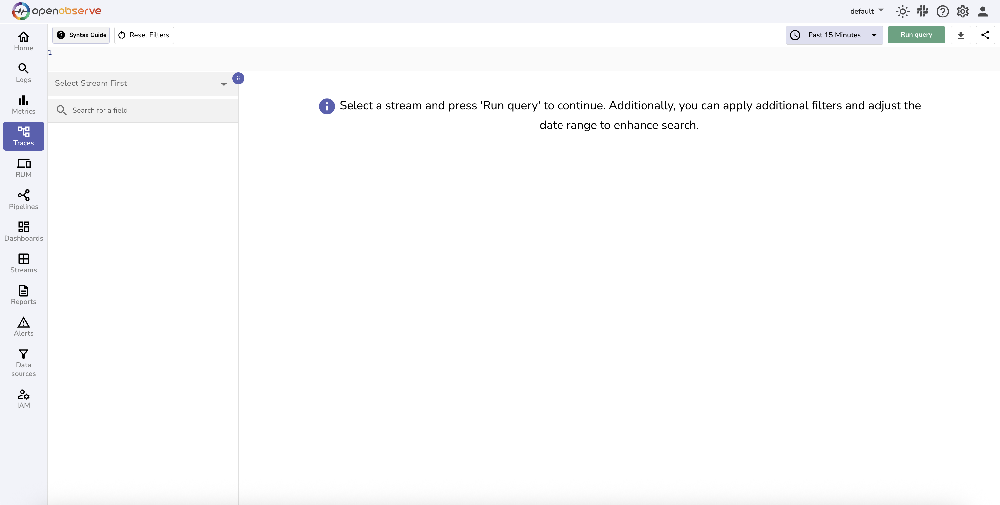
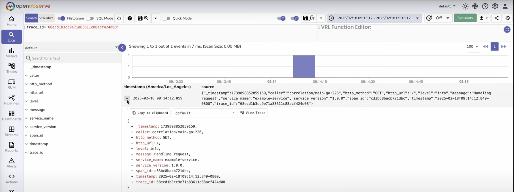

# Distributed Tracing

OpenObserve provides powerful distributed tracing capabilities that enable you to track requests as they flow through your microservices architecture, identify performance bottlenecks, and troubleshoot complex distributed systems with ease.

## Overview

Distributed tracing in OpenObserve allows you to visualize the complete journey of requests across multiple services, understand service dependencies, and pinpoint the root cause of performance issues. Built for modern cloud-native applications, OpenObserve efficiently handles trace ingestion, correlation, and analysis at enterprise scale while maintaining exceptional query performance.

*Distributed Tracing overview page*

## Key Features

### Trace Ingestion
- **OpenTelemetry Native**: Full support for OpenTelemetry protocol with automatic trace collection
- **Multiple Protocols**: Compatible with Jaeger, Zipkin, and custom tracing formats
- **High Throughput**: Process millions of spans per second with sub-millisecond latency
- **Sampling Strategies**: Intelligent sampling to balance observability with performance impact
- **Batch Processing**: Optimized batch ingestion for maximum efficiency

### Trace Structure & Data
- **Hierarchical Spans**: Complete trace trees showing parent-child relationships between operations
- **Rich Metadata**: Capture detailed span attributes, tags, and contextual information
- **Error Tracking**: Automatic error detection and classification within traces
- **Service Mapping**: Dynamic service topology discovery and visualization
- **Custom Instrumentation**: Support for manual and automatic instrumentation

### Trace Analysis & Search

- **Advanced Filtering**: Search traces by service, operation, duration, errors, and custom attributes

- **Dependency Analysis**: Visualize service dependencies and communication patterns

- **Performance Profiling**: Identify slow operations and bottlenecks across your distributed system

- **Error Investigation**: Quickly locate and analyze failed requests and exceptions

### Visualization & Insights

- **Gantt Chart Views**: Interactive timeline visualization showing span relationships and durations

- **Service Map**: Real-time service topology with performance metrics and error rates

- **Flame Graphs**: Detailed performance analysis with hierarchical span breakdown

- **Trace Comparison**: Side-by-side comparison of traces for performance analysis

### Correlation & Context

- **Metrics Correlation**: Link traces to related metrics and logs for complete observability

- **Log Integration**: Automatic correlation between trace spans and application logs

- **Alert Integration**: Trigger alerts based on trace patterns, error rates, and performance thresholds

### Storage & Performance

- **Efficient Compression**: Advanced compression techniques reduce storage overhead by up to 85%

- **Smart Indexing**: High-performance indexing optimized for trace queries and span searches

- **Tail-based Sampling**: Intelligent sampling decisions based on complete trace context

- **Retention Management**: [Flexible retention policies](../user-guide/streams/extended-retention.md) for cost-effective long-term storage

### Integration & Standards
- **OpenTelemetry Ecosystem**: Full compatibility with OpenTelemetry collectors and instrumentation libraries
- **Jaeger Integration**: Seamless migration from Jaeger with native protocol support
- **Zipkin Compatibility**: Support for Zipkin trace format and existing instrumentation
- **Cloud Native**: Native Kubernetes integration with automatic service discovery
- **API Access**: Comprehensive REST APIs for programmatic trace access and analysis
