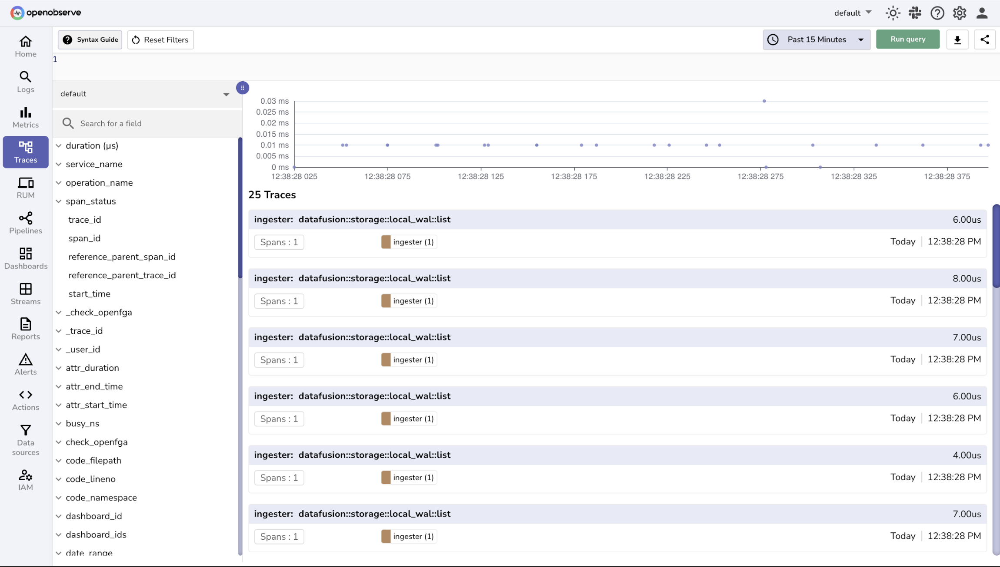
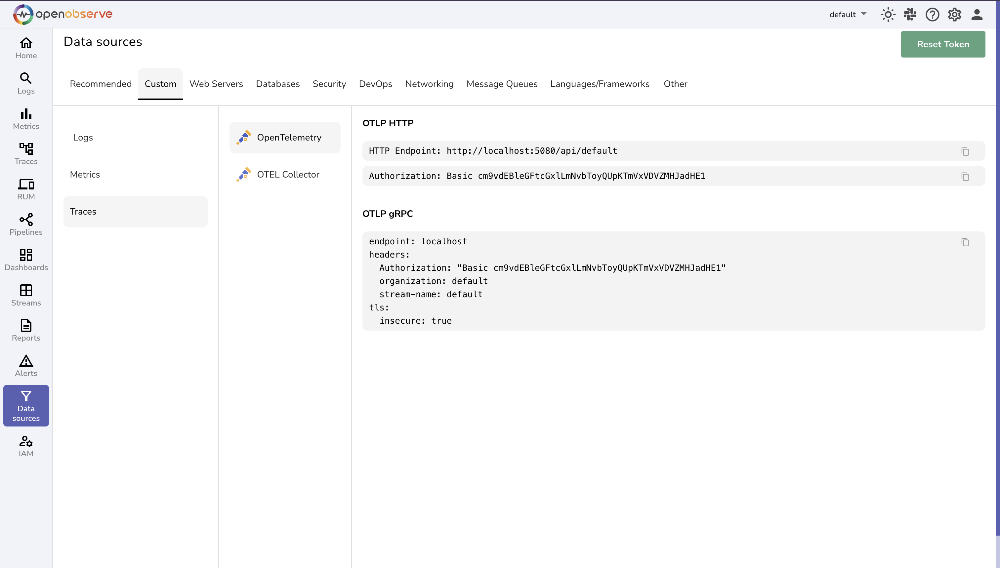
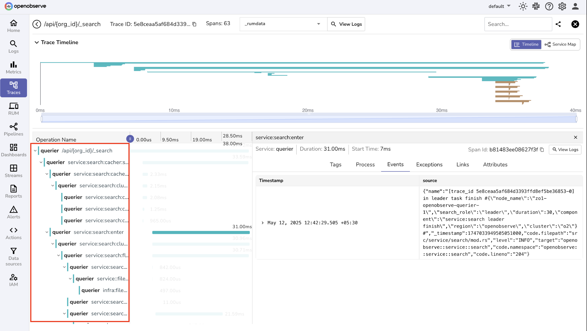
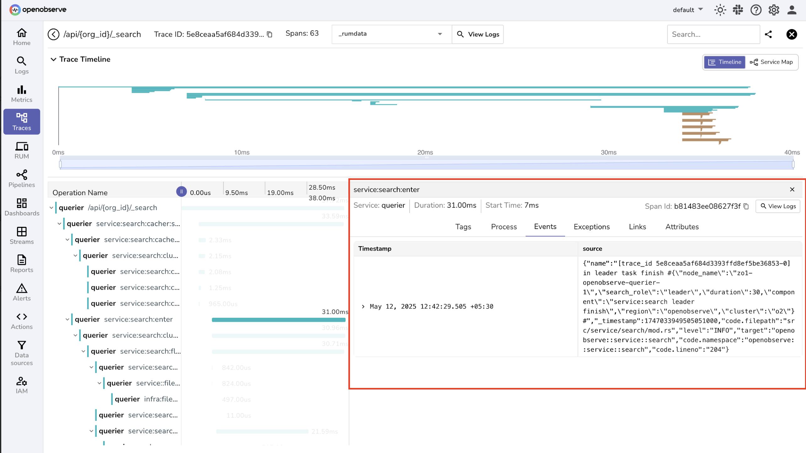
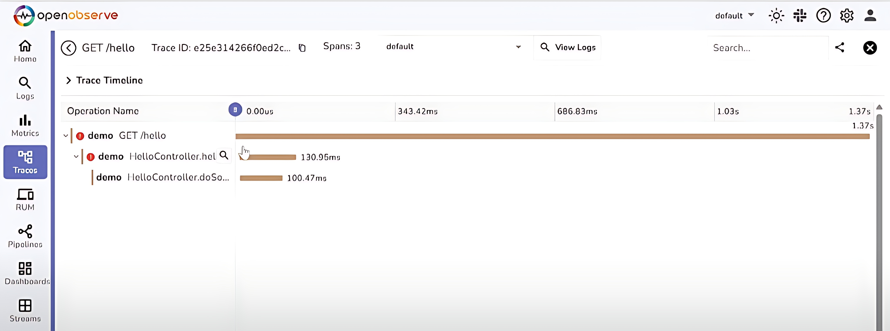
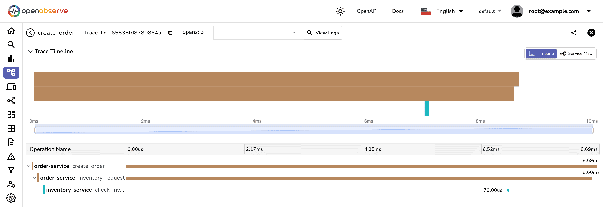
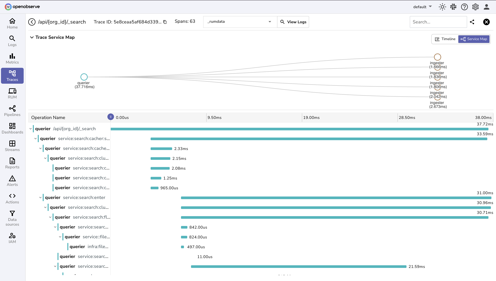
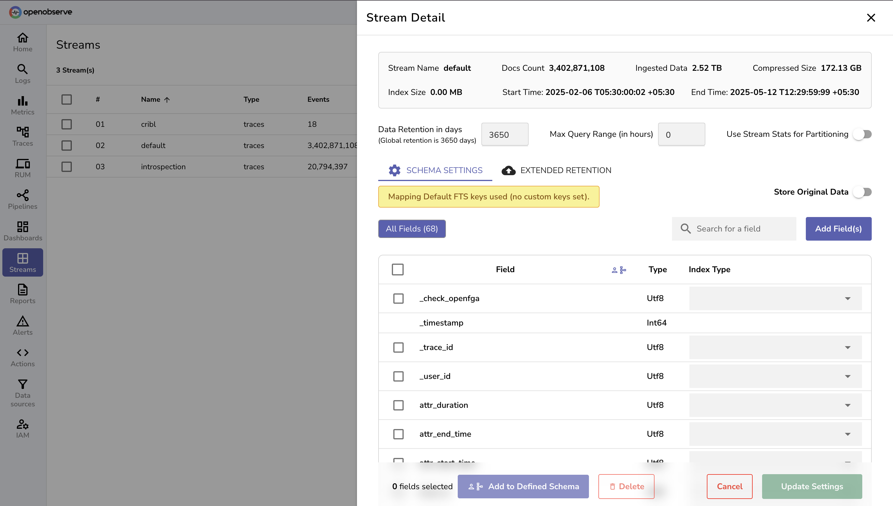

# Distributed Tracing

OpenObserve provides powerful distributed tracing capabilities that enable you to track requests as they flow through your microservices architecture, identify performance bottlenecks, and troubleshoot complex distributed systems with ease.

## Overview

Distributed tracing in OpenObserve allows you to visualize the complete journey of requests across multiple services, understand service dependencies, and pinpoint the root cause of performance issues. Built for modern cloud-native applications, OpenObserve efficiently handles trace ingestion, correlation, and analysis at enterprise scale while maintaining exceptional query performance.

*Distributed Tracing overview page*

## Key Features

### Trace Ingestion

- **OpenTelemetry Native**: Full support for OpenTelemetry protocol with automatic trace collection

- **High Throughput**: Process millions of spans per second with sub-millisecond latency

### Trace Structure & Data

- **Hierarchical Spans**: Complete trace trees showing parent-child relationships between operations

- **Rich Metadata**: Capture detailed span attributes, tags, and contextual information

- **Custom Instrumentation**: Support for manual and automatic instrumentation

### Trace Analysis & Search

- **Advanced Filtering**: Search traces by service, operation, duration, errors, and custom attributes

- **Performance Profiling**: Identify slow operations and bottlenecks across your distributed system

- **Error Investigation**: Quickly locate and analyze failed requests and exceptions

### Visualization & Insights

- **Gantt Chart Views**: Interactive timeline visualization showing span relationships and durations

- **Service Map**: Real-time service topology with performance metrics and error rates

### Storage & Performance

- **Smart Indexing**: High-performance indexing optimized for trace queries and span searches

- **Retention Management**: [Flexible retention policies](../user-guide/streams/extended-retention.md) for cost-effective long-term storage

### Integration & Standards
- **OpenTelemetry Ecosystem**: Full compatibility with OpenTelemetry collectors and instrumentation libraries
- **Jaeger and Zipkin Compatibility**: Supports ingestion from Jaeger and Zipkin via OpenTelemetry Collector
- **Kubernetes-Friendly:** Easily integrates into Kubernetes environments via OpenTelemetry Collector with support for service metadata enrichment.
- **API Access**: Comprehensive REST APIs for programmatic trace access and analysis