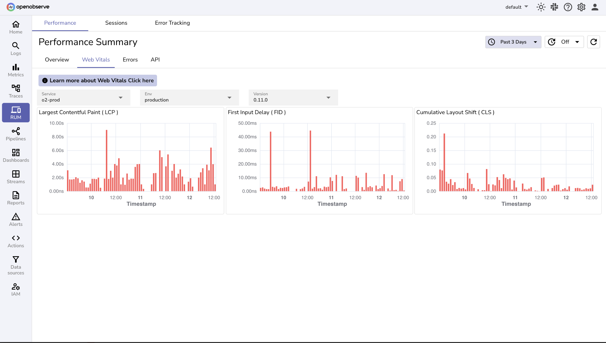
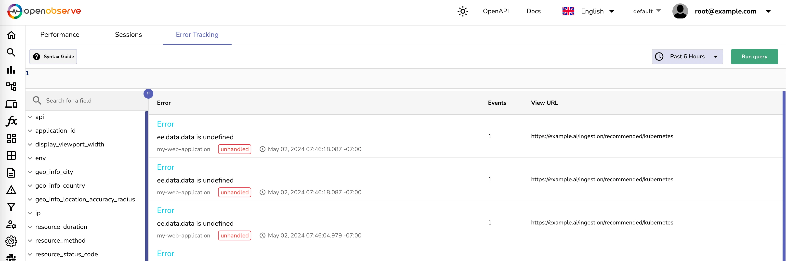
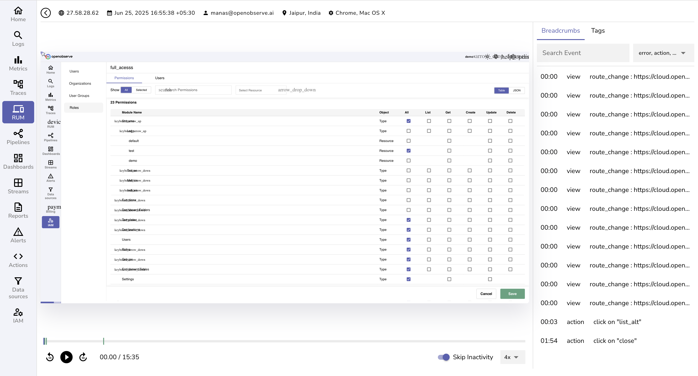
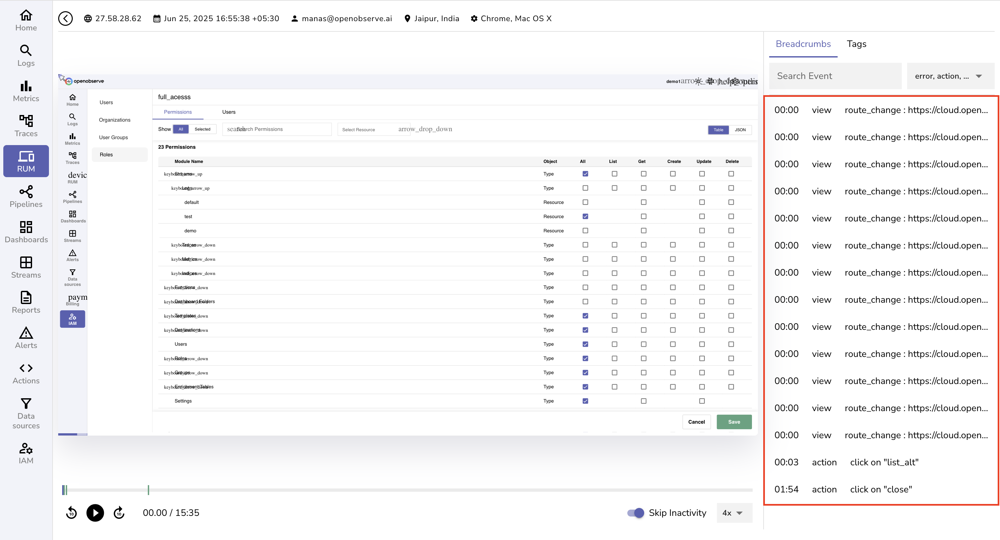

# Frontend Observability

OpenObserve provides robust frontend observability tools that help monitor user experience, track performance metrics, and capture errors in web applications. With minimal overhead, you can gain deep visibility into how users interact with your frontend—ensuring smooth performance across devices and browsers.

## Overview

Frontend Observability in OpenObserve enables real user monitoring, performance tracking (including Core Web Vitals), JavaScript error capture, and session replay. These tools are optimized for modern frontend architectures and come with a lightweight SDK for easy integration.

## Key Features

### Real User Monitoring (RUM)

- **Page Load Performance**: Track FCP, LCP, and other performance indicators

- **Web Vitals Monitoring**: Automatically capture Google's Core Web Vitals

- **Geographic & Device Context**: Analyze user experience by browser, device, and approximate location.

- **Network Insights**: Track HTTP requests and network timing

### [Error Tracking](../user-guide/rum.md#error-tracking)

- **JavaScript Errors**: Automatically capture exceptions and errors with full stack traces
- **Source Maps**: View original source files when source maps are uploaded.
- **Error Context**: Includes user session metadata and browser details

### [Session Replay](../user-guide/rum.md#session-replay)

- **User Interaction Recording**: Replay user sessions to understand behavior and debug issues

- **Event Timeline**: View DOM changes, clicks, inputs, and navigation in order

- **Privacy Features**: Configurable masking for sensitive fields

## Integration

- **Web SDK**: Easily add via CDN or NPM (`@openobserve/browser-rum`)
- **Framework Support**: Works with vanilla JS, React, Vue, Angular, and more

