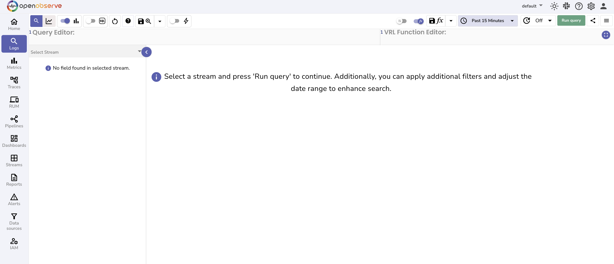
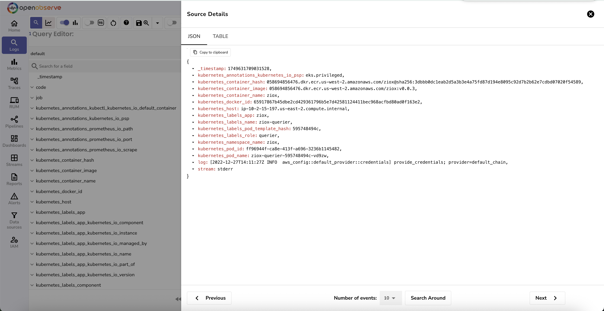
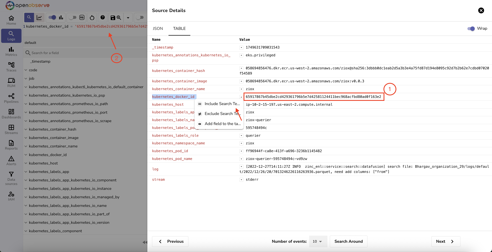
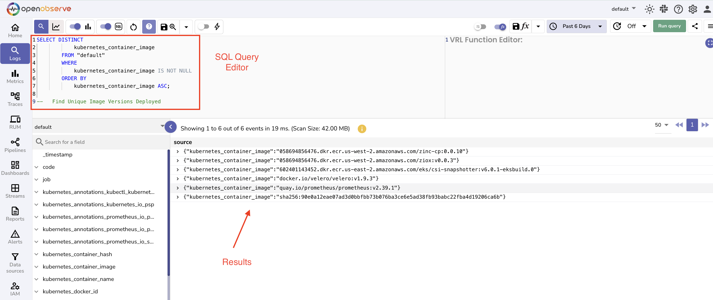
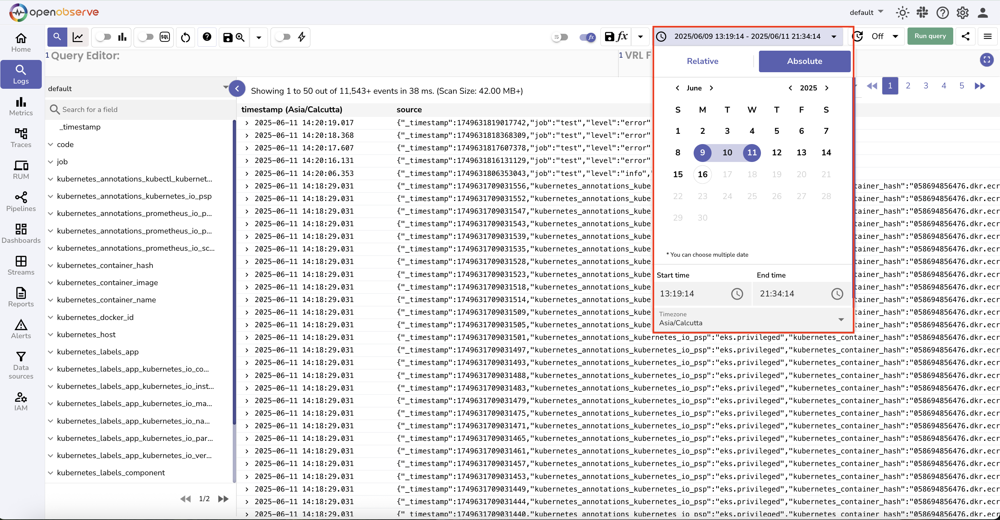
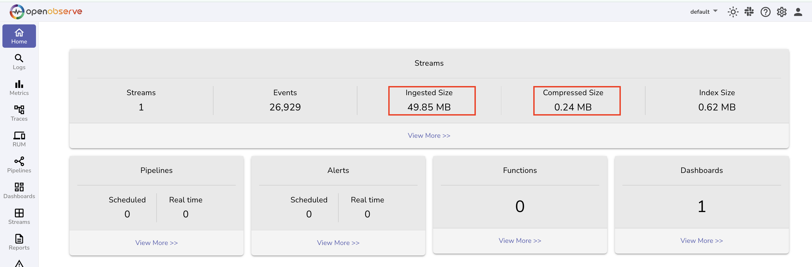
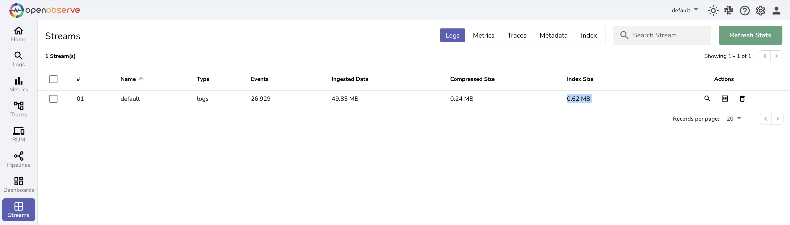
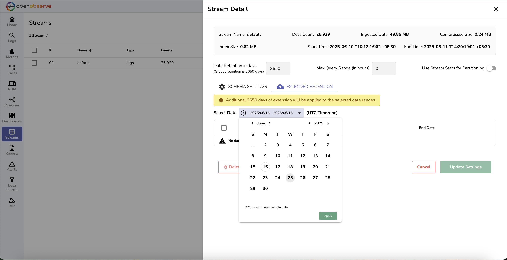

# Logs

OpenObserve provides powerful log management capabilities for collecting, storing, and analyzing log data from your applications and infrastructure.

## Overview

Logs in OpenObserve offer comprehensive observability into your system's behavior, allowing you to track events, debug issues, and monitor application performance. Built with high performance and cost efficiency in mind, OpenObserve handles log ingestion and querying at scale.

*Logs Page view*

## Key Features

### Log Ingestion
- **Multiple Protocols**: Support for various log shipping protocols including HTTP, syslog, and popular log shippers
- **Structured & Unstructured**: Handle both JSON structured logs and plain text logs
- **Real-time Processing**: Immediate indexing and availability for search and analysis

### Search & Query

- **Field Extraction**: Automatic parsing and extraction of log fields. 

The [Schema Settings](../user-guide/streams/schema-settings.md) tab in the Stream Details panel allows you to inspect and manage the schema used to store and query ingested data. 

- **Full-text Search**: Powerful search capabilities across all log fields

- **SQL Queries**: Use familiar SQL syntax for complex log analysis

- **Time-based Filtering**: Efficient time range queries for targeted log exploration

### Storage & Performance
- **Compressed Storage**: Efficient compression reduces storage costs significantly

- **Fast Retrieval**: Optimized indexing for quick log searches and aggregations

Know more about [Streams](../user-guide/streams/streams-in-openobserve.md) and its [details](../user-guide/streams/stream-details.md#stream-details)

- **Retention Policies**: [Configurable data retention](../user-guide/streams/extended-retention.md) to manage storage costs

