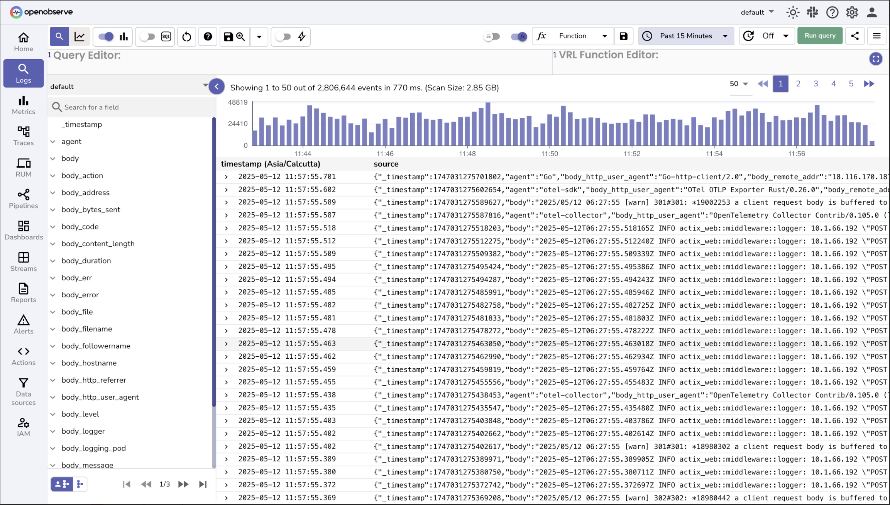
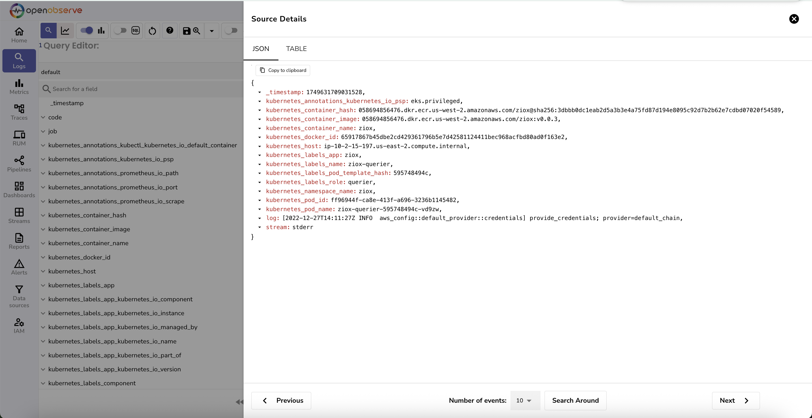
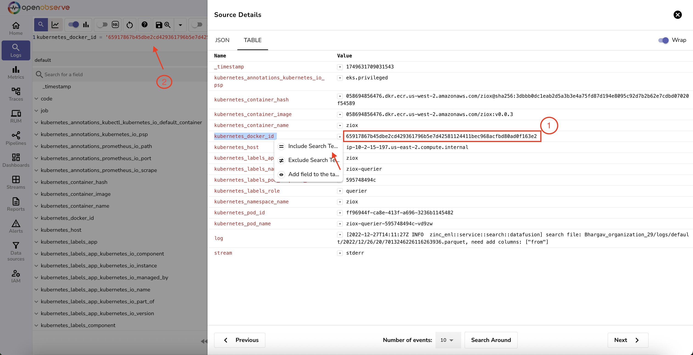
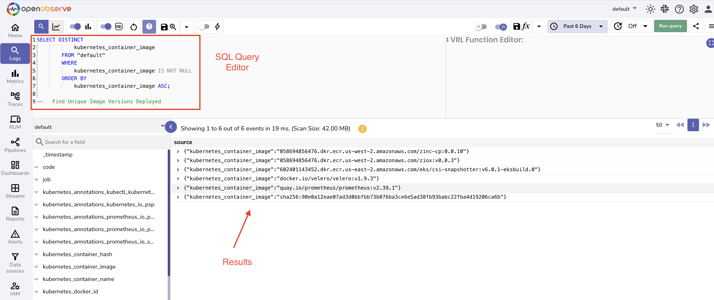
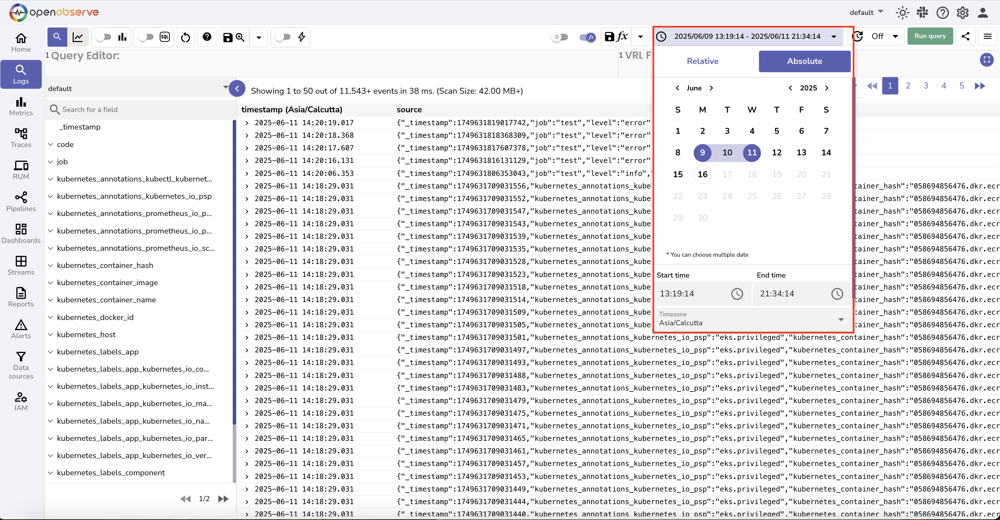
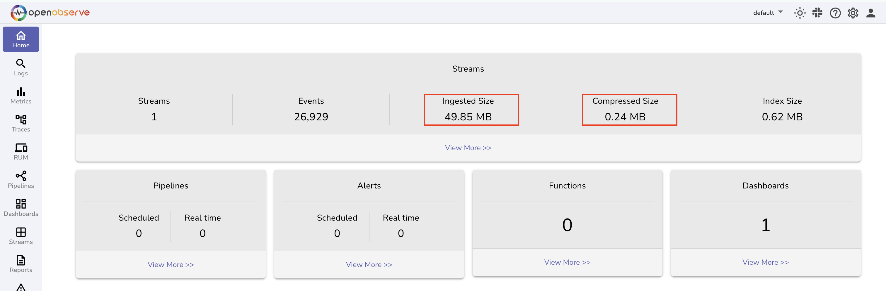
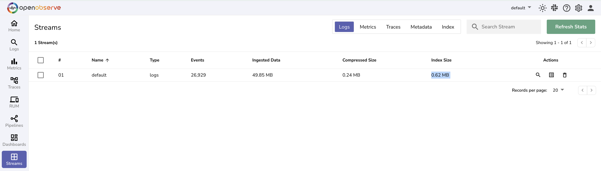
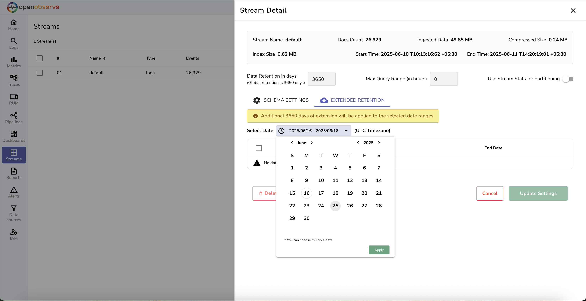

# Logs

OpenObserve provides powerful log management capabilities for collecting, storing, and analyzing log data from your applications and infrastructure.

## Overview

Logs in OpenObserve offer comprehensive observability into your system's behavior, allowing you to track events, debug issues, and monitor application performance. Built with high performance and cost efficiency in mind, OpenObserve handles log ingestion and querying at scale.

## Key Features

### Log Ingestion
- **Multiple Protocols**: Support for multiple ingestion methods including HTTP and integration with popular log shippers like Fluent Bit, Vector, etc.
- **Structured & Unstructured**: Handle both JSON structured logs and plain text logs
- **Real-time Processing**: Immediate indexing and availability for search and analysis

### Search & Query

- **Field Extraction**: Automatic field detection and parsing for structured data. The [Schema Settings](../user-guide/data-processing/streams/schema-settings.md) tab in the Stream Details panel lets you inspect and manage the schema used to store and query ingested data.

- **Full-text Search**: Powerful search capabilities across all log fields

- **SQL Queries**: Use familiar SQL syntax for complex filtering and aggregation.

- **Time-based Filtering**: Query logs within specific time windows using absolute or relative ranges.

### Storage & Performance
- **Compressed Storage**: Efficient compression reduces storage costs significantly

- **Fast Retrieval**: Optimized indexing for quick log searches and aggregations. Learn more about [Streams](../user-guide/data-processing/streams/streams-in-openobserve.md) and their [details](../user-guide/data-processing/streams/stream-details.md#stream-details).

- **Retention Policies**: [Configurable data retention](../user-guide/data-processing/streams/extended-retention.md) to manage storage costs

## Get started with logs

Ready to send your first logs to OpenObserve?

- [Quickstart](../getting-started.md): get OpenObserve running in 5 minutes.
- [Log ingestion overview](../ingestion/logs/index.md): pick the right ingestion path for your stack.
- [Example queries](../user-guide/data-exploration/example-queries.md): copy-paste filters and SQL to try right away.

## Next steps

- [OpenTelemetry / OTLP](../ingestion/logs/otlp.md): the recommended modern ingestion path.
- [Vector](../ingestion/logs/vector.md), [Fluent Bit](../ingestion/logs/fluent-bit.md), [syslog](../ingestion/logs/syslog.md): popular agent-based options.
- [Schema settings](../user-guide/data-processing/streams/schema-settings.md): manage how your fields are stored and indexed.

**Need some help?**

- Join our [Community Slack](https://short.openobserve.ai/community) 
- Or [Contact support](https://openobserve.ai/contactus/)
