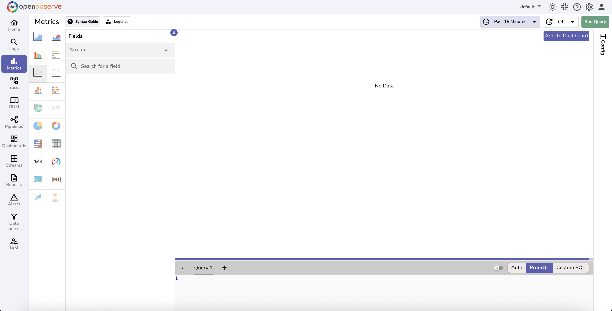
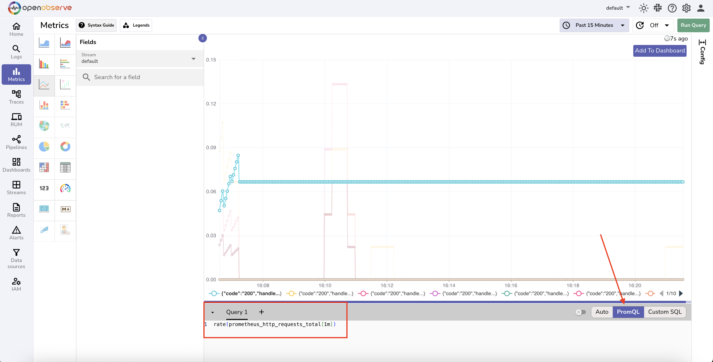
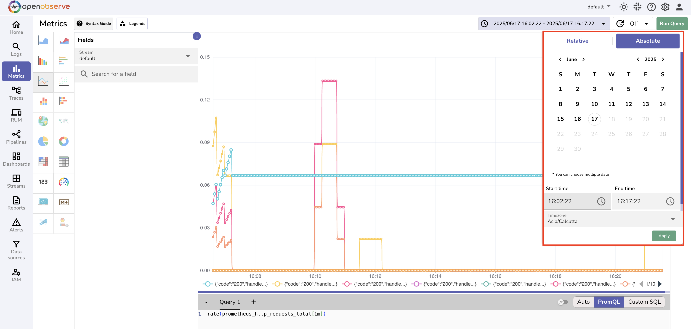
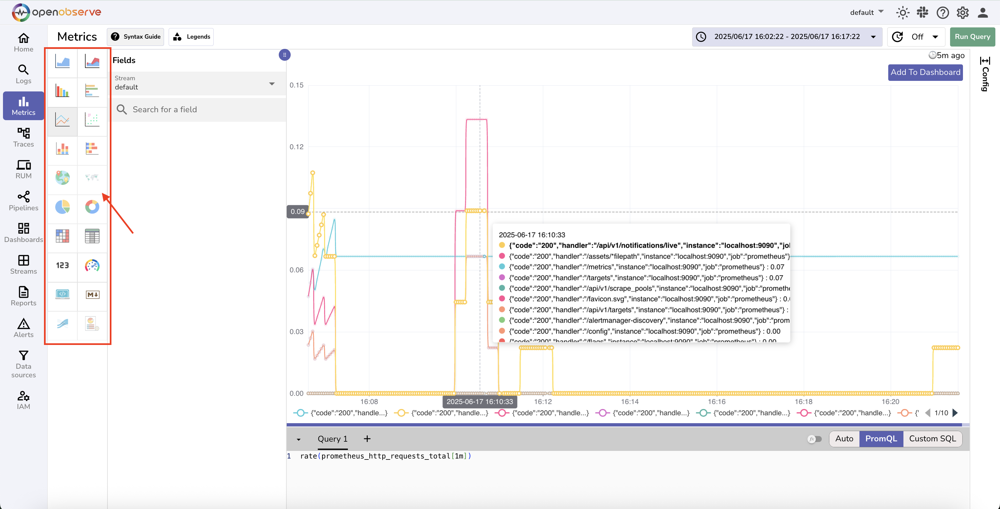
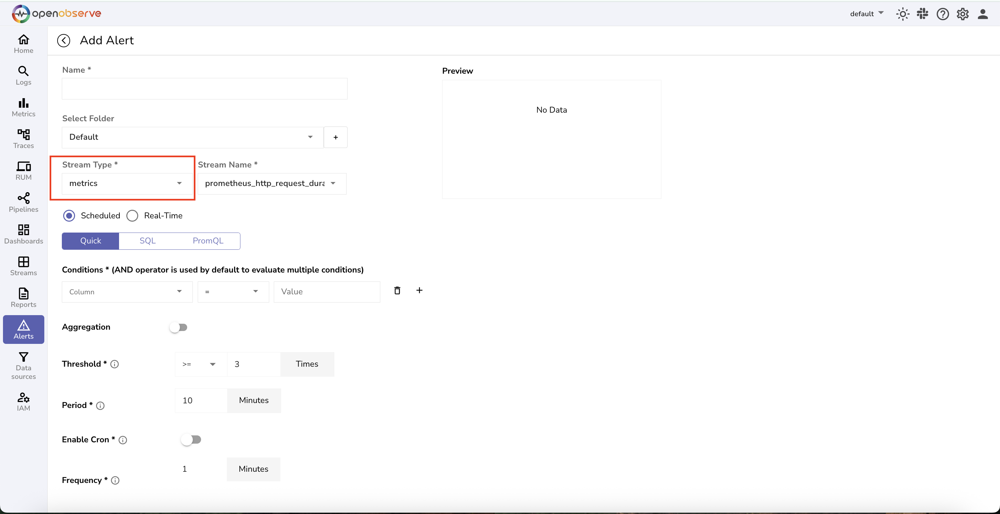
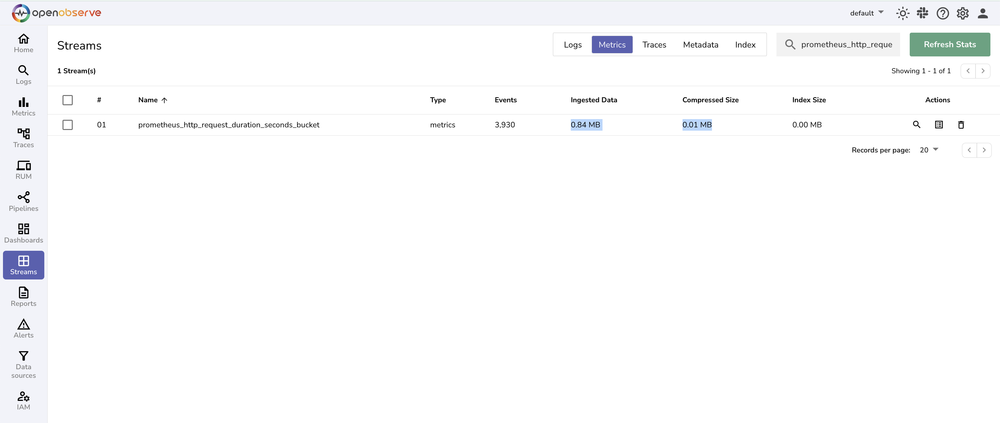
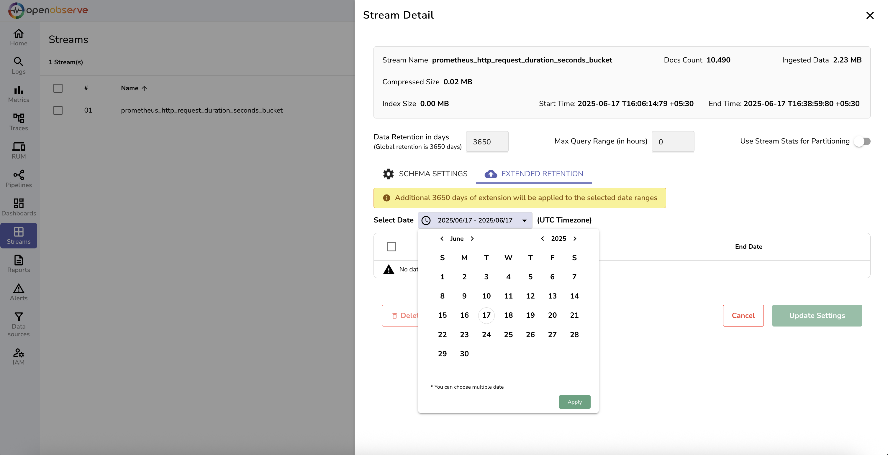

# Metrics

OpenObserve provides comprehensive metrics collection, storage, and visualization capabilities for monitoring your applications and infrastructure performance in real-time.

## Overview

Metrics in OpenObserve enable you to track key performance indicators, monitor system health, and gain insights into your application's behavior over time. Designed for high-throughput environments, OpenObserve efficiently handles metrics ingestion, storage, and querying at scale while maintaining cost-effectiveness.

*Metrics Page view*

## Key Features

### Metrics Ingestion
- **Multiple Formats**: Support for multiple formats including Prometheus remote-write and structured JSON metrics via HTTP ingestion.
- **Push & Pull Models**: Supports push-based ingestion and integration with systems like Prometheus for pull-based scraping.
- **High Throughput**: Handle millions of metrics per second with minimal latency
- **Optimized Processing**: Optimized ingestion pipelines for high-throughput environments.

### Data Types & Structure
- **Time Series Data**: Native support for time-series metrics with timestamp precision
- **Multi-dimensional**: Handle metrics with multiple labels and dimensions for detailed analysis
- **Aggregation Functions**: Built-in support for common aggregation functions (sum, avg, min, max, count)
- **Custom Metrics**: Flexible schema for application-specific metrics and KPIs

### Query & Analysis

- **PromQL Support**: Full compatibility with Prometheus Query Language for familiar querying

- **SQL Interface**: Use SQL syntax for complex metrics analysis and reporting

- **Time Range Selection**: Flexible time range queries with support for relative and absolute time periods

- **Mathematical Operations**: Perform calculations and transformations on metrics data

### Visualization & Dashboards

- **Real-time Charts**: Interactive time-series visualizations with multiple chart types

- **Custom Dashboards**: Create comprehensive dashboards with multiple metrics panels

- **Alerting Integration**: Set up alerts based on metrics thresholds and conditions

### Storage & Performance

- **Optimized Compression**: Advanced compression algorithms reduce storage costs by up to 90%

- **Efficient Indexing**: High-performance indexing for fast query execution across large datasets

- **Downsampling**: Automatic data [downsampling](../user-guide/metrics/downsampling-metrics.md) for long-term storage optimization

- **Retention Policies**: [Configurable retention settings](../user-guide/streams/extended-retention.md) to balance storage costs and data availability

### Integration & Compatibility
- **Prometheus Compatible**: Full compatibility with Prometheus ecosystem and exporters
- **Grafana Integration**: Native support for Grafana dashboards and visualization
- **API Access**: RESTful APIs for programmatic access to metrics data
- **Standard Exporters**: Support for popular metrics exporters (Node Exporter, cAdvisor, etc.)