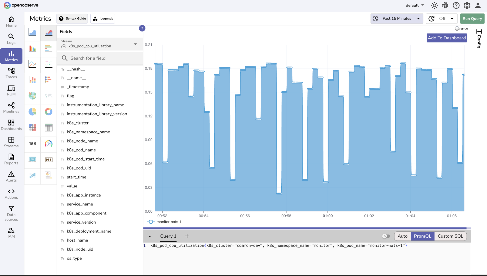
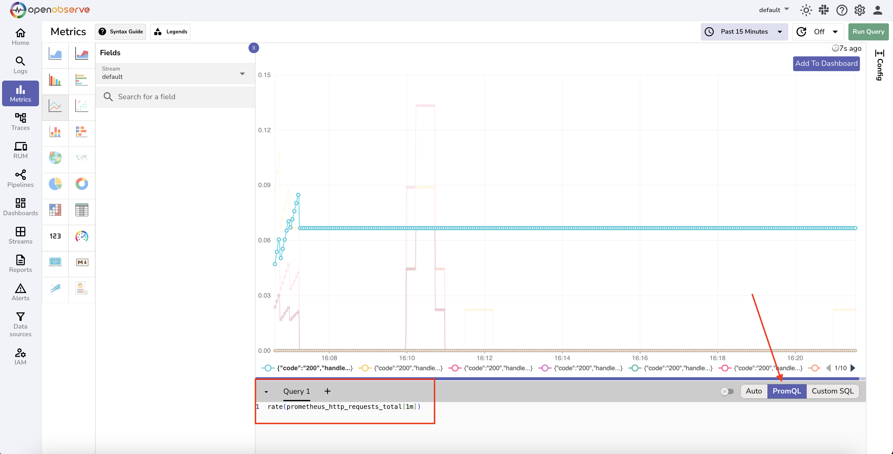
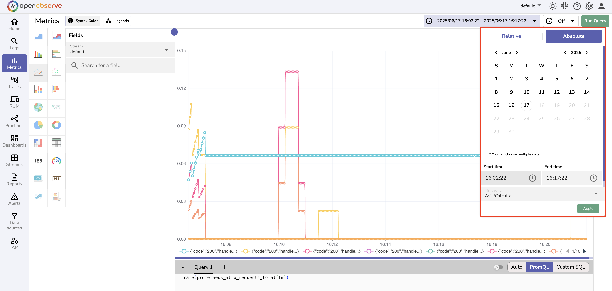
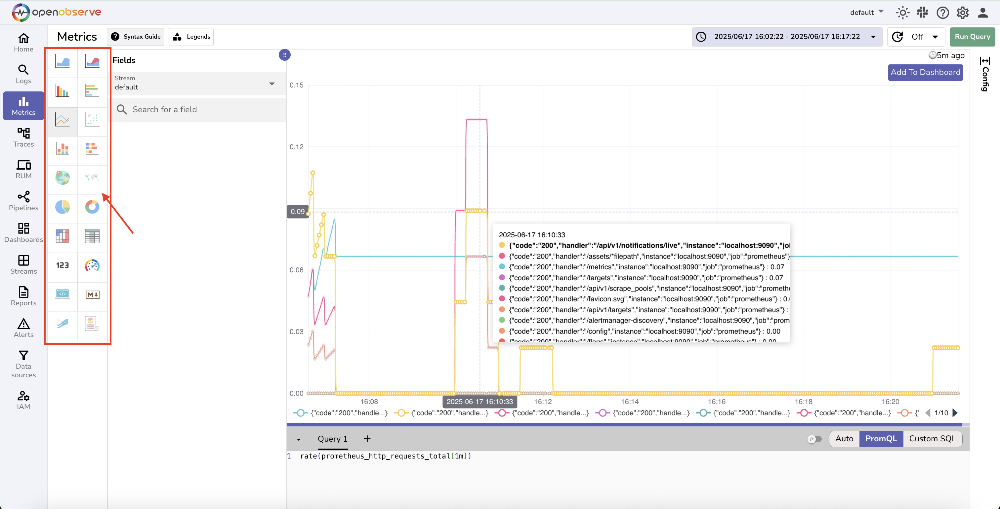
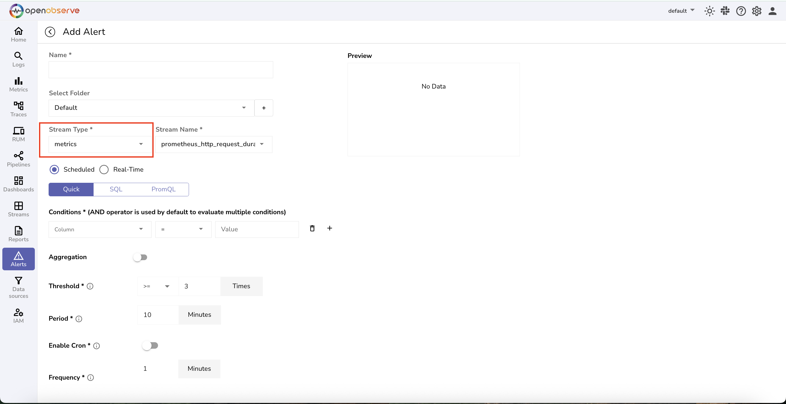
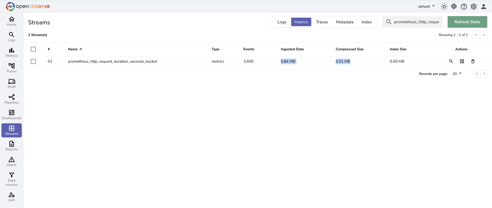
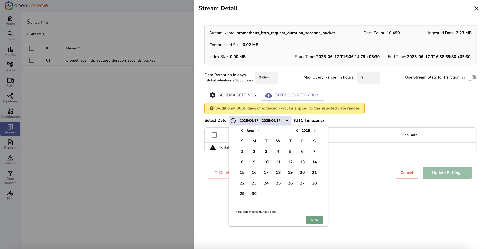

# Metrics

OpenObserve provides comprehensive metrics collection, storage, and visualization capabilities for monitoring your applications and infrastructure performance in real-time.

## Overview

Metrics in OpenObserve enable you to track key performance indicators, monitor system health, and gain insights into your application's behavior over time. Designed for high-throughput environments, OpenObserve efficiently handles metrics ingestion, storage, and querying at scale while maintaining cost-effectiveness.

## Key Features

### Metrics Ingestion
- **Multiple Formats**: Support for multiple formats including Prometheus remote-write and structured JSON metrics via HTTP ingestion.
- **Push & Pull Models**: Supports push-based ingestion and integration with systems like Prometheus for pull-based scraping.
- **High Throughput**: Handle millions of metrics per second with minimal latency.
- **Optimized Processing**: Optimized ingestion pipelines for high-throughput environments.

### Metric Structure
- **Time Series Data**: Native support for time-series metrics with timestamp precision.
- **Multi-dimensional**: Handle metrics with multiple labels and dimensions for detailed analysis.
- **Aggregation Functions**: Built-in support for common aggregation functions (sum, avg, min, max, count).
- **Custom Metrics**: Flexible schema for application-specific metrics and KPIs.

### Query & Analysis

- **PromQL Support**: Full compatibility with Prometheus Query Language for familiar querying.

- **SQL Interface**: Use SQL syntax for complex metrics analysis and reporting.

- **Time Range Selection**: Flexible time range queries with support for relative and absolute time periods.

- **Mathematical Operations**: Perform calculations and transformations on metrics data.

### Visualization & Dashboards

- **Real-time Charts**: Interactive time-series visualizations with multiple chart types.

- **Custom Dashboards**: Create comprehensive dashboards with multiple metrics panels.

- **Alerting Integration**: Set up alerts based on metrics thresholds and conditions.

- **Share Metrics Views**: Share an exact metrics view with your team by copying a URL from the **Share** button in the metrics toolbar. The URL encodes your current panel configuration — chart type, queries (PromQL or SQL), stream selection, time range, and refresh interval — so recipients see the same chart and data. Opening a shared link auto-restores the view and runs the query immediately.

The share URL carries the full panel state as a versioned base64 blob in the `metrics_data` query parameter. The metrics page also accepts lightweight deep-link overrides (`chart_type`, `query_type`, `stream_name`, `query`) for programmatic linking from alerts, dashboards, and other pages.

### Storage & Performance

- **Optimized Compression**: Advanced compression algorithms reduce storage costs.

- **Efficient Indexing**: High-performance indexing for fast query execution across large datasets.

- **Downsampling**: Automatic data [downsampling](../user-guide/data-exploration/metrics/downsampling-metrics.md) for long-term storage optimization.

- **Retention Policies**: [Configurable retention settings](../user-guide/data-processing/streams/extended-retention.md) to balance storage costs and data availability.

### Integration & Compatibility
- **Prometheus Compatible**: Full compatibility with Prometheus ecosystem and exporters.
- **OpenTelemetry Ecosystem**: Full compatibility with OpenTelemetry collectors and instrumentation libraries.
- **API Access**: RESTful APIs for programmatic access to metrics data.
- **Standard Exporters**: Support for popular metrics exporters (Node Exporter, cAdvisor, etc.).

## Get started with metrics

Ready to send your first metrics to OpenObserve?

- [Quickstart](../getting-started.md): get OpenObserve running in 5 minutes.
- [Prometheus remote-write](../ingestion/metrics/prometheus.md): the most common path for metrics ingestion.
- [Telegraf](../ingestion/metrics/telegraf.md): collect metrics from Telegraf agents.

## Next steps

- [OpenTelemetry / OTLP](../ingestion/logs/otlp.md): unified ingestion for logs, metrics, and traces.
- [Dashboards](../user-guide/analytics/dashboards/dashboards-in-openobserve.md): visualize metrics alongside logs and traces.
- [Alerts](../user-guide/analytics/alerts/index.md): notify on metric thresholds and anomalies.
- [Downsampling](../user-guide/data-exploration/metrics/downsampling-metrics.md): keep long-term metrics affordable.

**Need some help?**

- Join our [Community Slack](https://short.openobserve.ai/community) 
- Or [Contact support](https://openobserve.ai/contactus/)
