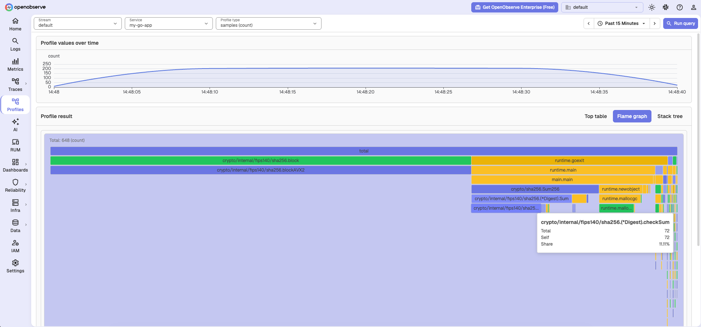
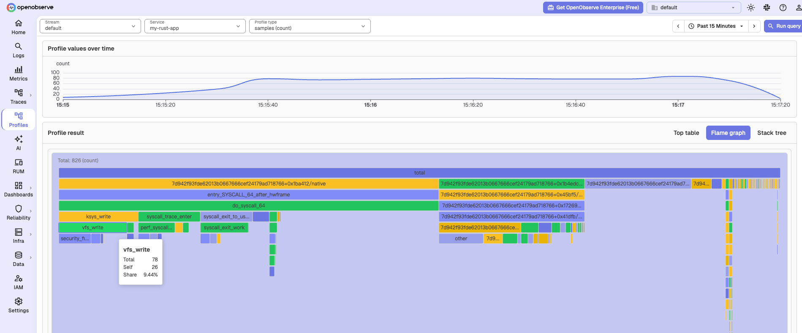

# Zero-Code CPU Profiling with otelcol-ebpf-profiler

[`otelcol-ebpf-profiler`](https://github.com/open-telemetry/opentelemetry-collector-releases/releases) is the Collector distribution that embeds the [eBPF profiler](https://github.com/open-telemetry/opentelemetry-ebpf-profiler) as the `profiling` receiver. It samples on-CPU stacks on a **Linux** host and exports [OTLP Profiles](https://opentelemetry.io/docs/concepts/signals/profiles/). No language SDK and no application restart. Do not use `otelcol-contrib`.

Use it for **Go**, **Rust**, C/C++, and other native runtimes. For Java, prefer [async-profiler](./java.md).

## Send profiles

Copy the endpoint and `Authorization` header from **Data Sources → Custom → Profiles**. Save as `ebpf-profiler-config.yaml`:

```yaml
receivers:
  profiling:
    samples_per_second: 20
    reporter_interval: 60s

exporters:
  otlp_http/openobserve:
    profiles_endpoint: http://<your-openobserve-host>/api/<your-org>/v1/profiles
    headers:
      Authorization: Basic <paste-from-Data-Sources>
      stream-name: default

service:
  pipelines:
    profiles:
      receivers: [profiling]
      exporters: [otlp_http/openobserve]
```

Do not set `service.name` in the Collector; it merges every process. Name each process instead:

```bash
OTEL_SERVICE_NAME=my-app ./your-app
```

Linux host, run as root:

```bash
sudo ./otelcol-ebpf-profiler --feature-gates=+service.profilesSupport --config=ebpf-profiler-config.yaml
```

## Native symbols

`otelcol-ebpf-profiler` does not resolve C/C++/Rust symbols on the host. OpenObserve displays the frames it receives. Kernel frames can still show names (`vfs_write`); userspace stays FileID/native.

[opentelemetry-ebpf-profiler#1388](https://github.com/open-telemetry/opentelemetry-ebpf-profiler/pull/1388) adds an opt-in `symtab` tracer that reads `.symtab` on the host (then `.dynsym`, then a `.gnu_debuglink` debug file). It is **not in `otelcol-ebpf-profiler` releases yet**. After it ships, upgrade the profiler and enable `symtab` (for example `--tracers=all,symtab`). Keep the ELF symbol table. For Rust:

```toml
# Cargo.toml
[profile.release]
strip = false
```

`strip = true` removes `.symtab`. `.dynsym` only has exported symbols, so Rust internals still would not resolve. For Rust function names today, use [pprof](./rust.md).

## Verify in OpenObserve

Go demo:



Rust demo:



## Next steps

- [otelcol-ebpf-profiler releases](https://github.com/open-telemetry/opentelemetry-collector-releases/releases): Linux `amd64` / `arm64` packages (`otelcol-ebpf-profiler_*_linux_*.tar.gz`).
- [OpenTelemetry eBPF Profiler](https://github.com/open-telemetry/opentelemetry-ebpf-profiler): receiver options.
- [opentelemetry-ebpf-profiler#1388](https://github.com/open-telemetry/opentelemetry-ebpf-profiler/pull/1388): on-host `symtab` tracer (not released).

**Need some help?**

- Join our [Community Slack](https://short.openobserve.ai/community)
- Or [Contact support](https://openobserve.ai/contactus/)
