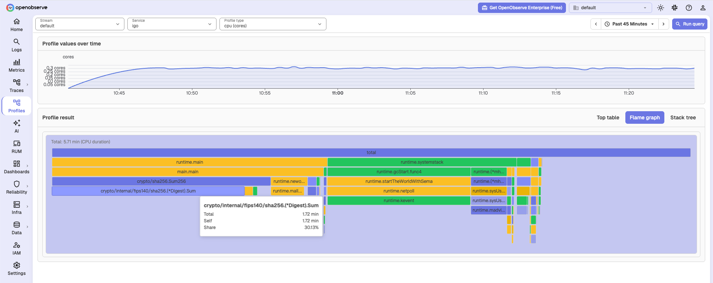

# Go Profiling

Go has two paths:

| Path | When to use |
|---|---|
| **pprof** (this page) | CPU, heap, mutex, and block; expose `/debug/pprof` |
| **[eBPF profiler](./ebpf.md)** | On-CPU and off-CPU; no code changes (Linux) |

## Expose pprof

Burns CPU so the flame graph has samples:

```go
package main

import (
	"crypto/sha256"
	"net/http"
	_ "net/http/pprof"
)

func main() {
	go func() {
		_ = http.ListenAndServe("127.0.0.1:6060", nil)
	}()

	buf := []byte("openobserve")
	for {
		sum := sha256.Sum256(buf)
		buf = sum[:]
	}
}
```

```bash
go mod init pprofdemo
go mod tidy
go run .
```

## Scrape with the Collector

Copy the endpoint and `Authorization` header from **Data Sources → Custom → Profiles**. Use [otelcol-contrib](https://github.com/open-telemetry/opentelemetry-collector-releases) **0.153+** (`remote:` scrape config). CPU scrape `timeout` must be longer than `?seconds=` on the pprof URL.

```yaml
receivers:
  pprof/cpu:
    remote:
      endpoint: http://127.0.0.1:6060/debug/pprof/profile?seconds=5
      collection_interval: 30s
      timeout: 60s

processors:
  resource:
    attributes:
      - key: service.name
        value: your-service
        action: upsert

exporters:
  otlp_http/openobserve:
    profiles_endpoint: http://<your-openobserve-host>/api/<your-org>/v1/profiles
    headers:
      Authorization: Basic <paste-from-Data-Sources>
      stream-name: default

service:
  pipelines:
    profiles:
      receivers: [pprof/cpu]
      processors: [resource]
      exporters: [otlp_http/openobserve]
```

```bash
otelcol-contrib --feature-gates=+service.profilesSupport --config=otelcol-config.yaml
```

## Heap, allocs, mutex, and block

For mutex and block, call these at process start (CPU and heap work without them):

```go
runtime.SetMutexProfileFraction(1)
runtime.SetBlockProfileRate(1)
```

| Profile | Endpoint |
|---|---|
| CPU | `/debug/pprof/profile?seconds=5` |
| Heap | `/debug/pprof/heap` |
| Allocations | `/debug/pprof/allocs` |
| Mutex | `/debug/pprof/mutex` |
| Block | `/debug/pprof/block` |

## Verify in OpenObserve



## Next steps

- [OTLP Profiles](./otlp.md): Collector exporter, `Authorization: Basic`, and `service.name`.
- [eBPF profiler](./ebpf.md): zero-code CPU profiling.
- [pprof receiver](https://github.com/open-telemetry/opentelemetry-collector-contrib/tree/main/receiver/pprofreceiver): scrape options.

**Need some help?**

- Join our [Community Slack](https://short.openobserve.ai/community)
- Or [Contact support](https://openobserve.ai/contactus/)
