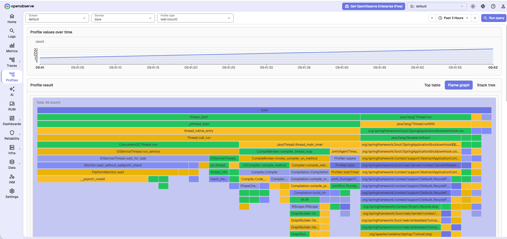

# Java Profiling with async-profiler

[async-profiler](https://github.com/async-profiler/async-profiler) **4.2+** attaches to a JVM and can push [OTLP Profiles](https://opentelemetry.io/docs/concepts/signals/profiles/) (`-o otlp`).

:::note[Experimental OTLP output]
async-profiler's `-o otlp` output is still experimental. Re-test after you upgrade async-profiler.
:::

## Send profiles

Run a Collector with the [OTLP Profiles](./otlp.md) exporter, then point `asprof` at it:

```bash
asprof --loop 60s -e cpu -o otlp \
  -f http://127.0.0.1:4318/v1development/profiles \
  8983
```

Replace `8983` with the JVM PID. `--loop 60s` starts a new 60-second profile each window and POSTs it.

Start with the JVM instead of attaching later. `-agentpath:lib=options` is one argument — no space before `=`.

```bash
java -agentpath:/path/to/libasyncProfiler.so=start,event=cpu,loop=60s,otlp,file=http://127.0.0.1:4318/v1development/profiles \
  -jar app.jar
```

## Events

| Goal | Flags |
|---|---|
| CPU | `-e cpu` (default) |
| Allocations | `-e alloc` |
| Lock contention | `-e lock` |

See [async-profiler profiling modes](https://github.com/async-profiler/async-profiler/blob/master/docs/ProfilingModes.md) for wall-clock, native memory, and other events (`asprof list`).

:::warning[Do not use `--all` in production]
`--all` turns on CPU, wall, allocation, lock, and native-memory profiling at the same time. Overhead is high. For continuous profiling, pick **one** event from the table above.
:::

## Verify in OpenObserve



## Next steps

- [OTLP Profiles](./otlp.md): Collector exporter, `Authorization: Basic`, and `service.name`.
- [async-profiler profiling modes](https://github.com/async-profiler/async-profiler/blob/master/docs/ProfilingModes.md)

**Need some help?**

- Join our [Community Slack](https://short.openobserve.ai/community)
- Or [Contact support](https://openobserve.ai/contactus/)
