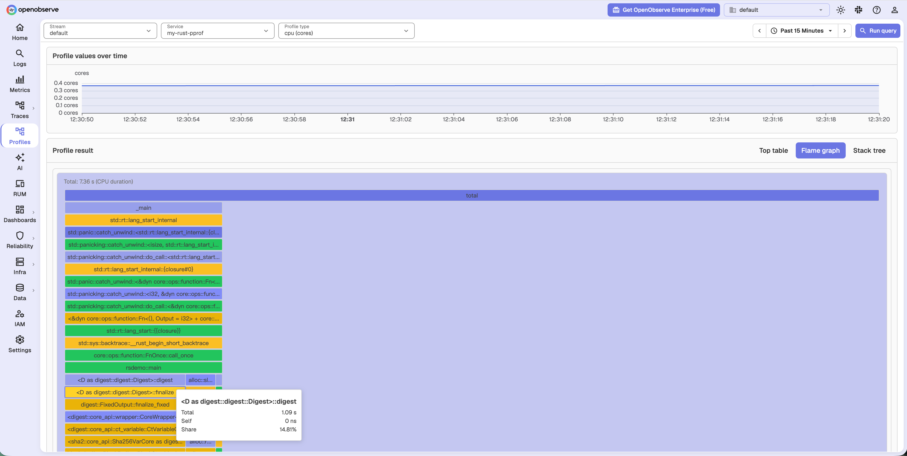

# Rust Profiling

Rust has two paths:

| Path | When to use |
|---|---|
| **pprof** (this page) | Function names in the flame graph |
| **[eBPF profiler](./ebpf.md)** | No code changes (Linux) |

## Expose pprof

Burns CPU so the flame graph has samples. Serves `/debug/pprof/profile` for the Collector:

```toml
# Cargo.toml
[package]
name = "rsdemo"
version = "0.1.0"
edition = "2021"

[dependencies]
pprof = { version = "0.14", features = ["protobuf-codec"] }
sha2 = "0.10"
tiny_http = "0.12"

[profile.release]
debug = 1
strip = false
```

```rust
use pprof::protos::Message;
use sha2::{Digest, Sha256};
use std::{thread, time::Duration};
use tiny_http::{Response, Server};

fn main() {
    thread::spawn(|| {
        let server = Server::http("127.0.0.1:6060").unwrap();
        for request in server.incoming_requests() {
            if !request.url().starts_with("/debug/pprof/profile") {
                let _ = request.respond(Response::empty(404));
                continue;
            }
            let guard = pprof::ProfilerGuard::new(99).unwrap();
            thread::sleep(Duration::from_secs(5));
            let mut body = Vec::new();
            if let Ok(report) = guard.report().build() {
                if let Ok(profile) = report.pprof() {
                    body = profile.write_to_bytes().unwrap_or_default();
                }
            }
            let _ = request.respond(Response::from_data(body));
        }
    });

    let mut buf = b"openobserve".to_vec();
    loop {
        buf = Sha256::digest(&buf).to_vec();
    }
}
```

```bash
cargo build --release
./target/release/rsdemo
```

## Scrape with the Collector

Copy the endpoint and `Authorization` header from **Data Sources → Custom → Profiles**. Use [otelcol-contrib](https://github.com/open-telemetry/opentelemetry-collector-releases) **0.153+** (`remote:` scrape config). CPU scrape `timeout` must be longer than the 5-second profile window.

```yaml
receivers:
  pprof/cpu:
    remote:
      endpoint: http://127.0.0.1:6060/debug/pprof/profile?seconds=5
      collection_interval: 30s
      timeout: 60s

processors:
  resource:
    attributes:
      - key: service.name
        value: your-service
        action: upsert

exporters:
  otlp_http/openobserve:
    profiles_endpoint: http://<your-openobserve-host>/api/<your-org>/v1/profiles
    headers:
      Authorization: Basic <paste-from-Data-Sources>
      stream-name: default

service:
  pipelines:
    profiles:
      receivers: [pprof/cpu]
      processors: [resource]
      exporters: [otlp_http/openobserve]
```

```bash
otelcol-contrib --feature-gates=+service.profilesSupport --config=otelcol-config.yaml
```

## Verify in OpenObserve



## Next steps

- [OTLP Profiles](./otlp.md): Collector exporter, `Authorization: Basic`, and `service.name`.
- [eBPF profiler](./ebpf.md): zero-code on-CPU sampling.
- [pprof-rs](https://github.com/tikv/pprof-rs): in-process profiler.
- [pprof receiver](https://github.com/open-telemetry/opentelemetry-collector-contrib/tree/main/receiver/pprofreceiver): scrape options.

**Need some help?**

- Join our [Community Slack](https://short.openobserve.ai/community)
- Or [Contact support](https://openobserve.ai/contactus/)
