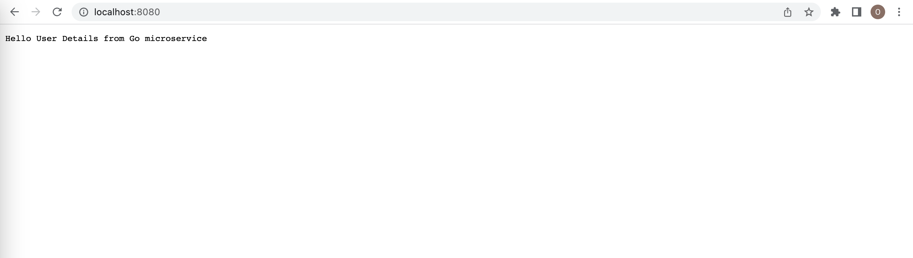
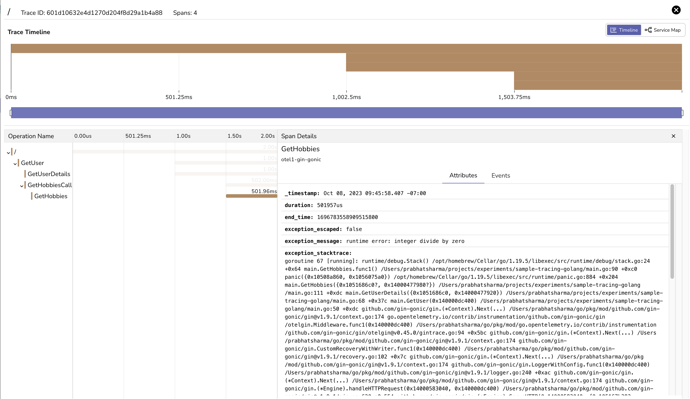

# Go

You can setup tracing for your Go application. Check sample configuration on how to setup traces.

## Clone 

```

git clone https://github.com/openobserve/sample-tracing-golang

```

If you don't have Go installed, please install it and then follow below steps.

Open `pkg/tel/otel_helper_http.go` file from that repository. and make changes to the highlighted lines below
```go linenums="1" hl_lines="29 38 36"

package tel

import (
	"context"
	"fmt"
	"os"

	"go.opentelemetry.io/otel"
	"go.opentelemetry.io/otel/attribute"
	"go.opentelemetry.io/otel/exporters/otlp/otlptrace/otlptracehttp"
	"go.opentelemetry.io/otel/propagation"
	"go.opentelemetry.io/otel/sdk/resource"
	sdktrace "go.opentelemetry.io/otel/sdk/trace"
	semconv "go.opentelemetry.io/otel/semconv/v1.4.0"
)

func InitTracerHTTP() *sdktrace.TracerProvider {
	otel.SetTextMapPropagator(propagation.NewCompositeTextMapPropagator(
		propagation.TraceContext{},
		propagation.Baggage{},
	))

	OTEL_OTLP_HTTP_ENDPOINT := os.Getenv("OTEL_OTLP_HTTP_ENDPOINT")

	if OTEL_OTLP_HTTP_ENDPOINT == "" {
		OTEL_OTLP_HTTP_ENDPOINT = "<host>:<port>" //without trailing slash
	}

	OTEL_OTLP_HTTP_ENDPOINT = "api.openobserve.ai"

	otlptracehttp.NewClient()

	otlpHTTPExporter, err := otlptracehttp.New(context.TODO(),
		// otlptracehttp.WithInsecure(), // use http & not https
		otlptracehttp.WithEndpoint(OTEL_OTLP_HTTP_ENDPOINT),
		otlptracehttp.WithURLPath("/api/default/v1/traces"),
		otlptracehttp.WithHeaders(map[string]string{
			"Authorization": "Authorization",
		}),
	)

	if err != nil {
		fmt.Println("Error creating HTTP OTLP exporter: ", err)
	}

	res := resource.NewWithAttributes(
		semconv.SchemaURL,
		// the service name used to display traces in backends
		semconv.ServiceNameKey.String("otel1-gin-gonic"),
		semconv.ServiceVersionKey.String("0.0.1"),
		attribute.String("environment", "test"),
	)

	tp := sdktrace.NewTracerProvider(
		sdktrace.WithSampler(sdktrace.AlwaysSample()),
		sdktrace.WithResource(res),
		sdktrace.WithBatcher(otlpHTTPExporter),
		// sdktrace.WithBatcher(stdExporter),
	)
	otel.SetTracerProvider(tp)

	return tp
}

```
## Setup up credentials 

- You will get `url` and `Authorization` key [here](https://cloud.openobserve.ai/web/ingestion/custom/traces/).
- Replace the `url` and `Authorization` key in the `pkg/tel/otel_helper_http.go` file.

## Setup Service/Application 
Follow the steps given in the sample-tracing-golang readme and then start server
```
go run .
```
The server is now running, navigate to [http://localhost:8080/](http://localhost:8080/)

Refresh page couple of times to get more traces exported.




Traces are captured, you can check these captured traces [here](https://cloud.openobserve.ai/web/traces).


Filter traces with your service name `otel1-gin-gonic`


Click on any trace to check trace data


Trace can have multiple spans, each span represents single operation or task within that trace. Click on any span to check span details.


