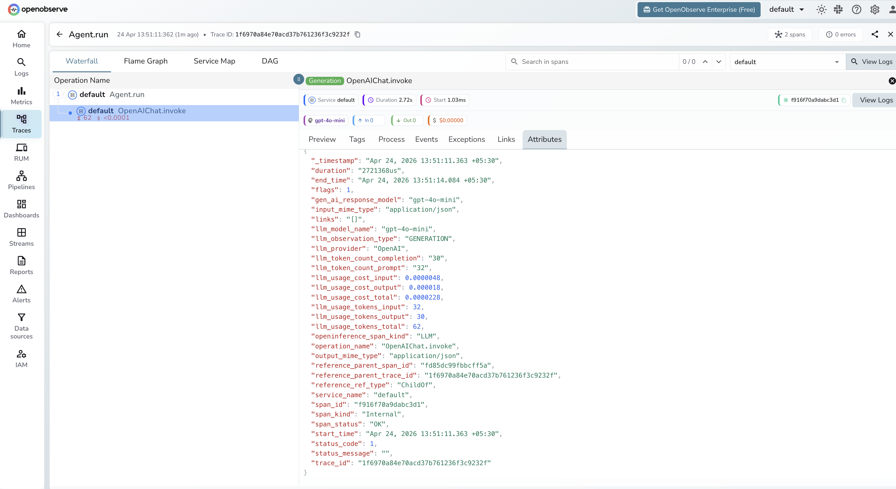

# **Agno → OpenObserve**

Automatically capture agent runs, tool calls, memory lookups, and LLM invocations for every Agno agent in your Python application.

## **Prerequisites**

* Python 3.9+
* An [OpenObserve](https://openobserve.ai/) account (cloud or self-hosted)
* Your OpenObserve **organisation ID** and **Base64-encoded auth token**
* An OpenAI API key (or whichever model backend your agents use)

## **Installation**

```shell
pip install openobserve-telemetry-sdk "openinference-instrumentation-agno==0.1.25" "agno==2.2.0" python-dotenv
```

## **Configuration**

Create a `.env` file in your project root:

```
# OpenObserve instance URL
# Default for self-hosted: http://localhost:5080
OPENOBSERVE_URL=https://api.openobserve.ai/

# Your OpenObserve organisation slug or ID
OPENOBSERVE_ORG=your_org_id

# Basic auth token — Base64-encoded "email:password"
OPENOBSERVE_AUTH_TOKEN=Basic <your_base64_token>

# LLM provider key
OPENAI_API_KEY=your-openai-key
```

## **Instrumentation**

Call `AgnoInstrumentor().instrument()` **before** importing Agno.

```python
from dotenv import load_dotenv
load_dotenv()

from openinference.instrumentation.agno import AgnoInstrumentor
from openobserve import openobserve_init

AgnoInstrumentor().instrument()
openobserve_init()

from agno.agent import Agent
from agno.models.openai import OpenAIChat

agent = Agent(
    model=OpenAIChat(id="gpt-4o-mini"),
    instructions="Answer questions concisely in one sentence.",
)

response = agent.run("What is OpenTelemetry?")
print(response.content)
```

### Agent with tools

```python
from agno.tools.duckduckgo import DuckDuckGoTools

agent = Agent(
    model=OpenAIChat(id="gpt-4o-mini"),
    tools=[DuckDuckGoTools()],
    instructions="Use DuckDuckGo to search for current information.",
)

response = agent.run("What is the latest version of Python?")
print(response.content)
```

## **What Gets Captured**

Each `agent.run()` call produces a root `AGENT` span with a child `LLM` span per model call, and additional `TOOL` spans when tools are invoked.

**LLM span**

| Attribute | Description |
| ----- | ----- |
| `openinference_span_kind` | `LLM` |
| `operation_name` | `OpenAIChat.invoke` |
| `llm_model_name` | Model used (e.g. `gpt-4o-mini`) |
| `llm_provider` | `OpenAI` |
| `llm_observation_type` | `GENERATION` |
| `llm_token_count_prompt` | Input token count |
| `llm_token_count_completion` | Output token count |
| `llm_usage_tokens_input` | Input tokens (numeric) |
| `llm_usage_tokens_output` | Output tokens (numeric) |
| `llm_usage_tokens_total` | Total tokens consumed |
| `llm_usage_cost_input` | Estimated input cost in USD |
| `llm_usage_cost_output` | Estimated output cost in USD |
| `gen_ai_response_model` | Model that handled the request |
| `duration` | Span latency |
| `span_status` | `OK` on success, `ERROR` on failure |

## **Viewing Traces**

1. Log in to OpenObserve and navigate to **Traces** in the left sidebar
2. Click any root agent span to open the waterfall view
3. Expand the trace to see the child `OpenAIChat.invoke` LLM span with token counts and cost
4. Filter by `llm_model_name` to compare performance across different models



## **Next Steps**

With Agno instrumented, every agent invocation is recorded in OpenObserve with a full span hierarchy. From here you can track token usage per agent run, measure tool latency, and monitor error rates across different agent configurations.

## **Read More**

- [LLM Observability Overview](../llm-applications.md)
- [Traces Ingestion with Python](../../../ingestion/traces/python.md)
- [Exploring Traces in OpenObserve](../../../user-guide/data-exploration/traces/)
- [Building Dashboards](../../../user-guide/analytics/dashboards/)
