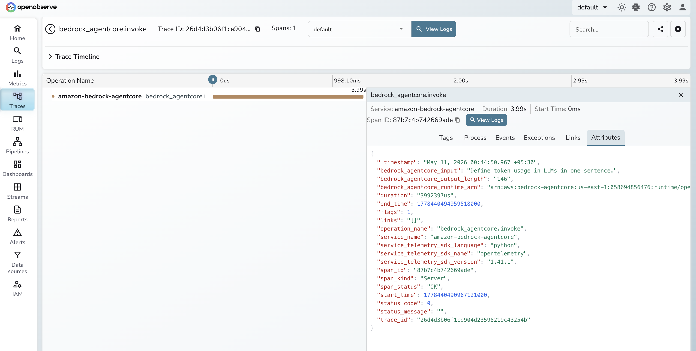

# **Amazon Bedrock AgentCore → OpenObserve**

Capture LLM call latency, token usage, model ID, and response metadata for every invocation made by agents built with Amazon Bedrock AgentCore. Bedrock AgentCore is AWS's framework for deploying production-ready AI agents. Instrumentation uses `openinference-instrumentation-bedrock` to automatically trace all boto3 Bedrock runtime calls, plus manual spans to capture AgentCore-level context.

## **Prerequisites**

* Python 3.10+
* An [OpenObserve](https://openobserve.ai/) account (cloud or self-hosted)
* Your OpenObserve **organisation ID** and **Base64-encoded auth token**
* AWS credentials with Bedrock access (`AWS_ACCESS_KEY_ID`, `AWS_SECRET_ACCESS_KEY`, `AWS_DEFAULT_REGION`)
* Access to Amazon Bedrock models in your AWS account

## **Installation**

```shell
pip install openobserve-telemetry-sdk openinference-instrumentation-bedrock bedrock-agentcore boto3 python-dotenv
```

## **Configuration**

Create a `.env` file in your project root:

```
OPENOBSERVE_URL=https://api.openobserve.ai/
OPENOBSERVE_ORG=your_org_id
OPENOBSERVE_AUTH_TOKEN=Basic <your_base64_token>
AWS_ACCESS_KEY_ID=your_access_key
AWS_SECRET_ACCESS_KEY=your_secret_key
AWS_DEFAULT_REGION=us-east-1
```

## **Instrumentation**

Call `BedrockInstrumentor().instrument()` before `openobserve_init()`. All boto3 Bedrock runtime calls are then automatically traced. Wrap each agent invocation in a manual span to attach AgentCore-specific attributes.

```python
from dotenv import load_dotenv
load_dotenv()

from openinference.instrumentation.bedrock import BedrockInstrumentor
from openobserve import openobserve_init

BedrockInstrumentor().instrument()
openobserve_init()

from opentelemetry import trace
import os
import boto3

tracer = trace.get_tracer(__name__)

client = boto3.client(
    "bedrock-runtime",
    region_name=os.environ.get("AWS_DEFAULT_REGION", "us-east-1"),
)

MODEL_ID = "us.amazon.nova-micro-v1:0"

def invoke_agent(prompt: str):
    with tracer.start_as_current_span("bedrock_agentcore.invoke") as span:
        span.set_attribute("bedrock_agentcore.model_id", MODEL_ID)
        span.set_attribute("bedrock_agentcore.input", prompt[:200])
        response = client.converse(
            modelId=MODEL_ID,
            messages=[{"role": "user", "content": [{"text": prompt}]}],
        )
        output = response["output"]["message"]["content"][0]["text"]
        usage = response.get("usage", {})
        span.set_attribute("bedrock_agentcore.output_length", len(output))
        span.set_attribute("bedrock_agentcore.input_tokens", usage.get("inputTokens", 0))
        span.set_attribute("bedrock_agentcore.output_tokens", usage.get("outputTokens", 0))
        span.set_attribute("bedrock_agentcore.stop_reason", response.get("stopReason", ""))
        span.set_attribute("span_status", "OK")
        return output

result = invoke_agent("What is distributed tracing?")
print(result)
```

## **What Gets Captured**

Each invocation produces a manual `bedrock_agentcore.invoke` root span with child spans from the OpenInference Bedrock instrumentation.

**`bedrock_agentcore.invoke` span (manual)**

| Attribute | Description |
| ----- | ----- |
| `bedrock_agentcore_model_id` | Bedrock model ID used for the call |
| `bedrock_agentcore_input` | First 200 characters of the input prompt |
| `bedrock_agentcore_output_length` | Character length of the model response |
| `bedrock_agentcore_input_tokens` | Prompt tokens consumed |
| `bedrock_agentcore_output_tokens` | Completion tokens generated |
| `bedrock_agentcore_stop_reason` | Why the model stopped (e.g. `end_turn`) |
| `span_status` | `OK` or `ERROR` |
| `duration` | End-to-end call latency |

**Auto-instrumented Bedrock child spans**

| Attribute | Description |
| ----- | ----- |
| `llm_model_name` | Bedrock model identifier |
| `llm_input_messages` | Serialised input messages |
| `llm_output_messages` | Serialised output messages |
| `llm_token_count_prompt` | Prompt token count |
| `llm_token_count_completion` | Completion token count |
| `llm_invocation_parameters` | Model parameters sent in the request |

## **Viewing Traces**

1. Log in to OpenObserve and navigate to **Traces**
2. Filter by operation name `bedrock_agentcore.invoke` to see all agent calls
3. Expand any trace to see the child spans from the Bedrock instrumentation
4. Click a child span to inspect token counts and model parameters
5. Filter by `span_status` `ERROR` to find failed invocations



## **Next Steps**

With Bedrock AgentCore instrumented, every agent invocation is recorded in OpenObserve. From here you can track per-model latency, monitor token consumption across agent runs, and alert on error spans to detect failed invocations before they impact users.

## **Read More**

- [LLM Observability Overview](../llm-applications.md)
- [Traces Ingestion with Python](../../../ingestion/traces/python.md)
- [Exploring Traces in OpenObserve](../../../user-guide/data-exploration/traces/)
- [Building Dashboards](../../../user-guide/analytics/dashboards/)
