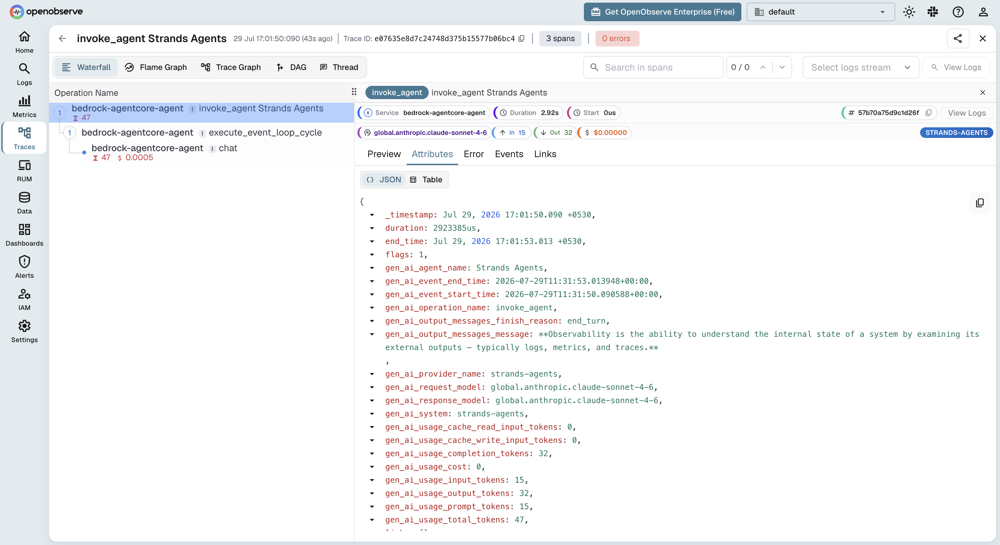

# **Amazon Bedrock AgentCore → OpenObserve**

Amazon Bedrock AgentCore is AWS's managed runtime for deploying and operating AI agents. There are two ways to get AgentCore telemetry into OpenObserve:

1. **Runtime OTLP export (recommended)** — the agent running inside AgentCore exports its own traces (model calls, tool invocations, agent loops) directly to OpenObserve via standard OpenTelemetry environment variables.
2. **Client-side spans** — wrap each `invoke_agent_runtime` call in a manual span to capture invocation latency and metadata from the calling application.

## **Prerequisites**

* Python 3.10+
* An [OpenObserve](https://openobserve.ai/) account (cloud or self-hosted)
* Your OpenObserve **organisation ID** and **Base64-encoded auth token**
* AWS credentials with `BedrockAgentCoreFullAccess` and `AmazonBedrockFullAccess` permissions
* For option 1: the [AgentCore starter toolkit](https://docs.aws.amazon.com/bedrock-agentcore/latest/devguide/runtime-getting-started.html) to deploy an agent
* For option 2: a deployed AgentCore runtime ARN

## **Option 1: Export Runtime Traces via OTLP**

Agents deployed to AgentCore emit OpenTelemetry traces. By default these go to CloudWatch through the AWS Distro for OpenTelemetry (ADOT); setting `DISABLE_ADOT_OBSERVABILITY=true` together with standard OTLP environment variables routes them to OpenObserve instead.

### **Create the agent**

`agent.py` — a minimal [Strands](strands-agents.md) agent hosted in AgentCore. The `StrandsTelemetry` call is required: it registers the OTLP exporter from the `OTEL_EXPORTER_OTLP_*` environment variables. Without it no spans are exported, because `DISABLE_ADOT_OBSERVABILITY=true` also turns off the ADOT auto-instrumentation that would otherwise do this.

```python
from strands.telemetry import StrandsTelemetry
StrandsTelemetry().setup_otlp_exporter()

from bedrock_agentcore.runtime import BedrockAgentCoreApp
from strands import Agent

app = BedrockAgentCoreApp()
agent = Agent()

@app.entrypoint
def invoke(payload):
    result = agent(payload.get("prompt", "Hello"))
    return {"result": result.message}

if __name__ == "__main__":
    app.run()
```

`requirements.txt`:

```
bedrock-agentcore
strands-agents[otel]
```

### **Deploy with OTLP environment variables**

Install the starter toolkit, then configure and launch the agent with the OpenObserve endpoint. The exporter appends `/v1/traces` automatically, so set the endpoint without the path suffix.

```shell
pip install bedrock-agentcore-starter-toolkit

agentcore configure --entrypoint agent.py

agentcore launch \
  --env DISABLE_ADOT_OBSERVABILITY=true \
  --env OTEL_EXPORTER_OTLP_PROTOCOL=http/protobuf \
  --env OTEL_EXPORTER_OTLP_ENDPOINT=https://api.openobserve.ai/api/your_org_id \
  --env "OTEL_EXPORTER_OTLP_HEADERS=Authorization=Basic <your_base64_token>" \
  --env OTEL_SERVICE_NAME=bedrock-agentcore-agent
```

For a self-hosted OpenObserve instance replace the endpoint, e.g. `http://your-host:5080/api/default`.

### **Invoke the agent**

```shell
agentcore invoke '{"prompt": "Explain observability in one sentence."}'
```

Each invocation produces a full trace in OpenObserve: the agent loop, every model call with token usage, and every tool invocation as child spans.

## **Option 2: Client-Side Invocation Spans**

If you only need invocation latency from the calling application, wrap each runtime call in a manual span.

Install dependencies:

```shell
pip install openobserve-telemetry-sdk boto3 python-dotenv
```

Create a `.env` file in your project root:

```
OPENOBSERVE_URL=https://api.openobserve.ai/
OPENOBSERVE_ORG=your_org_id
OPENOBSERVE_AUTH_TOKEN=Basic <your_base64_token>

AWS_ACCESS_KEY_ID=your-access-key-id
AWS_SECRET_ACCESS_KEY=your-secret-access-key
AWS_DEFAULT_REGION=your-aws-region
BEDROCK_AGENTCORE_RUNTIME_ARN=arn:aws:bedrock-agentcore:us-east-1:123456789012:runtime/your-runtime-id
```

```python
from dotenv import load_dotenv
load_dotenv()

from openobserve import openobserve_init
openobserve_init(resource_attributes={"service.name": "amazon-bedrock-agentcore"})

from opentelemetry import trace
import os, json, uuid, boto3

RUNTIME_ARN = os.environ["BEDROCK_AGENTCORE_RUNTIME_ARN"]

client = boto3.client(
    "bedrock-agentcore",
    region_name=os.environ.get("AWS_DEFAULT_REGION", "us-east-1"),
)

tracer = trace.get_tracer(__name__)

with tracer.start_as_current_span("bedrock_agentcore.invoke") as span:
    span.set_attribute("bedrock_agentcore.runtime_arn", RUNTIME_ARN)
    span.set_attribute("bedrock_agentcore.input", "Explain observability in one sentence.")

    response = client.invoke_agent_runtime(
        agentRuntimeArn=RUNTIME_ARN,
        runtimeSessionId=str(uuid.uuid4()),
        payload=json.dumps({"input": "Explain observability in one sentence."}).encode(),
        contentType="application/json",
        accept="application/json",
    )
    output = json.loads(response["response"].read()).get("output", "")
    span.set_attribute("bedrock_agentcore.output_length", len(output))
    print(output)
```

## **What Gets Captured**

With runtime OTLP export (option 1), each invocation produces a trace with spans `invoke_agent Strands Agents` → `execute_event_loop_cycle` → `chat`, plus one span per tool call, following the `gen_ai.*` semantic conventions:

| Attribute | Description |
|---|---|
| `gen_ai_agent_name` / `gen_ai_system` | Agent framework identifier (`Strands Agents` / `strands-agents`) |
| `gen_ai_operation_name` | Operation per span (e.g. `invoke_agent`, `chat`) |
| `gen_ai_request_model` / `gen_ai_response_model` | Model invoked by the agent |
| `gen_ai_usage_input_tokens` / `gen_ai_usage_output_tokens` / `gen_ai_usage_total_tokens` | Token usage per model call |
| `gen_ai_output_messages_message` | The agent's response text |
| `gen_ai_output_messages_finish_reason` | Why generation stopped (e.g. `end_turn`) |
| `span_status` | `OK` on success, `ERROR` on failure |
| `duration` | Latency of each step in the agent loop |

With client-side spans (option 2):

| Attribute | Description |
|---|---|
| `operation_name` | Always `bedrock_agentcore.invoke` |
| `bedrock_agentcore_runtime_arn` | ARN of the invoked runtime |
| `bedrock_agentcore_input` | Input text sent to the agent |
| `bedrock_agentcore_output_length` | Character length of the response |
| `span_status` | `OK` on success, `ERROR` on failure |
| `duration` | End-to-end invocation latency |

## **Viewing Traces**

1. Log in to OpenObserve and navigate to **Traces** in the left sidebar
2. Filter by `service_name = bedrock-agentcore-agent` (option 1) or `service_name = amazon-bedrock-agentcore` (option 2)
3. Click a span to inspect latency, token usage, and input/output attributes



## **Next Steps**

Track agent latency over time, set alerts on slow or failing invocations, monitor token usage per model call, and correlate agent spans with downstream Bedrock model calls.

## **Read More**

- [LLM Observability Overview](../llm-applications.md)
- [Strands Agents](strands-agents.md)
- [Amazon Bedrock](../providers/amazon-bedrock.md)
- [Explore Traces](../../../user-guide/data-exploration/traces/index.md)
- [Alerts](../../../user-guide/analytics/alerts/index.md)
