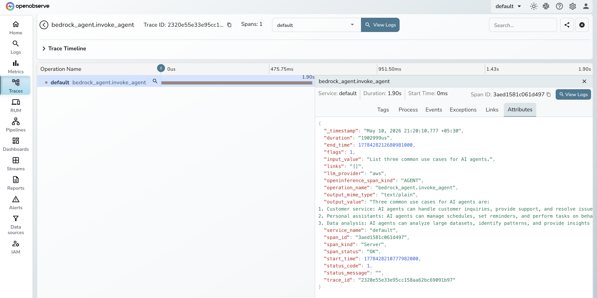

# **Amazon Bedrock Agents → OpenObserve**

Automatically capture latency and invocation metadata for every Amazon Bedrock Agent call using the OpenInference Bedrock instrumentation.

## **Prerequisites**

* Python 3.8+
* An [OpenObserve](https://openobserve.ai/) account (cloud or self-hosted)
* Your OpenObserve **organisation ID** and **Base64-encoded auth token**
* AWS credentials with `AmazonBedrockFullAccess` permissions
* A Bedrock Agent with an Agent ID and Alias ID. See [Create a Bedrock agent](https://docs.aws.amazon.com/bedrock/latest/userguide/agents-create.html).

## **Installation**

```shell
pip install openobserve-telemetry-sdk openinference-instrumentation-bedrock boto3 python-dotenv
```

## **Configuration**

Create a `.env` file in your project root:

```
OPENOBSERVE_URL=https://api.openobserve.ai/
OPENOBSERVE_ORG=your_org_id
OPENOBSERVE_AUTH_TOKEN=Basic <your_base64_token>

AWS_ACCESS_KEY_ID=your-access-key-id
AWS_SECRET_ACCESS_KEY=your-secret-access-key
AWS_DEFAULT_REGION=your-aws-region
BEDROCK_AGENT_ID=your-agent-id
BEDROCK_AGENT_ALIAS_ID=TSTALIASID
```

## **Instrumentation**

Call `BedrockInstrumentor().instrument()` before creating any boto3 client.

```python
from dotenv import load_dotenv
load_dotenv()

from openinference.instrumentation.bedrock import BedrockInstrumentor
from openobserve import openobserve_init

BedrockInstrumentor().instrument()
openobserve_init(resource_attributes={"service.name": "amazon-bedrock-agents"})

import os, uuid, boto3

client = boto3.client(
    "bedrock-agent-runtime",
    region_name=os.environ.get("AWS_DEFAULT_REGION", "us-east-1"),
)

response = client.invoke_agent(
    agentId=os.environ["BEDROCK_AGENT_ID"],
    agentAliasId=os.environ.get("BEDROCK_AGENT_ALIAS_ID", "TSTALIASID"),
    sessionId=str(uuid.uuid4()),
    inputText="What can you help me with?",
)
completion = ""
for event in response.get("completion", []):
    if "chunk" in event:
        completion += event["chunk"]["bytes"].decode("utf-8")
print(completion)
```

## **What Gets Captured**

| Attribute | Description |
|---|---|
| `operation_name` | Always `bedrock_agent.invoke_agent` |
| `openinference_span_kind` | Always `AGENT` |
| `llm_provider` | Always `aws` |
| `input_value` | Text sent to the agent |
| `output_value` | Agent response text |
| `output_mime_type` | Always `text/plain` |
| `span_status` | `OK` on success, `ERROR` on failure |
| `duration` | End-to-end invocation latency |

## **Viewing Traces**

1. Log in to OpenObserve and navigate to **Traces** in the left sidebar
2. Click any `bedrock_agent.invoke_agent` span to inspect latency and input/output content



## **Next Steps**

Track agent response times, monitor failure rates, and correlate agent spans with the rest of your application traces.

## **Read More**

- [LLM Observability Overview](../llm-applications.md)
- [Amazon Bedrock](../providers/amazon-bedrock.md)
- [Explore Traces](../../../user-guide/data-exploration/traces/index.md)
- [Alerts](../../../user-guide/analytics/alerts/index.md)
