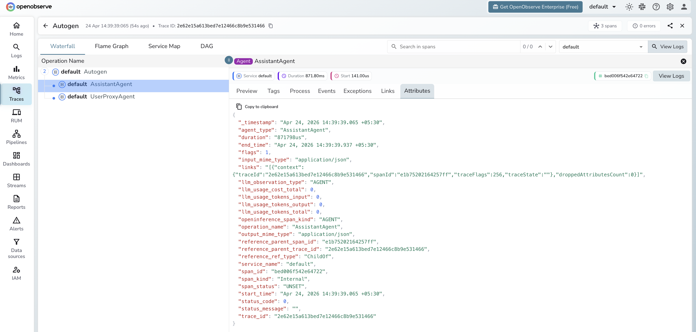

# **AutoGen → OpenObserve**

Automatically capture agent conversations, LLM calls, and tool executions for every AutoGen multi-agent workflow in your Python application.

## **Prerequisites**

* Python 3.9+
* An [OpenObserve](https://openobserve.ai/) account (cloud or self-hosted)
* Your OpenObserve **organisation ID** and **Base64-encoded auth token**
* An OpenAI API key (or whichever LLM backend your agents use)

## **Installation**

```shell
pip install openobserve-telemetry-sdk openinference-instrumentation-autogen "ag2==0.9.0" python-dotenv
```

The `ag2` package is the maintained fork of `pyautogen` and imports as `autogen`.

## **Configuration**

Create a `.env` file in your project root:

```
# OpenObserve instance URL
# Default for self-hosted: http://localhost:5080
OPENOBSERVE_URL=https://api.openobserve.ai/

# Your OpenObserve organisation slug or ID
OPENOBSERVE_ORG=your_org_id

# Basic auth token — Base64-encoded "email:password"
OPENOBSERVE_AUTH_TOKEN=Basic <your_base64_token>

# LLM provider key
OPENAI_API_KEY=your-openai-key
```

## **Instrumentation**

Call `AutogenInstrumentor().instrument()` **before** importing AutoGen.

```python
from dotenv import load_dotenv
load_dotenv()

from openinference.instrumentation.autogen import AutogenInstrumentor
from openobserve import openobserve_init

AutogenInstrumentor().instrument()
openobserve_init()

import os
import autogen

config_list = [{"model": "gpt-4o-mini", "api_key": os.environ["OPENAI_API_KEY"]}]

assistant = autogen.AssistantAgent(
    name="assistant",
    llm_config={"config_list": config_list},
    system_message="You are a helpful assistant. Keep answers brief.",
)

user = autogen.UserProxyAgent(
    name="user",
    human_input_mode="NEVER",
    max_consecutive_auto_reply=1,
    is_termination_msg=lambda x: True,
)

user.initiate_chat(assistant, message="Explain OpenTelemetry in one sentence.")
```

### Two-agent conversation

```python
researcher = autogen.AssistantAgent(
    name="researcher",
    llm_config={"config_list": config_list},
    system_message="You research questions and provide factual answers.",
)

critic = autogen.AssistantAgent(
    name="critic",
    llm_config={"config_list": config_list},
    system_message="You review answers and confirm if they are correct. Reply TERMINATE when done.",
)

user = autogen.UserProxyAgent(
    name="user",
    human_input_mode="NEVER",
    max_consecutive_auto_reply=0,
)

user.initiate_chat(
    researcher,
    message="What is the capital of France?",
    max_turns=2,
)
```

## **What Gets Captured**

Each `initiate_chat()` call produces a root span with child `AGENT` spans per agent and `LLM` spans for each model call.

**Agent span**

| Attribute | Description |
| ----- | ----- |
| `openinference_span_kind` | `AGENT` |
| `operation_name` | Agent class name (e.g. `AssistantAgent`) |
| `agent_type` | Agent class name (e.g. `AssistantAgent`) |
| `llm_observation_type` | `AGENT` |
| `input_mime_type` | `application/json` |
| `output_mime_type` | `application/json` |
| `duration` | Agent turn latency |
| `span_status` | `UNSET` on success, `ERROR` on failure |

Token counts and model name appear on the child `LLM` spans beneath each agent span.

## **Viewing Traces**

1. Log in to OpenObserve and navigate to **Traces** in the left sidebar
2. Click any root conversation span to open the waterfall view
3. Expand the tree to see each `AssistantAgent` span and its child LLM calls
4. Filter by `operation_name = AssistantAgent` to find all agent spans



## **Next Steps**

With AutoGen instrumented, every multi-agent conversation is recorded in OpenObserve with the full sequence of LLM calls. From here you can track how many turns a conversation takes, measure token usage per agent, and identify which agents drive the most cost.

## **Read More**

- [LLM Observability Overview](../llm-applications.md)
- [Traces Ingestion with Python](../../../ingestion/traces/python.md)
- [Exploring Traces in OpenObserve](../../../user-guide/data-exploration/traces/)
- [Building Dashboards](../../../user-guide/analytics/dashboards/)
