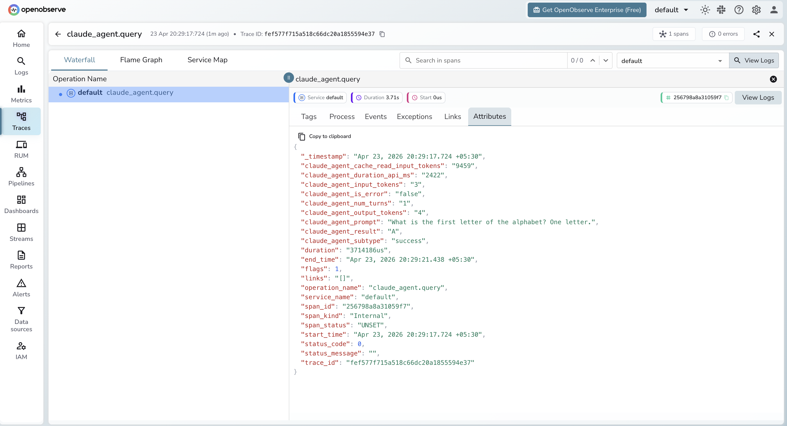

# **Claude Agent SDK → OpenObserve**

Capture agent query timing, token usage, turn counts, and error status for every agent run built with Anthropic's Claude Agent SDK. The SDK does not include a built-in OTel instrumentor, so traces are created by wrapping `query()` calls in manual spans and extracting usage data from `ResultMessage`.

## **Prerequisites**

* Python 3.10+
* Claude Code CLI installed (`npm install -g @anthropic-ai/claude-code` or existing Claude Code installation)
* An [OpenObserve](https://openobserve.ai/) account (cloud or self-hosted)
* Your OpenObserve **organisation ID** and **Base64-encoded auth token**
* An Anthropic API key

## **Installation**

```shell
pip install openobserve-telemetry-sdk claude-agent-sdk python-dotenv
```

## **Configuration**

Create a `.env` file in your project root:

```
# OpenObserve instance URL
# Default for self-hosted: http://localhost:5080
OPENOBSERVE_URL=https://api.openobserve.ai/

# Your OpenObserve organisation slug or ID
OPENOBSERVE_ORG=your_org_id

# Basic auth token — Base64-encoded "email:password"
OPENOBSERVE_AUTH_TOKEN=Basic <your_base64_token>

# Anthropic API key
ANTHROPIC_API_KEY=your-anthropic-key
```

## **Instrumentation**

The Claude Agent SDK runs Claude Code CLI as a subprocess and has no built-in OTel instrumentation. Call `openobserve_init()` to set up the tracer provider, then wrap each `query()` call in a manual span and extract usage data from the `ResultMessage`.

```python
import asyncio
from dotenv import load_dotenv
load_dotenv()

from openobserve import openobserve_init
openobserve_init()

from opentelemetry import trace
from claude_agent_sdk import query, ClaudeAgentOptions, ResultMessage

tracer = trace.get_tracer(__name__)


async def run_agent(prompt: str):
    options = ClaudeAgentOptions(
        allowed_tools=["Read", "Glob"],
        permission_mode="dontAsk",
        max_turns=3,
    )
    with tracer.start_as_current_span("claude_agent.query") as span:
        span.set_attribute("claude_agent.prompt", prompt[:100])
        async for message in query(prompt=prompt, options=options):
            if isinstance(message, ResultMessage):
                span.set_attribute("claude_agent.subtype", message.subtype)
                span.set_attribute("claude_agent.num_turns", message.num_turns)
                span.set_attribute("claude_agent.is_error", message.is_error)
                span.set_attribute("claude_agent.duration_api_ms", message.duration_api_ms)
                if message.usage:
                    span.set_attribute("claude_agent.input_tokens", message.usage.get("input_tokens", 0))
                    span.set_attribute("claude_agent.output_tokens", message.usage.get("output_tokens", 0))
                    span.set_attribute("claude_agent.cache_read_input_tokens", message.usage.get("cache_read_input_tokens", 0))


asyncio.run(run_agent("List the Python files in this directory."))
```

If Claude Code CLI is not on your `PATH`, pass its location explicitly:

```python
options = ClaudeAgentOptions(
    cli_path="/path/to/claude",
    permission_mode="dontAsk",
    max_turns=3,
)
```

## **What Gets Captured**

Each `query()` call produces one span containing the following attributes sourced from `ResultMessage`.

| Attribute | Description |
| ----- | ----- |
| `claude_agent_prompt` | First 100 characters of the prompt |
| `claude_agent_subtype` | `success` or `error_during_execution` |
| `claude_agent_num_turns` | Number of agentic turns executed |
| `claude_agent_is_error` | `true` if the agent encountered an error |
| `claude_agent_duration_api_ms` | Time spent in API calls (milliseconds) |
| `claude_agent_input_tokens` | Total input tokens consumed |
| `claude_agent_output_tokens` | Total output tokens generated |
| `claude_agent_cache_read_input_tokens` | Input tokens served from prompt cache |
| `duration` | End-to-end span latency |

## **Viewing Traces**

1. Log in to OpenObserve and navigate to **Traces**
2. Filter by operation name `claude_agent.query` to find agent spans
3. Click any span to inspect token usage, turn count, and duration
4. Use `claude_agent_is_error = true` to filter for failed runs



## **Next Steps**

With Claude Agent SDK instrumented, every agent run is recorded in OpenObserve. From here you can track token usage per prompt type, measure multi-turn agent costs, and alert on error runs.

## **Read More**

- [LLM Observability Overview](../llm-applications.md)
- [Anthropic (Python)](../providers/anthropic.md)
- [Traces Ingestion with Python](../../../ingestion/traces/python.md)
- [Exploring Traces in OpenObserve](../../../user-guide/data-exploration/traces/)
