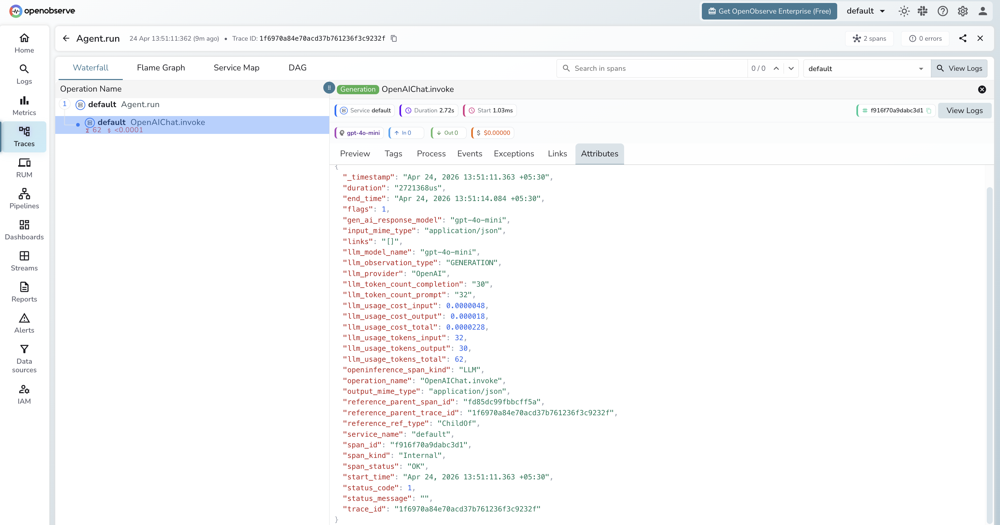

# **CrewAI → OpenObserve**

Automatically capture crew executions, agent runs, task completions, and all nested LLM calls for every CrewAI workflow in your Python application.

## **Prerequisites**

* Python 3.10+
* An [OpenObserve](https://openobserve.ai/) account (cloud or self-hosted)
* Your OpenObserve **organisation ID** and **Base64-encoded auth token**
* An OpenAI API key (or whichever LLM provider your agents use)

## **Installation**

```shell
pip install openobserve-telemetry-sdk opentelemetry-instrumentation-crewai crewai python-dotenv
```

## **Configuration**

Create a `.env` file in your project root:

```
# OpenObserve instance URL
# Default for self-hosted: http://localhost:5080
OPENOBSERVE_URL=https://api.openobserve.ai/

# Your OpenObserve organisation slug or ID
OPENOBSERVE_ORG=your_org_id

# Basic auth token — Base64-encoded "email:password"
OPENOBSERVE_AUTH_TOKEN=Basic <your_base64_token>

# LLM provider key (whichever backend CrewAI is calling)
OPENAI_API_KEY=your-openai-key
```

## **Instrumentation**

Set up `openobserve_init()` first, then call `CrewAIInstrumentor().instrument()`. Also set `CREWAI_TELEMETRY_OPT_OUT=true` to disable CrewAI's own internal telemetry, which would otherwise conflict with the OTel provider.

```python
from dotenv import load_dotenv
load_dotenv()

import os
os.environ["CREWAI_TELEMETRY_OPT_OUT"] = "true"

from openobserve import openobserve_init
from opentelemetry.instrumentation.crewai import CrewAIInstrumentor

CrewAIInstrumentor().instrument()
openobserve_init()

from crewai import Agent, Task, Crew, Process

researcher = Agent(
    role="Researcher",
    goal="Find concise, factual answers.",
    backstory="You are a precise researcher who answers questions directly.",
    verbose=False,
)

task = Task(
    description="Explain what OpenTelemetry is in two sentences.",
    expected_output="A two-sentence explanation of OpenTelemetry.",
    agent=researcher,
)

crew = Crew(
    agents=[researcher],
    tasks=[task],
    process=Process.sequential,
    verbose=False,
)

result = crew.kickoff()
print("Result:", result)
```

## **What Gets Captured**

Each `crew.kickoff()` call produces a root `crewai.workflow` span with child spans for each agent run and task execution.

| Attribute | Description |
| ----- | ----- |
| `gen_ai_system` | `crewai` |
| `gen_ai_operation_name` | `invoke_agent` |
| `llm_observation_type` | `AGENT` for agent spans |
| `traceloop_span_kind` | `task` for task spans, `agent` for agent spans |
| `operation_name` | Task description with `.task` suffix |
| `crewai_task_description` | Full task description |
| `crewai_task_expected_output` | Configured expected output |
| `crewai_task_agent` | Agent assigned to the task |
| `crewai_task_id` | Unique task ID |
| `crewai_task_processed_by_agents` | Agent(s) that executed the task |
| `crewai_task_retry_count` | Number of retry attempts |
| `crewai_task_tools` | Tools available to the task |
| `crewai_task_used_tools` | Number of tools actually used |
| `duration` | Span latency |
| `span_status` | `OK` on success, `ERROR` on failure |

## **Viewing Traces**

1. Log in to OpenObserve and navigate to **Traces** in the left sidebar
2. Filter by `gen_ai_system = crewai` to find CrewAI traces
3. Click any root `crewai.workflow` span to open the full hierarchy
4. Expand the tree to see agent spans, task spans, and nested LLM calls



## **Next Steps**

With CrewAI instrumented, every crew execution is recorded in OpenObserve with a full span hierarchy. From here you can track which agents consume the most tokens, compare task latency across runs, and set alerts on error spans from failed agent executions.

## **Read More**

- [LLM Observability Overview](../llm-applications.md)
- [Traces Ingestion with Python](../../../ingestion/traces/python.md)
- [Exploring Traces in OpenObserve](../../../user-guide/data-exploration/traces/)
- [Building Dashboards](../../../user-guide/analytics/dashboards/)
