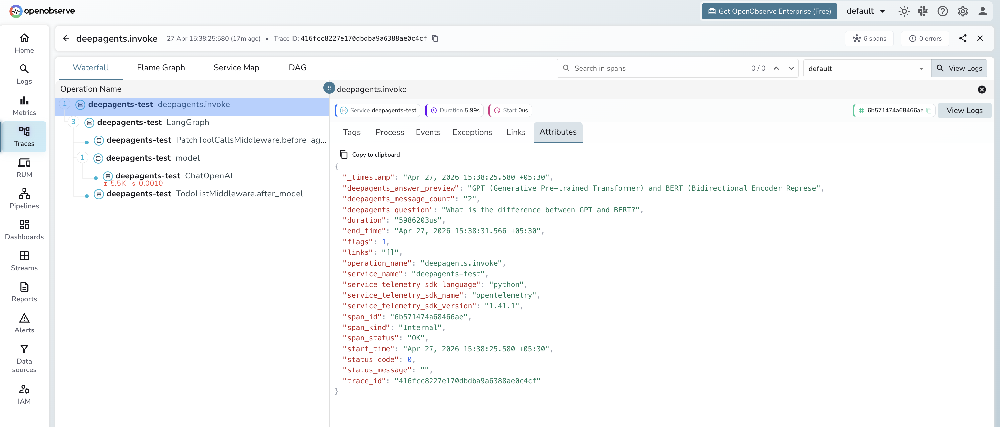

# **LangChain DeepAgents → OpenObserve**

Capture agent invocation latency, LangChain call chains, and message counts for every DeepAgents run. DeepAgents is an agent harness built on LangChain and LangGraph with built-in planning and subagent support for complex multi-step tasks. Instrumentation uses `openinference-instrumentation-langchain` to automatically trace all LLM and LangGraph calls, plus manual spans to capture agent-level context.

## **Prerequisites**

* Python 3.11+
* An [OpenObserve](https://openobserve.ai/) account (cloud or self-hosted)
* Your OpenObserve **organisation ID** and **Base64-encoded auth token**
* An OpenAI API key

## **Installation**

```shell
pip install openobserve-telemetry-sdk openinference-instrumentation-langchain \
  deepagents langchain-openai python-dotenv
```

## **Configuration**

Create a `.env` file in your project root:

```
OPENOBSERVE_URL=https://api.openobserve.ai/
OPENOBSERVE_ORG=your_org_id
OPENOBSERVE_AUTH_TOKEN=Basic <your_base64_token>
OPENAI_API_KEY=your-openai-api-key
```

## **Instrumentation**

Call `LangChainInstrumentor().instrument()` before `openobserve_init()`. DeepAgents builds on LangGraph, so all LangChain and LangGraph calls are automatically traced as child spans. Wrap each `agent.invoke()` call in a manual root span to attach your own attributes.

```python
from dotenv import load_dotenv
load_dotenv()

from openinference.instrumentation.langchain import LangChainInstrumentor
LangChainInstrumentor().instrument()

from openobserve import openobserve_init, openobserve_shutdown
openobserve_init(resource_attributes={"service.name": "my-app"})

from opentelemetry import trace
from langchain_openai import ChatOpenAI
from deepagents import create_deep_agent

tracer = trace.get_tracer(__name__)

model = ChatOpenAI(model="gpt-4o-mini", temperature=0)
agent = create_deep_agent(model=model, tools=[])

with tracer.start_as_current_span("deepagents.invoke") as span:
    span.set_attribute("deepagents.question", "What is distributed tracing?")
    result = agent.invoke({
        "messages": [{"role": "user", "content": "What is distributed tracing?"}]
    })
    messages = result.get("messages", [])
    answer = messages[-1].content[:80] if messages else ""
    span.set_attribute("deepagents.answer_preview", answer)
    span.set_attribute("deepagents.message_count", len(messages))
    span.set_attribute("span_status", "OK")
    print(answer)

openobserve_shutdown()
```

## **What Gets Captured**

Each agent run produces a manual `deepagents.invoke` root span with child spans from the LangChain instrumentation for every LLM call and LangGraph node execution.

**`deepagents.invoke` span (manual root)**

| Attribute | Description |
| ----- | ----- |
| `deepagents_question` | The user prompt passed to the agent |
| `deepagents_answer_preview` | First 80 characters of the final agent response |
| `deepagents_message_count` | Total messages in the agent result |
| `span_status` | `OK` or `ERROR` |
| `error_message` | Error detail on failed runs |
| `duration` | End-to-end agent run latency |

**LangChain child spans (auto-instrumented)**

| Span name | Description |
| ----- | ----- |
| `ChatOpenAI` | Each LLM call with model name, input, output, and token counts |
| `LangGraph` | LangGraph node execution for the agent graph |
| `PatchToolCallsMiddleware.before_agent` | Middleware pre-processing step |
| `TodoListMiddleware.after_model` | Post-model processing middleware |

## **Viewing Traces**

1. Log in to OpenObserve and navigate to **Traces**
2. Filter by `service_name = deepagents-test` to see all agent spans
3. Filter by `operation_name = deepagents.invoke` to see the root spans for each run
4. Expand any trace to see the full LangGraph span tree with nested LLM calls
5. Filter by `span_status = ERROR` to find failed agent runs



## **Next Steps**

With DeepAgents instrumented, every agent run is recorded in OpenObserve. From here you can track end-to-end agent latency, inspect the full LangGraph execution tree, and compare token consumption across different prompts.

## **Read More**

- [LLM Observability Overview](../llm-applications.md)
- [LangChain](./langchain.md)
- [Traces Ingestion with Python](../../../ingestion/traces/python.md)
- [Exploring Traces in OpenObserve](../../../user-guide/data-exploration/traces/)
