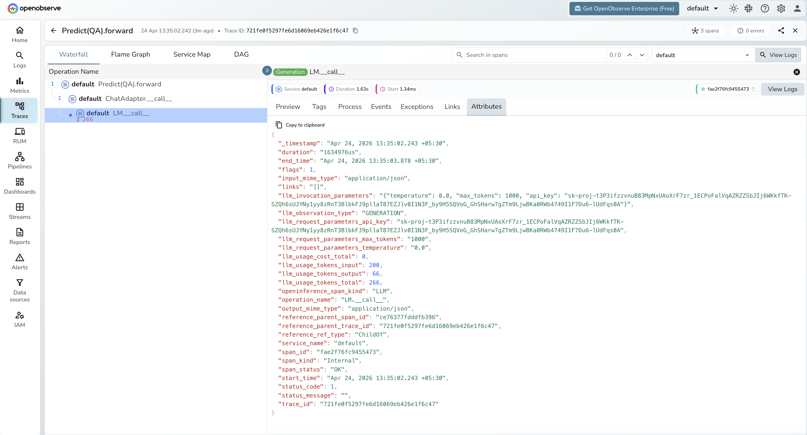

# **DSPy → OpenObserve**

Automatically capture module executions, LLM calls, and optimiser runs for every DSPy program in your Python application.

## **Prerequisites**

* Python 3.9+
* An [OpenObserve](https://openobserve.ai/) account (cloud or self-hosted)
* Your OpenObserve **organisation ID** and **Base64-encoded auth token**
* An OpenAI API key (or whichever LLM backend DSPy is calling)

## **Installation**

```shell
pip install openobserve-telemetry-sdk "openinference-instrumentation-dspy==0.1.16" "dspy==2.6.13" python-dotenv
```

## **Configuration**

Create a `.env` file in your project root:

```
# OpenObserve instance URL
# Default for self-hosted: http://localhost:5080
OPENOBSERVE_URL=https://api.openobserve.ai/

# Your OpenObserve organisation slug or ID
OPENOBSERVE_ORG=your_org_id

# Basic auth token — Base64-encoded "email:password"
OPENOBSERVE_AUTH_TOKEN=Basic <your_base64_token>

# LLM provider key
OPENAI_API_KEY=your-openai-key
```

## **Instrumentation**

Call `DSPyInstrumentor().instrument()` **before** importing DSPy.

```python
from dotenv import load_dotenv
load_dotenv()

from openinference.instrumentation.dspy import DSPyInstrumentor
from openobserve import openobserve_init

DSPyInstrumentor().instrument()
openobserve_init()

import os
import dspy

lm = dspy.LM("openai/gpt-4o-mini", api_key=os.environ["OPENAI_API_KEY"])
dspy.configure(lm=lm)


class QA(dspy.Signature):
    """Answer questions with short factual answers."""
    question: str = dspy.InputField()
    answer: str = dspy.OutputField()


predict = dspy.Predict(QA)
result = predict(question="What is OpenTelemetry?")
print(result.answer)
```

### Chain of thought

```python
chain_of_thought = dspy.ChainOfThought(QA)
result = chain_of_thought(question="Why is distributed tracing useful?")
print(result.reasoning)
print(result.answer)
```

## **What Gets Captured**

Each DSPy module call produces a root `CHAIN` span with a child `LLM` span for each underlying model call.

**Module span (CHAIN)**

| Attribute | Description |
| ----- | ----- |
| `openinference_span_kind` | `CHAIN` |
| `operation_name` | Module and method name (e.g. `Predict(QA).forward`) |
| `llm_observation_type` | `CHAIN` |
| `input_mime_type` | `application/json` |
| `output_mime_type` | `application/json` |
| `duration` | End-to-end module latency |
| `span_status` | `OK` on success, `ERROR` on failure |

**LLM call span (LLM)**

| Attribute | Description |
| ----- | ----- |
| `openinference_span_kind` | `LLM` |
| `operation_name` | `LM.__call__` |
| `llm_observation_type` | `GENERATION` |
| `llm_invocation_parameters` | JSON string with temperature, max_tokens, and other call parameters |
| `llm_request_parameters_temperature` | Temperature setting for the call |
| `llm_request_parameters_max_tokens` | Max tokens configured |
| `llm_usage_tokens_input` | Prompt token count |
| `llm_usage_tokens_output` | Completion token count |
| `llm_usage_tokens_total` | Total tokens consumed |
| `span_status` | `OK` on success, `ERROR` on failure |

Note: `llm_invocation_parameters` includes the API key in plaintext. Avoid exposing raw span data in dashboards shared with untrusted viewers.

## **Viewing Traces**

1. Log in to OpenObserve and navigate to **Traces** in the left sidebar
2. Filter by `operation_name` containing `forward` to find DSPy module spans
3. Click any span to expand the trace and see the child `LM.__call__` LLM span
4. Inspect `llm_usage_tokens_input` and `llm_usage_tokens_output` on the LLM span for token counts



## **Next Steps**

With DSPy instrumented, every module execution is recorded in OpenObserve with the full chain of LLM calls that produced the output. From here you can track token usage per module, compare latency across optimisation strategies, and monitor the effect of compiled prompts on cost and speed.

## **Read More**

- [LLM Observability Overview](../llm-applications.md)
- [Traces Ingestion with Python](../../../ingestion/traces/python.md)
- [Exploring Traces in OpenObserve](../../../user-guide/data-exploration/traces/)
- [Building Dashboards](../../../user-guide/analytics/dashboards/)
