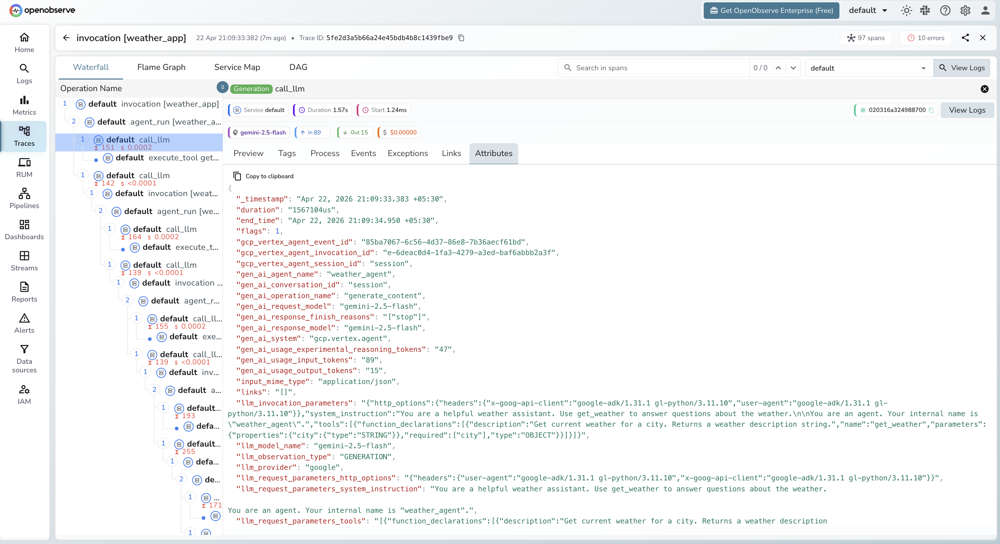

# **Google ADK → OpenObserve**

Automatically capture agent runs, LLM calls, tool executions, and token usage for every Google ADK agent in your Python application.

## **Prerequisites**

* Python 3.10+
* An [OpenObserve](https://openobserve.ai/) account (cloud or self-hosted)
* Your OpenObserve **organisation ID** and **Base64-encoded auth token**
* A [Google AI Studio](https://aistudio.google.com/) API key (`GOOGLE_API_KEY`)

## **Installation**

```shell
pip install openobserve-telemetry-sdk openinference-instrumentation-google-adk google-adk python-dotenv
```

## **Configuration**

Create a `.env` file in your project root:

```
# OpenObserve instance URL
# Default for self-hosted: http://localhost:5080
OPENOBSERVE_URL=https://api.openobserve.ai/

# Your OpenObserve organisation slug or ID
OPENOBSERVE_ORG=your_org_id

# Basic auth token — Base64-encoded "email:password"
OPENOBSERVE_AUTH_TOKEN=Basic <your_base64_token>

# Google AI Studio API key
GOOGLE_API_KEY=your-google-api-key
```

## **Instrumentation**

Call `GoogleADKInstrumentor().instrument()` **before** importing any ADK modules.

```python
from dotenv import load_dotenv
load_dotenv()

from openinference.instrumentation.google_adk import GoogleADKInstrumentor
from openobserve import openobserve_init

GoogleADKInstrumentor().instrument()
openobserve_init()

import asyncio
from google.adk import Agent, Runner
from google.adk.sessions import InMemorySessionService
from google.genai import types


def get_weather(city: str) -> str:
    """Get current weather for a city."""
    return f"Sunny, 22°C in {city}"


agent = Agent(
    name="weather_agent",
    model="gemini-2.5-flash",
    instruction="You are a helpful assistant. Use get_weather for weather questions.",
    tools=[get_weather],
)

session_service = InMemorySessionService()
runner = Runner(agent=agent, session_service=session_service, app_name="my_app")


async def main():
    await session_service.create_session(
        app_name="my_app", user_id="user1", session_id="session1"
    )
    content = types.Content(
        role="user",
        parts=[types.Part.from_text(text="What's the weather in London?")],
    )
    async for event in runner.run_async(
        user_id="user1", session_id="session1", new_message=content
    ):
        if event.content and event.content.parts:
            for part in event.content.parts:
                if getattr(part, "text", None):
                    print(part.text)


asyncio.run(main())
```

## **What Gets Captured**

Each agent invocation produces a trace with a hierarchy of spans: `invocation [<app_name>]` at the root, `agent_run [<agent_name>]` for the agent execution, `call_llm` for each LLM API call, and `execute_tool <tool_name>` for each tool invocation. Multi-turn agents produce multiple `call_llm` spans within a single `agent_run`.

| Attribute | Description |
| ----- | ----- |
| `gcp_vertex_agent_name` | Agent name (e.g. `weather_agent`) |
| `gcp_vertex_agent_invocation_id` | Unique ID for the agent invocation |
| `gen_ai_request_model` | Model used (e.g. `gemini-2.5-flash`) |
| `gen_ai_system` | `gcp.vertex.agent` |
| `gen_ai_conversation_id` | Session identifier passed to the runner |
| `llm_usage_input_tokens` | Input tokens for the LLM call |
| `llm_usage_output_tokens` | Output tokens for the LLM call |
| `llm_usage_tokens_total` | Total tokens consumed |
| `llm_usage_cost_input` | Estimated input cost in USD |
| `llm_usage_cost_output` | Estimated output cost in USD |
| `llm_token_count_completion_details_reasoning` | Reasoning tokens (Gemini 2.5 thinking budget) |
| `user_id` | User identifier passed to the runner |
| `duration` | Span latency |
| `span_status` | `OK` or `ERROR` |

## **Viewing Traces**

1. Log in to OpenObserve and navigate to **Traces** in the left sidebar
2. Click any `invocation [<app_name>]` root span to open the waterfall view
3. Expand the tree to see `agent_run`, `call_llm`, and `execute_tool` child spans
4. Click a `call_llm` span to inspect token counts, model, and cost for that specific LLM call



## **Next Steps**

With Google ADK instrumented, every agent invocation is recorded in OpenObserve with a full span hierarchy. From here you can track token usage per agent run, compare latency across tools and LLM calls, and set alerts on error spans from failed tool executions.

## **Read More**

- [LLM Observability Overview](../llm-applications.md)
- [Traces Ingestion with Python](../../../ingestion/traces/python.md)
- [Exploring Traces in OpenObserve](../../../user-guide/data-exploration/traces/)
- [Building Dashboards](../../../user-guide/analytics/dashboards/)
