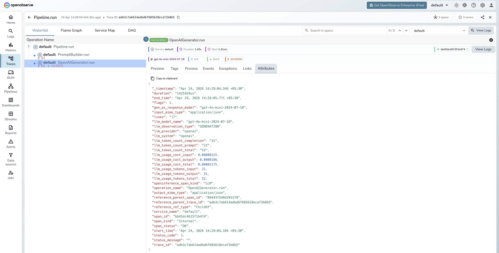

# **Haystack → OpenObserve**

Automatically capture pipeline runs, component executions, and LLM calls for every Haystack v2 pipeline in your Python application.

## **Prerequisites**

* Python 3.10+
* An [OpenObserve](https://openobserve.ai/) account (cloud or self-hosted)
* Your OpenObserve **organisation ID** and **Base64-encoded auth token**
* An OpenAI API key (or whichever generator component you use)

## **Installation**

```shell
pip install openobserve-telemetry-sdk openinference-instrumentation-haystack haystack-ai python-dotenv
```

## **Configuration**

Create a `.env` file in your project root:

```
# OpenObserve instance URL
# Default for self-hosted: http://localhost:5080
OPENOBSERVE_URL=https://api.openobserve.ai/

# Your OpenObserve organisation slug or ID
OPENOBSERVE_ORG=your_org_id

# Basic auth token — Base64-encoded "email:password"
OPENOBSERVE_AUTH_TOKEN=Basic <your_base64_token>

# LLM provider key
OPENAI_API_KEY=your-openai-key
```

## **Instrumentation**

Call `HaystackInstrumentor().instrument()` **before** importing any Haystack modules.

```python
from dotenv import load_dotenv
load_dotenv()

from openinference.instrumentation.haystack import HaystackInstrumentor
from openobserve import openobserve_init

HaystackInstrumentor().instrument()
openobserve_init()

from haystack import Pipeline
from haystack.components.builders import PromptBuilder
from haystack.components.generators import OpenAIGenerator

template = "Answer the following question in one sentence: {{ question }}"

pipeline = Pipeline()
pipeline.add_component("prompt", PromptBuilder(template=template))
pipeline.add_component("llm", OpenAIGenerator(model="gpt-4o-mini"))
pipeline.connect("prompt.prompt", "llm.prompt")

result = pipeline.run({"prompt": {"question": "What is OpenTelemetry?"}})
print(result["llm"]["replies"][0])
```

### RAG pipeline

```python
from haystack.components.retrievers.in_memory import InMemoryBM25Retriever
from haystack.document_stores.in_memory import InMemoryDocumentStore
from haystack import Document

store = InMemoryDocumentStore()
store.write_documents([
    Document(content="OpenObserve is an observability platform for logs, metrics, and traces."),
    Document(content="OpenTelemetry is a vendor-neutral standard for telemetry data."),
])

rag = Pipeline()
rag.add_component("retriever", InMemoryBM25Retriever(document_store=store))
rag.add_component("prompt", PromptBuilder(
    template="Given these documents: {{ doc.content }}\nAnswer: {{ question }}"
))
rag.add_component("llm", OpenAIGenerator(model="gpt-4o-mini"))
rag.connect("retriever.documents", "prompt.documents")
rag.connect("prompt.prompt", "llm.prompt")

result = rag.run({"retriever": {"query": "What is OpenObserve?"}, "prompt": {"question": "What is OpenObserve?"}})
print(result["llm"]["replies"][0])
```

## **What Gets Captured**

Each `pipeline.run()` produces a root `CHAIN` span with a child span per component. Generator components produce `LLM` child spans.

**LLM span (OpenAIGenerator)**

| Attribute | Description |
| ----- | ----- |
| `openinference_span_kind` | `LLM` |
| `operation_name` | `OpenAIGenerator.run` |
| `llm_model_name` | Resolved model version (e.g. `gpt-4o-mini-2024-07-18`) |
| `llm_provider` | `openai` |
| `llm_system` | `openai` |
| `llm_observation_type` | `GENERATION` |
| `llm_token_count_prompt` | Input token count |
| `llm_token_count_completion` | Output token count |
| `llm_token_count_total` | Total tokens consumed |
| `llm_usage_tokens_input` | Input tokens (numeric) |
| `llm_usage_tokens_output` | Output tokens (numeric) |
| `llm_usage_cost_input` | Estimated input cost in USD |
| `llm_usage_cost_output` | Estimated output cost in USD |
| `gen_ai_response_model` | Exact model version returned by the API |
| `duration` | Component execution latency |
| `span_status` | `OK` on success, `ERROR` on failure |

## **Viewing Traces**

1. Log in to OpenObserve and navigate to **Traces** in the left sidebar
2. Click any root pipeline span to open the waterfall view
3. Expand the tree to see each component span in execution order
4. Filter by `operation_name = OpenAIGenerator.run` to find LLM spans and inspect token counts



## **Next Steps**

With Haystack instrumented, every pipeline execution is recorded in OpenObserve with a span for each component. From here you can identify which components add the most latency, track token usage per pipeline run, and compare retrieval quality across different configurations.

## **Read More**

- [LLM Observability Overview](../llm-applications.md)
- [Traces Ingestion with Python](../../../ingestion/traces/python.md)
- [Exploring Traces in OpenObserve](../../../user-guide/data-exploration/traces/)
- [Building Dashboards](../../../user-guide/analytics/dashboards/)
