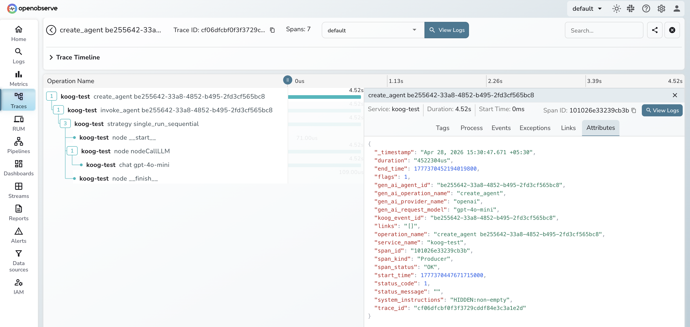

# **Koog → OpenObserve**

Capture agent invocation latency, LLM call details, and span trees for every Koog agent run. Koog is JetBrains' Kotlin-first AI agent framework with built-in OpenTelemetry support. Configure an OTLP HTTP exporter and Koog emits structured spans for agent creation, invocation, and node execution automatically.

## **Prerequisites**

* JDK 17+ and Kotlin 2.x
* Gradle 8+
* An [OpenObserve](https://openobserve.ai/) account (cloud or self-hosted)
* Your OpenObserve **organisation ID** and **Base64-encoded auth token**
* An OpenAI API key

## **Installation**

Add the following to your `build.gradle.kts`:

```kotlin
dependencies {
    implementation("ai.koog:koog-agents:0.7.1")
    implementation("org.jetbrains.kotlinx:kotlinx-coroutines-core:1.9.0")

    implementation("io.opentelemetry:opentelemetry-api:1.46.0")
    implementation("io.opentelemetry:opentelemetry-sdk:1.46.0")
    implementation("io.opentelemetry:opentelemetry-exporter-otlp:1.46.0")
    implementation("io.opentelemetry.semconv:opentelemetry-semconv:1.29.0-alpha")
}
```

## **Configuration**

Set environment variables before running:

```shell
export OPENAI_API_KEY=your-openai-api-key
export OPENOBSERVE_URL=https://api.openobserve.ai/
export OPENOBSERVE_ORG=your_org_id
export OPENOBSERVE_AUTH_TOKEN="Basic <your_base64_token>"
```

## **Instrumentation**

Build an OTLP span exporter, register it with `OpenTelemetrySdk`, then create a Koog agent. Koog uses the registered global OTel instance to emit spans for each agent run.

```kotlin
import ai.koog.agents.core.agent.AIAgent
import ai.koog.agents.core.agent.config.AIAgentConfig
import ai.koog.prompt.executor.clients.openai.OpenAILLMClient
import ai.koog.prompt.llm.OpenAIModels
import io.opentelemetry.api.common.Attributes
import io.opentelemetry.exporter.otlp.http.trace.OtlpHttpSpanExporter
import io.opentelemetry.sdk.OpenTelemetrySdk
import io.opentelemetry.sdk.resources.Resource
import io.opentelemetry.sdk.trace.SdkTracerProvider
import io.opentelemetry.sdk.trace.export.BatchSpanProcessor
import io.opentelemetry.semconv.ServiceAttributes
import kotlinx.coroutines.runBlocking

fun main() = runBlocking {
    val ooUrl = System.getenv("OPENOBSERVE_URL") ?: "http://localhost:5080/"
    val ooOrg = System.getenv("OPENOBSERVE_ORG") ?: "default"
    val ooAuth = System.getenv("OPENOBSERVE_AUTH_TOKEN") ?: ""

    val exporter = OtlpHttpSpanExporter.builder()
        .setEndpoint("${ooUrl}api/${ooOrg}/v1/traces")
        .addHeader("Authorization", ooAuth)
        .build()

    val tracerProvider = SdkTracerProvider.builder()
        .addSpanProcessor(BatchSpanProcessor.create(exporter))
        .setResource(Resource.create(
            Attributes.of(ServiceAttributes.SERVICE_NAME, "koog-app")
        ))
        .build()

    OpenTelemetrySdk.builder()
        .setTracerProvider(tracerProvider)
        .buildAndRegisterGlobal()

    val executor = OpenAILLMClient(System.getenv("OPENAI_API_KEY"))

    val agent = AIAgent.build(
        executor = executor,
        llmModel = OpenAIModels.Chat.GPT4oMini,
        config = AIAgentConfig(
            prompt = "You are a helpful assistant. Answer questions concisely."
        )
    ) {}

    val response = agent.run("What is distributed tracing?")
    println(response)

    tracerProvider.shutdown()
}
```

Run with:

```shell
./gradlew run
```

## **What Gets Captured**

| Attribute | Description |
| ----- | ----- |
| `gen_ai_system` | AI provider |
| `gen_ai_request_model` | Model requested |
| `gen_ai_usage_input_tokens` | Prompt tokens consumed |
| `gen_ai_usage_output_tokens` | Completion tokens generated |
| `koog_agent_name` | Agent identifier |
| `koog_node_name` | Node within the agent graph that executed |
| `duration` | Span latency |

## **Viewing Traces**

1. Log in to OpenObserve and navigate to **Traces**
2. Filter by `gen_ai_system` to see all Koog LLM calls
3. Expand any trace to see the full agent span tree
4. Click the LLM span to inspect token usage
5. Filter by `span_status` `ERROR` to find failed agent runs



## **Next Steps**

With Koog instrumented, every agent run is recorded in OpenObserve. From here you can track latency per agent node, monitor token consumption across runs, and alert on failed invocations.

## **Read More**

- [LLM Observability Overview](../llm-applications.md)
- [Quarkus LangChain4j](./quarkus-langchain4j.md)
- [Exploring Traces in OpenObserve](../../../user-guide/data-exploration/traces/)
- [Building Dashboards](../../../user-guide/analytics/dashboards/)
