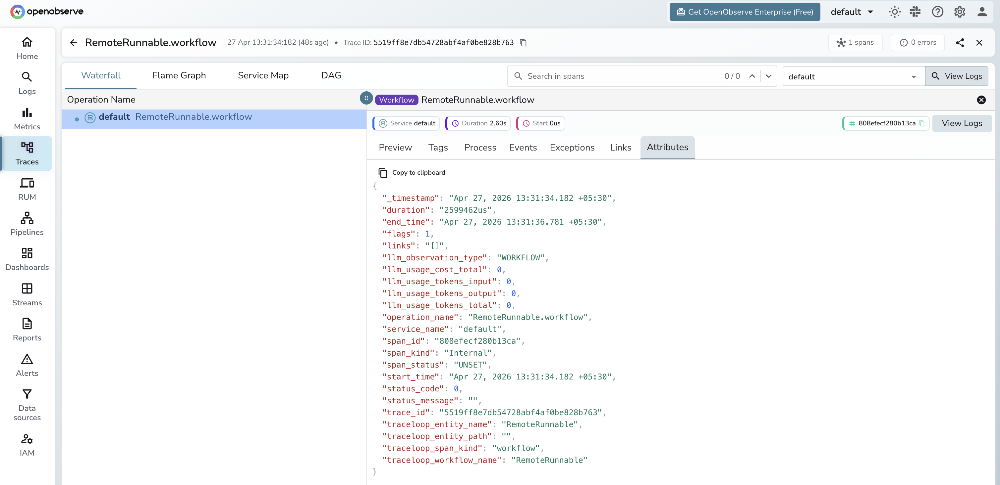

# **LangServe → OpenObserve**

Trace every remote chain invocation when calling a LangServe-hosted API from a Python client. LangServe uses LangChain under the hood, so the LangChain instrumentor captures `RemoteRunnable` calls as workflow spans and records end-to-end latency for each remote invocation.

## **Prerequisites**

* Python 3.8+
* A running LangServe server (see the server setup below)
* An [OpenObserve](https://openobserve.ai/) account (cloud or self-hosted)
* Your OpenObserve **organisation ID** and **Base64-encoded auth token**

## **Installation**

```shell
pip install openobserve-telemetry-sdk opentelemetry-instrumentation-langchain langserve python-dotenv
```

## **Configuration**

Create a `.env` file in your project root:

```
OPENOBSERVE_URL=https://api.openobserve.ai/
OPENOBSERVE_ORG=your_org_id
OPENOBSERVE_AUTH_TOKEN=Basic <your_base64_token>
LANGSERVE_URL=http://localhost:8000
```

## **Server setup**

Start a minimal LangServe server before running the instrumented client. Install the server dependencies separately:

```shell
pip install langserve[all] langchain_openai fastapi uvicorn
```

```python
from fastapi import FastAPI
from langchain_openai import ChatOpenAI
from langchain_core.output_parsers import StrOutputParser
from langchain_core.prompts import ChatPromptTemplate
from langserve import add_routes

app = FastAPI()
llm = ChatOpenAI(model="gpt-4o-mini")
prompt = ChatPromptTemplate.from_template("Answer in one sentence: {input}")
chain = prompt | llm | StrOutputParser()
add_routes(app, chain, path="/chain")

if __name__ == "__main__":
    import uvicorn
    uvicorn.run(app, host="0.0.0.0", port=8000)
```

## **Instrumentation**

Call `LangchainInstrumentor().instrument()` **before** importing or instantiating `RemoteRunnable`.

```python
from dotenv import load_dotenv
load_dotenv()

from opentelemetry.instrumentation.langchain import LangchainInstrumentor
from openobserve import openobserve_init

LangchainInstrumentor().instrument()
openobserve_init()

import os
from langserve import RemoteRunnable

chain = RemoteRunnable(f"{os.environ.get('LANGSERVE_URL', 'http://localhost:8000')}/chain/")

result = chain.invoke({"input": "What is OpenTelemetry?"})
print(result)
```

## **What Gets Captured**

| Attribute | Description |
| ----- | ----- |
| `operation_name` | `RemoteRunnable.workflow` |
| `llm_observation_type` | `WORKFLOW` |
| `traceloop_entity_name` | `RemoteRunnable` |
| `traceloop_workflow_name` | `RemoteRunnable` |
| `traceloop_span_kind` | `workflow` |
| `span_kind` | `Internal` |
| `span_status` | `UNSET` on success, `ERROR` on failure |
| `duration` | End-to-end latency for the remote chain call |

Token counts are not available on the client side because the LLM call happens inside the server. To capture token usage, instrument the server with the same `LangchainInstrumentor` and point it at OpenObserve.

## **Viewing Traces**

1. Log in to OpenObserve and navigate to **Traces**
2. Spans appear with `operation_name: RemoteRunnable.workflow`
3. Use `duration` to monitor remote chain latency end-to-end
4. Error spans from invalid endpoints appear with `span_status: ERROR`



## **Next Steps**

With LangServe instrumented, every remote chain call is recorded in OpenObserve. From here you can monitor API latency per endpoint and alert on error rates.

## **Read More**

- [LangChain](langchain.md)
- [LLM Observability Overview](../llm-applications.md)
- [Traces Ingestion with Python](../../../ingestion/traces/python.md)
- [Exploring Traces in OpenObserve](../../../user-guide/data-exploration/traces/)
