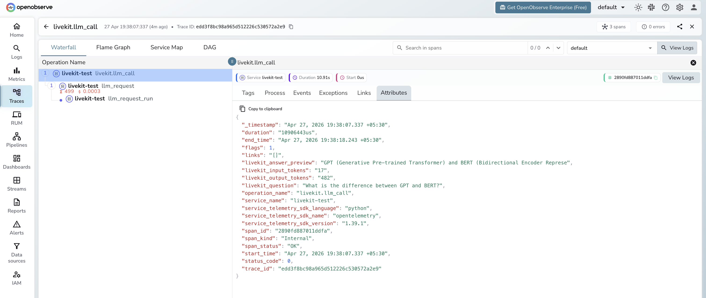

# **LiveKit → OpenObserve**

Capture LLM call latency, token usage, input messages, and output content for every LiveKit Agents LLM call. LiveKit Agents is a Python framework for building real-time voice AI agents. Its LLM components can be used standalone without a LiveKit server. Register a TracerProvider with `telemetry.set_tracer_provider()` and every LLM call is automatically traced as nested `llm_request` and `llm_request_run` spans, plus your own manual root spans.

## **Prerequisites**

* Python 3.10+
* An [OpenObserve](https://openobserve.ai/) account (cloud or self-hosted)
* Your OpenObserve **organisation ID** and **Base64-encoded auth token**
* An OpenAI API key

## **Installation**

```shell
pip install "livekit-agents[openai]" opentelemetry-exporter-otlp-proto-http \
  opentelemetry-sdk python-dotenv
```

## **Configuration**

Create a `.env` file in your project root:

```
OPENAI_API_KEY=your-openai-api-key
OTEL_EXPORTER_OTLP_ENDPOINT=https://api.openobserve.ai/api/your_org_id/v1/traces
OTEL_EXPORTER_OTLP_HEADERS=Authorization=Basic <your_base64_token>
```

## **Instrumentation**

Build a `TracerProvider` with an OTLP exporter and pass it to `telemetry.set_tracer_provider()` before making any LLM calls. The LiveKit SDK then attaches its own spans as children of any active span.

```python
from dotenv import load_dotenv
load_dotenv()

import asyncio
import os
from opentelemetry.sdk.trace import TracerProvider
from opentelemetry.sdk.trace.export import BatchSpanProcessor
from opentelemetry.exporter.otlp.proto.http.trace_exporter import OTLPSpanExporter
from opentelemetry.sdk.resources import Resource
from opentelemetry import trace as trace_api

auth_header = os.environ["OTEL_EXPORTER_OTLP_HEADERS"].replace("Authorization=", "")

provider = TracerProvider(resource=Resource.create({"service.name": "my-app"}))
provider.add_span_processor(
    BatchSpanProcessor(
        OTLPSpanExporter(
            endpoint=os.environ["OTEL_EXPORTER_OTLP_ENDPOINT"],
            headers={"Authorization": auth_header},
        )
    )
)
trace_api.set_tracer_provider(provider)

from livekit.agents import telemetry, llm
from livekit.plugins import openai as lk_openai

telemetry.set_tracer_provider(provider)
tracer = trace_api.get_tracer(__name__)

model = lk_openai.LLM(model="gpt-4o-mini")


async def main():
    with tracer.start_as_current_span("livekit.llm_call") as span:
        span.set_attribute("livekit.question", "What is distributed tracing?")
        ctx = llm.ChatContext()
        ctx.add_message(role="user", content="What is distributed tracing?")
        stream = model.chat(chat_ctx=ctx)
        collected = await stream.collect()
        usage = collected.usage
        span.set_attribute("livekit.input_tokens", usage.prompt_tokens if usage else 0)
        span.set_attribute("livekit.output_tokens", usage.completion_tokens if usage else 0)
        span.set_attribute("livekit.answer_preview", (collected.text or "")[:80])
        span.set_attribute("span_status", "OK")
        print(collected.text)

    provider.force_flush()


asyncio.run(main())
```

## **What Gets Captured**

Each LLM call produces a manual `livekit.llm_call` root span with nested spans from the LiveKit SDK.

**`livekit.llm_call` span (manual root)**

| Attribute | Description |
| ----- | ----- |
| `livekit_question` | User prompt passed to the LLM |
| `livekit_input_tokens` | Prompt tokens for the call |
| `livekit_output_tokens` | Completion tokens generated |
| `livekit_answer_preview` | First 80 characters of the response |
| `span_status` | `OK` or `ERROR` |
| `duration` | End-to-end call latency |

**`llm_request` span (auto-instrumented child)**

| Attribute | Description |
| ----- | ----- |
| `gen_ai_request_model` | Model requested (e.g. `gpt-4o-mini`) |
| `gen_ai_response_model` | Model that served the response |
| `gen_ai_system` | Provider system (e.g. `api.openai.com`) |
| `gen_ai_usage_input_tokens` | Input tokens (numeric) |
| `gen_ai_usage_output_tokens` | Output tokens (numeric) |
| `llm_input` | Full input messages as JSON |
| `llm_output_content` | Full response text |

## **Viewing Traces**

1. Log in to OpenObserve and navigate to **Traces**
2. Filter by `service_name = livekit-test` to isolate LiveKit spans
3. Filter by `operation_name = livekit.llm_call` to see the root span for each call
4. Expand a trace to see the nested `llm_request` and `llm_request_run` spans
5. Filter by `span_status = ERROR` to find failed calls



## **Next Steps**

With LiveKit Agents instrumented, every LLM call is recorded in OpenObserve. From here you can monitor turn latency, track token usage per session, and alert on high-latency or failed calls.

## **Read More**

- [LLM Observability Overview](../llm-applications.md)
- [VoltAgent](voltagent.md)
- [Traces Ingestion with Python](../../../ingestion/traces/python.md)
- [Exploring Traces in OpenObserve](../../../user-guide/data-exploration/traces/)
