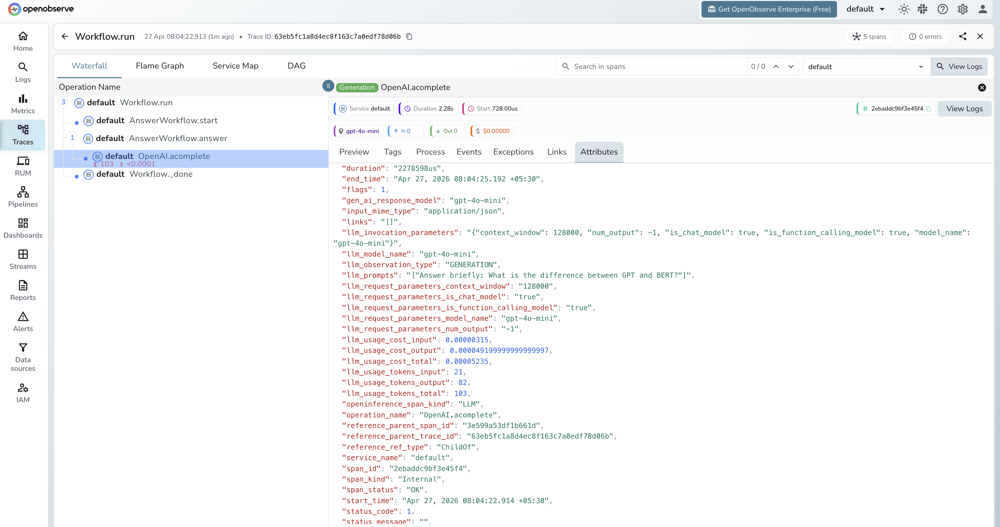

# **LlamaIndex Workflows → OpenObserve**

Automatically capture step-by-step execution spans for every LlamaIndex Workflow run. LlamaIndex Workflows are event-driven, step-based pipelines built on top of the LlamaIndex core. The OpenInference LlamaIndex instrumentor covers the workflow execution path, emitting spans for each step and any LLM calls within them.

## **Prerequisites**

* Python 3.9+
* An [OpenObserve](https://openobserve.ai/) account (cloud or self-hosted)
* Your OpenObserve **organisation ID** and **Base64-encoded auth token**
* An OpenAI API key

## **Installation**

```shell
pip install openobserve "openinference-instrumentation-llama-index==2.2.4" \
  "llama-index-core==0.10.68" "llama-index-llms-openai==0.1.31" \
  python-dotenv
```

Pin `llama-index-core` to `0.10.68` on Python 3.9. Later versions use `X | Y` union syntax that requires Python 3.10+.

## **Configuration**

Create a `.env` file in your project root:

```
OPENOBSERVE_URL=http://localhost:5080/
OPENOBSERVE_ORG=default
OPENOBSERVE_AUTH_TOKEN=Basic <your_base64_token>
OPENAI_API_KEY=your-openai-api-key
```

## **Instrumentation**

Call `LlamaIndexInstrumentor().instrument()` before importing LlamaIndex components. Define your workflow steps normally.

```python
from dotenv import load_dotenv
load_dotenv()

from openinference.instrumentation.llama_index import LlamaIndexInstrumentor
from openobserve import openobserve_init

LlamaIndexInstrumentor().instrument()
openobserve_init()

import os
import asyncio
from llama_index.core.workflow import Workflow, StartEvent, StopEvent, step, Event
from llama_index.llms.openai import OpenAI

class QuestionEvent(Event):
    question: str

class QAWorkflow(Workflow):
    @step
    async def start(self, ev: StartEvent) -> QuestionEvent:
        return QuestionEvent(question=ev.get("question", "What is AI?"))

    @step
    async def answer(self, ev: QuestionEvent) -> StopEvent:
        llm = OpenAI(model="gpt-4o-mini", api_key=os.environ["OPENAI_API_KEY"])
        response = await llm.acomplete(f"Answer briefly: {ev.question}")
        return StopEvent(result=str(response))

async def main():
    workflow = QAWorkflow(timeout=30, verbose=False)
    result = await workflow.run(question="Explain distributed tracing in one sentence.")
    print(result)

asyncio.run(main())
```

## **What Gets Captured**

Each workflow run produces a trace with spans for each step and any LLM calls within them:

| Attribute | Description |
| ----- | ----- |
| `openinference_span_kind` | `CHAIN` for the workflow root and steps, `LLM` for model calls |
| `operation_name` | Span name, e.g. `OpenAI.acomplete` for async LLM calls |
| `llm_model_name` | Model used inside the LLM step (e.g. `gpt-4o-mini`) |
| `llm_prompts` | The prompt string sent to the model |
| `llm_usage_tokens_input` | Input token count |
| `llm_usage_tokens_output` | Output token count |
| `llm_usage_tokens_total` | Total tokens for the LLM call |
| `llm_usage_cost_input` | Estimated cost of input tokens |
| `llm_usage_cost_output` | Estimated cost of output tokens |
| `llm_invocation_parameters` | JSON string of model config (context window, function calling support) |
| `llm_observation_type` | `GENERATION` for LLM spans |
| `gen_ai_response_model` | Model ID returned by the provider |
| `span_status` | `OK` or error status |
| `duration` | Latency per step and for the full workflow |

## **Viewing Traces**

1. Log in to OpenObserve and navigate to **Traces**
2. Each workflow run appears as a root span with child spans per step
3. Expand the trace to see the step execution order and which step called the LLM
4. Filter by `openinference_span_kind` = `LLM` to focus on model calls
5. Filter by `span_status` = `ERROR` to find failed workflow runs



## **Next Steps**

With LlamaIndex Workflows instrumented, every pipeline run is recorded in OpenObserve. From here you can monitor step latency, track token usage per step, and identify slow or failing steps.

## **Read More**

- [LlamaIndex](llamaindex.md)
- [LLM Observability Overview](../llm-applications.md)
- [Exploring Traces in OpenObserve](../../../user-guide/data-exploration/traces/)
- [Building Dashboards](../../../user-guide/analytics/dashboards/)
