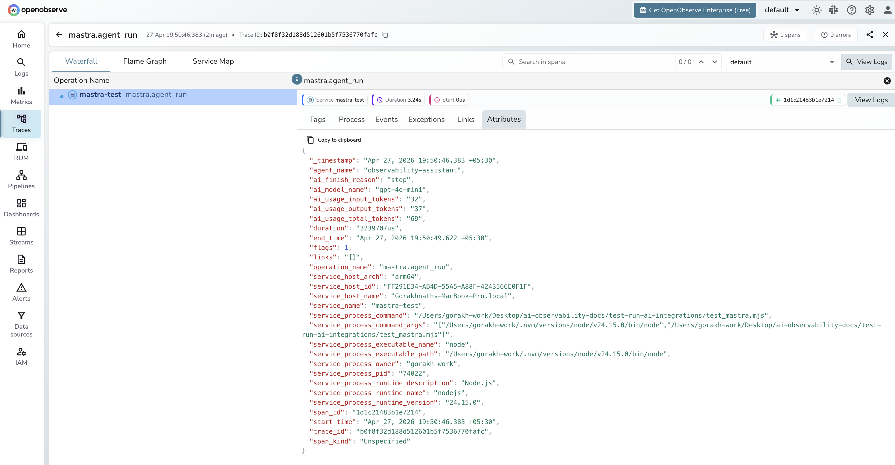

# **Mastra → OpenObserve**

Capture agent run latency, token usage, model name, and finish reason for every Mastra agent invocation. Mastra is a TypeScript-first AI agent framework built on the Vercel AI SDK. Wrap each `agent.generate()` call in a manual OpenTelemetry span and export to OpenObserve via OTLP.

## **Prerequisites**

* Node.js 18+
* An [OpenObserve](https://openobserve.ai/) account (cloud or self-hosted)
* Your OpenObserve **organisation ID** and **Base64-encoded auth token**
* An OpenAI API key

## **Installation**

```shell
npm install @mastra/core @ai-sdk/openai \
  @opentelemetry/sdk-node @opentelemetry/exporter-trace-otlp-http \
  @opentelemetry/sdk-trace-base @opentelemetry/resources \
  @opentelemetry/api dotenv
```

## **Configuration**

Create a `.env` file in your project root:

```
OPENAI_API_KEY=your-openai-api-key
```

## **Instrumentation**

Set up the OTel SDK before importing Mastra. Use dynamic imports to ensure the SDK is registered first, then wrap each `agent.generate()` call in a manual span to capture token usage and finish reason.

```javascript
import 'dotenv/config';
process.env.OTEL_SERVICE_NAME = 'my-mastra-app';

import { NodeSDK } from '@opentelemetry/sdk-node';
import { OTLPTraceExporter } from '@opentelemetry/exporter-trace-otlp-http';
import { SimpleSpanProcessor } from '@opentelemetry/sdk-trace-base';
import { resourceFromAttributes } from '@opentelemetry/resources';

const sdk = new NodeSDK({
  resource: resourceFromAttributes({ 'service.name': 'my-mastra-app' }),
  spanProcessors: [
    new SimpleSpanProcessor(
      new OTLPTraceExporter({
        url: 'https://api.openobserve.ai/api/your_org_id/v1/traces',
        headers: { Authorization: 'Basic <your_base64_token>' },
      })
    ),
  ],
});
sdk.start();

const { trace, SpanStatusCode } = await import('@opentelemetry/api');
const { Agent } = await import('@mastra/core/agent');
const { openai } = await import('@ai-sdk/openai');

const tracer = trace.getTracer('mastra-agent');

const agent = new Agent({
  name: 'my-assistant',
  instructions: 'You are a helpful assistant.',
  model: openai('gpt-4o-mini'),
});

async function runAgent(question) {
  return tracer.startActiveSpan('mastra.agent_run', async (span) => {
    try {
      span.setAttributes({
        agent_name: agent.name,
        ai_model_name: 'gpt-4o-mini',
        user_input: question.slice(0, 200),
      });
      const result = await agent.generate(question);
      span.setAttributes({
        ai_usage_input_tokens: result.usage?.inputTokens || 0,
        ai_usage_output_tokens: result.usage?.outputTokens || 0,
        ai_usage_total_tokens: result.usage?.totalTokens || 0,
        ai_finish_reason: result.finishReason || '',
      });
      span.setStatus({ code: SpanStatusCode.OK });
      return result;
    } catch (e) {
      span.setStatus({ code: SpanStatusCode.ERROR, message: e.message });
      span.setAttribute('error_message', e.message);
      throw e;
    } finally {
      span.end();
    }
  });
}

const result = await runAgent('What is distributed tracing?');
console.log(result.text);
await sdk.shutdown();
```

Save the file as `app.mjs` and run with:

```shell
node app.mjs
```

For self-hosted OpenObserve, replace the URL with `http://localhost:5080/api/default/v1/traces`.

## **What Gets Captured**

| Attribute | Description |
| ----- | ----- |
| `operation_name` | `mastra.agent_run` |
| `agent_name` | Name passed to the `Agent` constructor |
| `ai_model_name` | Model used for the agent run (e.g. `gpt-4o-mini`) |
| `user_input` | User's input message (truncated to 200 chars) |
| `ai_usage_input_tokens` | Prompt tokens consumed |
| `ai_usage_output_tokens` | Completion tokens generated |
| `ai_usage_total_tokens` | Total tokens consumed |
| `ai_finish_reason` | Why generation stopped (e.g. `stop`, `length`) |
| `error_message` | Error detail on failed runs |
| `span_kind` | `Unspecified` (Internal) |
| `span_status` | `OK` on success, `ERROR` on failure |
| `duration` | End-to-end agent run latency |

## **Viewing Traces**

1. Log in to OpenObserve and navigate to **Traces**
2. Filter by `service_name` to find your application's spans
3. Spans appear with `operation_name: mastra.agent_run`
4. Filter by `span_status = ERROR` to find failed agent runs
5. Use `ai_finish_reason = length` to identify responses cut off by token limits



## **Next Steps**

With Mastra instrumented, every agent run is recorded in OpenObserve. From here you can track agent latency, compare token consumption across different prompts, and alert on error rates.

## **Read More**

- [LLM Observability Overview](../llm-applications.md)
- [Vercel AI SDK](./vercel-ai-sdk.md)
- [Traces Ingestion with Python](../../../ingestion/traces/python.md)
- [Exploring Traces in OpenObserve](../../../user-guide/data-exploration/traces/)
- [Building Dashboards](../../../user-guide/analytics/dashboards/)
