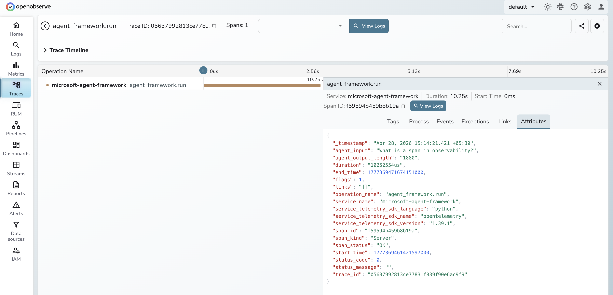

# **Microsoft Agent Framework → OpenObserve**

Capture agent run latency, LLM call details, and response metadata for every Microsoft Agent Framework invocation. Microsoft Agent Framework is a production-ready Python framework for building, orchestrating, and deploying multi-agent AI workflows with support for multiple LLM providers. Instrumentation wraps each agent call in an OpenTelemetry span exported directly to OpenObserve.

## **Prerequisites**

* Python 3.10+
* An [OpenObserve](https://openobserve.ai/) account (cloud or self-hosted)
* Your OpenObserve **organisation ID** and **Base64-encoded auth token**
* An OpenAI API key

## **Installation**

```shell
pip install openobserve-telemetry-sdk agent-framework python-dotenv
```

## **Configuration**

Create a `.env` file in your project root:

```
OPENOBSERVE_URL=https://api.openobserve.ai/
OPENOBSERVE_ORG=your_org_id
OPENOBSERVE_AUTH_TOKEN=Basic <your_base64_token>
OPENAI_API_KEY=your-openai-api-key
```

## **Instrumentation**

Call `openobserve_init()` to set up the tracer provider, then wrap each `agent.run()` call in a manual span to capture input and output attributes.

```python
from dotenv import load_dotenv
load_dotenv()

from openobserve import openobserve_init
openobserve_init()

from opentelemetry import trace
import asyncio
import os
from agent_framework import Agent, OpenAIChatClient

tracer = trace.get_tracer(__name__)

client = OpenAIChatClient(api_key=os.environ["OPENAI_API_KEY"])
agent = Agent(client=client)

async def main():
    with tracer.start_as_current_span("agent_framework.run") as span:
        span.set_attribute("agent.input", "What is distributed tracing?")
        result = await agent.run("What is distributed tracing?")
        output = result.text if hasattr(result, "text") else str(result)
        span.set_attribute("agent.output_length", len(output))
        span.set_attribute("span_status", "OK")
    print(output)

asyncio.run(main())
```

## **What Gets Captured**

| Attribute | Description |
| ----- | ----- |
| `agent_input` | The prompt passed to the agent |
| `agent_output_length` | Character length of the agent response |
| `span_status` | `OK` or `ERROR` |
| `error_message` | Error detail on failures |
| `duration` | Agent run latency |

## **Viewing Traces**

1. Log in to OpenObserve and navigate to **Traces**
2. Filter by operation name `agent_framework.run` to see all agent calls
3. Click any span to inspect input, output length, and latency
4. Filter by `span_status` `ERROR` to find failed runs



## **Next Steps**

With Microsoft Agent Framework instrumented, every agent run is recorded in OpenObserve. From here you can track latency per agent type, compare output lengths across different prompts, and set alerts on error spans to detect failures in production.

## **Read More**

- [LLM Observability Overview](../llm-applications.md)
- [Traces Ingestion with Python](../../../ingestion/traces/python.md)
- [Exploring Traces in OpenObserve](../../../user-guide/data-exploration/traces/)
- [Building Dashboards](../../../user-guide/analytics/dashboards/)
