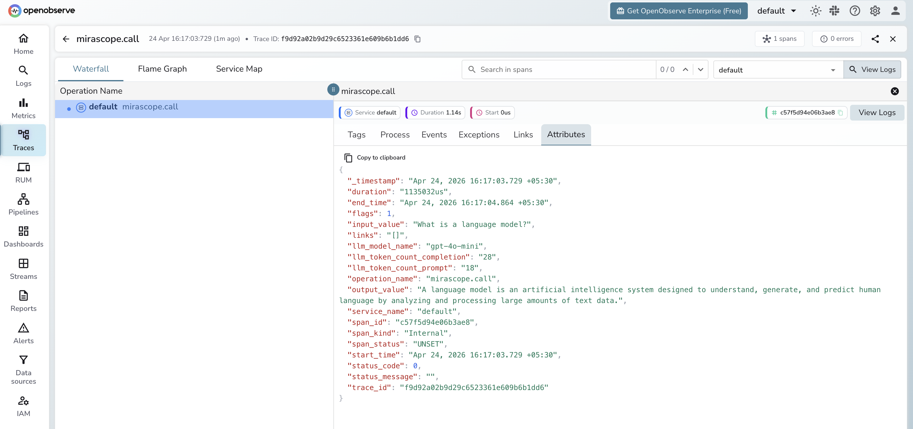

# **Mirascope → OpenObserve**

Capture token usage, latency, and model metadata for every Mirascope call. Mirascope does not include a dedicated OTel instrumentor, so traces are created by wrapping calls in manual spans and extracting usage data from the response.

## **Prerequisites**

* Python 3.9+
* An [OpenObserve](https://openobserve.ai/) account (cloud or self-hosted)
* Your OpenObserve **organisation ID** and **Base64-encoded auth token**
* An OpenAI API key (or whichever provider your Mirascope functions target)

## **Installation**

```shell
pip install openobserve-telemetry-sdk mirascope python-dotenv
```

## **Configuration**

Create a `.env` file in your project root:

```
OPENOBSERVE_URL=https://api.openobserve.ai/
OPENOBSERVE_ORG=your_org_id
OPENOBSERVE_AUTH_TOKEN=Basic <your_base64_token>
OPENAI_API_KEY=your-openai-api-key
```

## **Instrumentation**

Call `openobserve_init()` to set up the tracer provider, then wrap each Mirascope call in a manual span and extract token counts from the response.

```python
from dotenv import load_dotenv
load_dotenv()

from openobserve import openobserve_init
openobserve_init()

from opentelemetry import trace
from mirascope.openai import OpenAICall, OpenAICallParams

tracer = trace.get_tracer(__name__)


class Answer(OpenAICall):
    prompt_template = "Answer in one sentence: {question}"
    call_params = OpenAICallParams(model="gpt-4o-mini", max_tokens=100)
    question: str


def traced_answer(question: str) -> str:
    with tracer.start_as_current_span("mirascope.call") as span:
        span.set_attribute("llm_model_name", "gpt-4o-mini")
        span.set_attribute("input_value", question)
        response = Answer(question=question).call()
        output = response.content
        span.set_attribute("output_value", output[:200])
        if response.usage:
            span.set_attribute("llm_token_count_prompt", response.usage.prompt_tokens or 0)
            span.set_attribute("llm_token_count_completion", response.usage.completion_tokens or 0)
        return output


print(traced_answer("What is OpenTelemetry?"))
```

### Extractor (structured output)

Use `OpenAIExtractor` to extract structured data from unstructured text with the same manual tracing approach:

```python
from typing import Literal
from mirascope.openai import OpenAIExtractor

class Sentiment(OpenAIExtractor[Literal["positive", "negative", "neutral"]]):
    extract_schema: type[Literal["positive", "negative", "neutral"]] = Literal["positive", "negative", "neutral"]
    prompt_template = "Classify the sentiment: {text}"
    call_params = OpenAICallParams(model="gpt-4o-mini")
    text: str

with tracer.start_as_current_span("mirascope.extract") as span:
    span.set_attribute("llm_model_name", "gpt-4o-mini")
    result = Sentiment(text="OpenObserve makes tracing easy.").extract()
    span.set_attribute("output_value", str(result))
    print(result)
```

## **What Gets Captured**

These are the attributes you set explicitly on each manual span.

| Attribute | Description |
| ----- | ----- |
| `llm_model_name` | Model used (e.g. `gpt-4o-mini`) |
| `input_value` | Prompt or question passed to the call |
| `output_value` | First 200 characters of the response content |
| `llm_token_count_prompt` | Input tokens consumed |
| `llm_token_count_completion` | Output tokens generated |
| `duration` | End-to-end span latency |
| `error` | Exception details on failure |

## **Viewing Traces**

1. Log in to OpenObserve and navigate to **Traces** in the left sidebar
2. Filter by operation name `mirascope.call` to find Mirascope spans
3. Click any span to inspect token counts and the prompt and response



## **Next Steps**

With Mirascope instrumented, every LLM call is recorded in OpenObserve. From here you can track token usage per function, monitor latency per call class, and set alerts on error spans.

## **Read More**

- [LLM Observability Overview](../llm-applications.md)
- [Traces Ingestion with Python](../../../ingestion/traces/python.md)
- [Exploring Traces in OpenObserve](../../../user-guide/data-exploration/traces/)
- [Building Dashboards](../../../user-guide/analytics/dashboards/)
