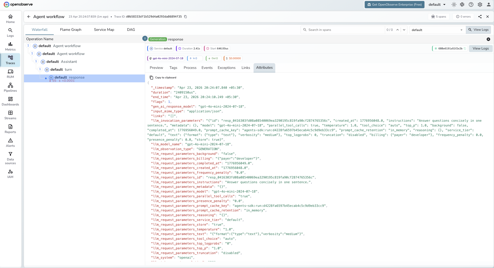
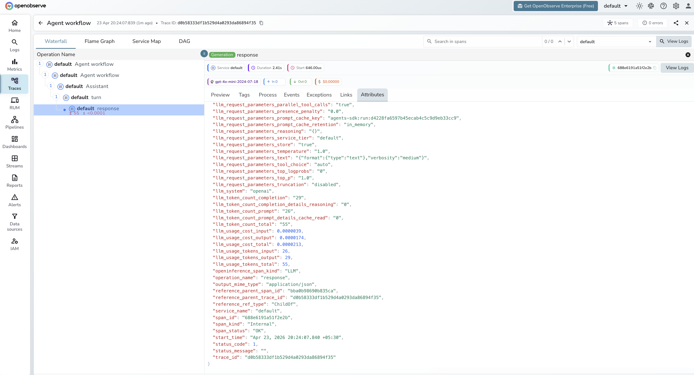

# **OpenAI Agents SDK → OpenObserve**

Automatically capture agent runs, LLM calls, and handoffs for every agent built with the OpenAI Agents SDK. Each `Runner.run()` call produces a trace with a four-level span hierarchy: a root runner span, an `Agent workflow` (`CHAIN`) span, an `Assistant` span, a `turn` span, and a `response` (`LLM`) span for each model call.

## **Prerequisites**

* Python 3.10+
* An [OpenObserve](https://openobserve.ai/) account (cloud or self-hosted)
* Your OpenObserve **organisation ID** and **Base64-encoded auth token**
* An OpenAI API key

## **Installation**

```shell
pip install openobserve-telemetry-sdk openinference-instrumentation-openai-agents openai-agents python-dotenv
```

## **Configuration**

Create a `.env` file in your project root:

```
# OpenObserve instance URL
# Default for self-hosted: http://localhost:5080
OPENOBSERVE_URL=https://api.openobserve.ai/

# Your OpenObserve organisation slug or ID
OPENOBSERVE_ORG=your_org_id

# Basic auth token — Base64-encoded "email:password"
OPENOBSERVE_AUTH_TOKEN=Basic <your_base64_token>

# OpenAI API key
OPENAI_API_KEY=your-openai-key
```

## **Instrumentation**

Call `OpenAIAgentsInstrumentor().instrument()` **before** importing any agents modules.

```python
from dotenv import load_dotenv
load_dotenv()

from openinference.instrumentation.openai_agents import OpenAIAgentsInstrumentor
from openobserve import openobserve_init

OpenAIAgentsInstrumentor().instrument()
openobserve_init()

import asyncio
from agents import Agent, Runner

agent = Agent(
    name="Assistant",
    instructions="You are a helpful assistant.",
    model="gpt-4o-mini",
)

async def main():
    result = await Runner.run(agent, "What is OpenTelemetry?")
    print(result.final_output)

asyncio.run(main())
```

### Agent with tools

```python
from dotenv import load_dotenv
load_dotenv()

from openinference.instrumentation.openai_agents import OpenAIAgentsInstrumentor
from openobserve import openobserve_init

OpenAIAgentsInstrumentor().instrument()
openobserve_init()

import asyncio
from agents import Agent, Runner, function_tool

@function_tool
def get_weather(city: str) -> str:
    """Return current weather for a city."""
    return f"Sunny, 22°C in {city}"

agent = Agent(
    name="WeatherAgent",
    instructions="Use get_weather to answer weather questions.",
    model="gpt-4o-mini",
    tools=[get_weather],
)

async def main():
    result = await Runner.run(agent, "What is the weather in London?")
    print(result.final_output)

asyncio.run(main())
```

### Multi-agent handoffs

```python
from dotenv import load_dotenv
load_dotenv()

from openinference.instrumentation.openai_agents import OpenAIAgentsInstrumentor
from openobserve import openobserve_init

OpenAIAgentsInstrumentor().instrument()
openobserve_init()

import asyncio
from agents import Agent, Runner

specialist = Agent(
    name="Specialist",
    instructions="You are a specialist in technical topics.",
    model="gpt-4o-mini",
)

triage = Agent(
    name="Triage",
    instructions="Route technical questions to the Specialist.",
    model="gpt-4o-mini",
    handoffs=[specialist],
)

async def main():
    result = await Runner.run(triage, "Explain how OTLP works.")
    print(result.final_output)

asyncio.run(main())
```

## **What Gets Captured**

Each `Runner.run()` call produces a trace with a four-level span tree. The `Agent workflow` span (`CHAIN`) wraps an `Assistant` span, which contains a `turn` span, which contains a `response` span (`LLM`) for each model call.

| Attribute | Description |
| ----- | ----- |
| `openinference_span_kind` | `CHAIN` for agent workflow steps, `LLM` for model calls |
| `operation_name` | `Agent workflow` for agent steps, `response` for LLM calls |
| `llm_model_name` | Resolved model snapshot (e.g. `gpt-4o-mini-2024-07-18`) |
| `llm_system` | `openai` |
| `llm_token_count_prompt` | Input tokens for the LLM call |
| `llm_token_count_completion` | Output tokens for the LLM call |
| `llm_token_count_total` | Total tokens consumed |
| `llm_token_count_completion_details_reasoning` | Reasoning tokens (0 for non-reasoning models) |
| `llm_token_count_prompt_details_cache_read` | Prompt tokens served from cache |
| `llm_usage_cost_input` | Estimated input cost in USD |
| `llm_usage_cost_output` | Estimated output cost in USD |
| `duration` | Span latency |
| `span_status` | `OK` or error status |

## **Viewing Traces**

1. Log in to OpenObserve and navigate to **Traces** in the left sidebar
2. Click any root span to open the waterfall view
3. Expand the tree to see `CHAIN` agent workflow spans and their `LLM` child spans
4. For multi-agent workflows, each handoff appears as a separate `CHAIN` span making it easy to trace which agent handled each step





## **Next Steps**

With the OpenAI Agents SDK instrumented, every agent run is recorded in OpenObserve with a full span hierarchy. From here you can track token usage per agent step, measure per-call latency, trace handoff chains, and set alerts on failed runs.

## **Read More**

- [LLM Observability Overview](../llm-applications.md)
- [Traces Ingestion with Python](../../../ingestion/traces/python.md)
- [Exploring Traces in OpenObserve](../../../user-guide/data-exploration/traces/)
- [Building Dashboards](../../../user-guide/analytics/dashboards/)
