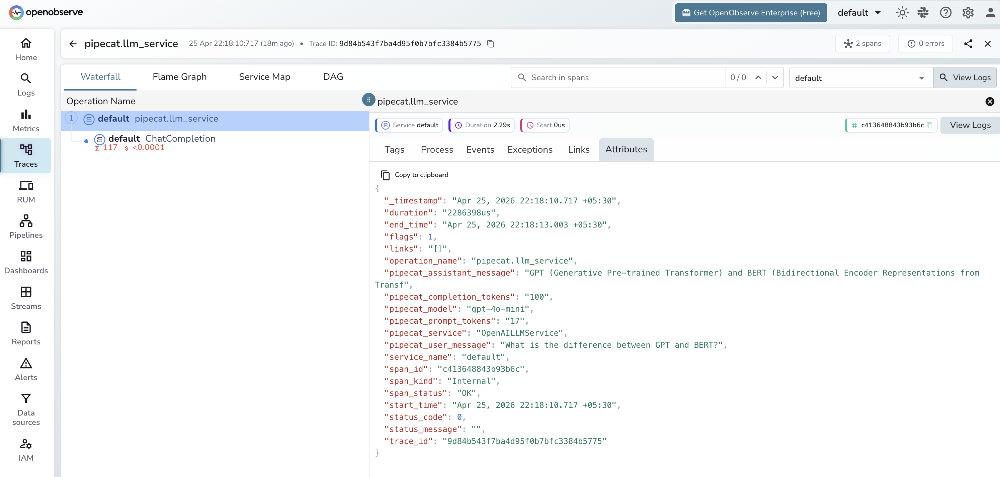

# **Pipecat → OpenObserve**

Capture per-turn LLM spans, token usage, and pipeline stage latency for every Pipecat voice agent interaction. Pipecat is a Python framework for building real-time voice and multimodal AI pipelines. Instrument it by wrapping LLM service calls with manual OTel spans and using the OpenAI instrumentor for the underlying model calls.

## **Prerequisites**

* Python 3.10+
* An [OpenObserve](https://openobserve.ai/) account (cloud or self-hosted)
* Your OpenObserve **organisation ID** and **Base64-encoded auth token**
* An OpenAI API key

## **Installation**

```shell
pip install openobserve-telemetry-sdk openinference-instrumentation-openai \
  "pipecat-ai[openai]" opentelemetry-api python-dotenv
```

## **Configuration**

Create a `.env` file in your project root:

```
OPENOBSERVE_URL=https://api.openobserve.ai/
OPENOBSERVE_ORG=your_org_id
OPENOBSERVE_AUTH_TOKEN=Basic <your_base64_token>
OPENAI_API_KEY=your-openai-api-key
```

## **Instrumentation**

Call `OpenAIInstrumentor().instrument()` **before** importing Pipecat. Wrap the pipeline's LLM service handler in a manual span to capture Pipecat-level context alongside the automatic OpenAI spans.

```python
from dotenv import load_dotenv
load_dotenv()

from openinference.instrumentation.openai import OpenAIInstrumentor
from openobserve import openobserve_init

OpenAIInstrumentor().instrument()
openobserve_init()

from opentelemetry import trace
import os
import asyncio
from openai import AsyncOpenAI

tracer = trace.get_tracer(__name__)
client = AsyncOpenAI(api_key=os.environ["OPENAI_API_KEY"])

async def pipeline_turn(user_message: str) -> str:
    with tracer.start_as_current_span("pipecat.llm_service") as span:
        span.set_attribute("pipecat.service", "OpenAILLMService")
        span.set_attribute("pipecat.model", "gpt-4o-mini")
        span.set_attribute("pipecat.user_message", user_message[:200])
        response = await client.chat.completions.create(
            model="gpt-4o-mini",
            messages=[{"role": "user", "content": user_message}],
            max_tokens=200,
        )
        reply = response.choices[0].message.content
        span.set_attribute("pipecat.assistant_message", reply[:200])
        span.set_attribute("pipecat.prompt_tokens", response.usage.prompt_tokens)
        span.set_attribute("pipecat.completion_tokens", response.usage.completion_tokens)
        return reply

async def main():
    reply = await pipeline_turn("Explain distributed tracing in one sentence.")
    print(reply)

asyncio.run(main())
```

## **What Gets Captured**

Two span types appear for each turn:

| Attribute | Description |
| ----- | ----- |
| `pipecat_service` | LLM service class name (e.g. `OpenAILLMService`) |
| `pipecat_model` | Model used for this turn |
| `pipecat_user_message` | User input text |
| `pipecat_assistant_message` | LLM reply text |
| `pipecat_prompt_tokens` | Prompt tokens for this turn |
| `pipecat_completion_tokens` | Completion tokens for this turn |
| `llm_model_name` | Resolved model name (from OpenAI instrumentor child span) |
| `llm_token_count_prompt` | Prompt tokens (from OpenAI instrumentor child span) |
| `llm_token_count_completion` | Completion tokens (from OpenAI instrumentor child span) |
| `duration` | Per-turn latency |
| `span_status` | `OK` or error status |

## **Viewing Traces**

1. Log in to OpenObserve and navigate to **Traces**
2. Each pipeline turn appears as a `pipecat.llm_service` root span with a child LLM span
3. Filter by `pipecat.service` to compare different LLM service configurations
4. Sort by duration to find the slowest turns



## **Next Steps**

With Pipecat instrumented, every voice pipeline turn is recorded in OpenObserve. From here you can monitor turn latency, track cumulative token usage per session, and alert on slow or failed turns.

## **Read More**

- [LiveKit](livekit.md)
- [LLM Observability Overview](../llm-applications.md)
- [Traces Ingestion with Python](../../../ingestion/traces/python.md)
- [Exploring Traces in OpenObserve](../../../user-guide/data-exploration/traces/)
