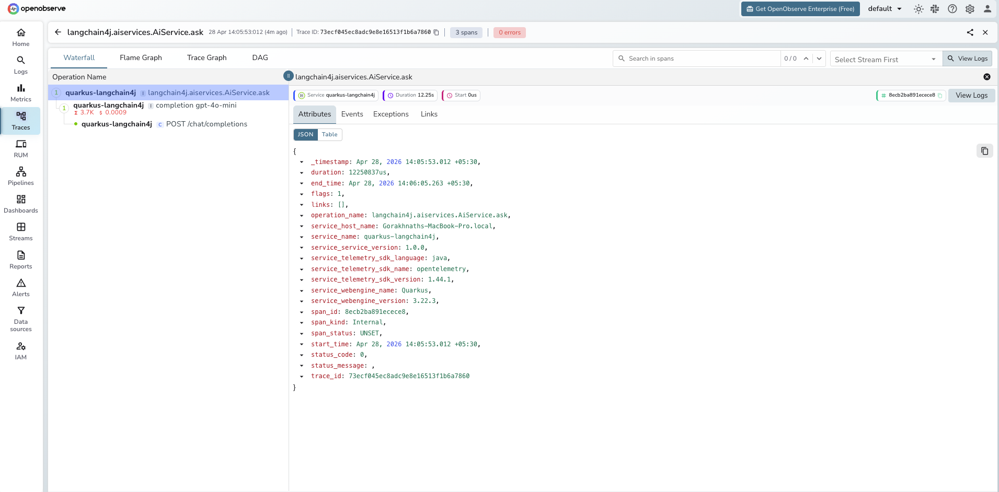

# **Quarkus LangChain4j → OpenObserve**

Capture LLM call latency, prompt content, completion content, token usage, and model metadata for every AI service call in a Quarkus application. Quarkus LangChain4j integrates LangChain4j with Quarkus's native OpenTelemetry extension. Add the `quarkus-opentelemetry` extension and configure your OTLP endpoint — every `@RegisterAiService` call is automatically traced with `gen_ai.*` semantic convention attributes.

## **Prerequisites**

* Java 17+
* Maven 3.9+
* An [OpenObserve](https://openobserve.ai/) account (cloud or self-hosted)
* Your OpenObserve **organisation ID** and **Base64-encoded auth token**
* An OpenAI API key

## **Installation**

Add the following to your `pom.xml`:

```xml
<dependencyManagement>
  <dependencies>
    <dependency>
      <groupId>io.quarkus.platform</groupId>
      <artifactId>quarkus-bom</artifactId>
      <version>3.18.0</version>
      <type>pom</type>
      <scope>import</scope>
    </dependency>
    <dependency>
      <groupId>io.quarkiverse.langchain4j</groupId>
      <artifactId>quarkus-langchain4j-bom</artifactId>
      <version>0.24.0</version>
      <type>pom</type>
      <scope>import</scope>
    </dependency>
  </dependencies>
</dependencyManagement>

<dependencies>
  <dependency>
    <groupId>io.quarkiverse.langchain4j</groupId>
    <artifactId>quarkus-langchain4j-openai</artifactId>
  </dependency>
  <dependency>
    <groupId>io.quarkus</groupId>
    <artifactId>quarkus-opentelemetry</artifactId>
  </dependency>
</dependencies>
```

## **Configuration**

Set the following in `src/main/resources/application.properties`:

```properties
quarkus.langchain4j.openai.api-key=${OPENAI_API_KEY}
quarkus.langchain4j.openai.chat-model.model-id=gpt-4o-mini

quarkus.langchain4j.tracing.include-prompt=true
quarkus.langchain4j.tracing.include-completion=true

quarkus.otel.exporter.otlp.traces.endpoint=${OPENOBSERVE_OTLP_URL:http://localhost:5080/api/default/v1/traces}
quarkus.otel.exporter.otlp.traces.headers=Authorization=${OPENOBSERVE_AUTH_TOKEN}
quarkus.otel.service.name=my-quarkus-app
quarkus.otel.traces.sampler=always_on
```

## **Instrumentation**

Define an AI service interface with `@RegisterAiService`. Quarkus and LangChain4j automatically create the implementation and wrap every call in an OTel span.

```java
import io.quarkiverse.langchain4j.RegisterAiService;
import dev.langchain4j.service.UserMessage;

@RegisterAiService
public interface AssistantService {

    @UserMessage("{{message}}")
    String chat(String message);
}
```

Inject and call the service:

```java
import io.quarkus.runtime.QuarkusApplication;
import io.quarkus.runtime.annotations.QuarkusMain;
import jakarta.inject.Inject;

@QuarkusMain
public class MyApp implements QuarkusApplication {

    @Inject
    AssistantService assistant;

    @Override
    public int run(String... args) throws Exception {
        String response = assistant.chat("What is distributed tracing?");
        System.out.println(response);
        return 0;
    }
}
```

Run with:

```shell
export OPENAI_API_KEY=your-key
export OPENOBSERVE_AUTH_TOKEN="Basic <your_base64_token>"
mvn quarkus:dev
```

## **What Gets Captured**

| Attribute | Description |
| ----- | ----- |
| `gen_ai_system` | AI provider (e.g. `openai`) |
| `gen_ai_request_model` | Model requested |
| `gen_ai_response_model` | Model that served the response |
| `gen_ai_usage_input_tokens` | Prompt tokens consumed |
| `gen_ai_usage_output_tokens` | Completion tokens generated |
| `gen_ai_prompt` | Full prompt text (when `include-prompt=true`) |
| `gen_ai_completion` | Full completion text (when `include-completion=true`) |
| `duration` | LLM call latency |

## **Viewing Traces**

1. Log in to OpenObserve and navigate to **Traces**
2. Filter by `gen_ai_system` to see all LangChain4j calls
3. Filter by `gen_ai_request_model` to compare latency across models
4. Click any span to inspect the full prompt and completion text
5. Filter by `span_status` `ERROR` to find failed AI service calls



## **Next Steps**

With Quarkus LangChain4j instrumented, every AI service call is recorded in OpenObserve. From here you can track token consumption per service method, build cost dashboards, and alert on latency regressions.

## **Read More**

- [LLM Observability Overview](../llm-applications.md)
- [Spring AI](./spring-ai.md)
- [Exploring Traces in OpenObserve](../../../user-guide/data-exploration/traces/)
- [Building Dashboards](../../../user-guide/analytics/dashboards/)
