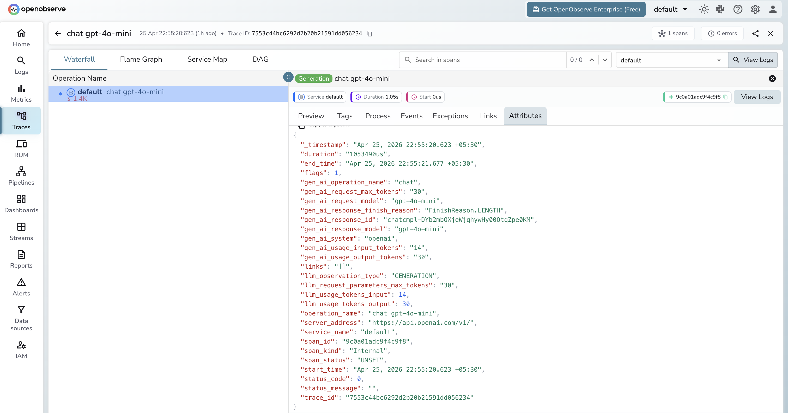

# **Semantic Kernel → OpenObserve**

Automatically capture LLM calls, function invocations, and planner steps for every Semantic Kernel application. Semantic Kernel emits OpenTelemetry spans natively. Configuring the tracer provider is all that is needed.

## **Prerequisites**

* Python 3.10+
* An [OpenObserve](https://openobserve.ai/) account (cloud or self-hosted)
* Your OpenObserve **organisation ID** and **Base64-encoded auth token**
* An OpenAI API key

## **Installation**

```shell
pip install openobserve-telemetry-sdk semantic-kernel python-dotenv
```

## **Configuration**

Create a `.env` file in your project root:

```
OPENOBSERVE_URL=https://api.openobserve.ai/
OPENOBSERVE_ORG=your_org_id
OPENOBSERVE_AUTH_TOKEN=Basic <your_base64_token>
OPENAI_API_KEY=your-openai-api-key
```

## **Instrumentation**

Set the OTel diagnostics env vars **before** calling `openobserve_init()`. Semantic Kernel detects the active tracer provider and emits spans automatically once diagnostics are enabled.

```python
import asyncio
import os
from dotenv import load_dotenv
load_dotenv()

os.environ["SEMANTICKERNEL_EXPERIMENTAL_GENAI_ENABLE_OTEL_DIAGNOSTICS"] = "true"
os.environ["SEMANTICKERNEL_EXPERIMENTAL_GENAI_ENABLE_OTEL_DIAGNOSTICS_SENSITIVE"] = "true"

from openobserve import openobserve_init
openobserve_init()

from semantic_kernel import Kernel
from semantic_kernel.connectors.ai.open_ai import OpenAIChatCompletion
from semantic_kernel.connectors.ai.open_ai import OpenAIChatPromptExecutionSettings
from semantic_kernel.contents import ChatHistory

kernel = Kernel()
kernel.add_service(
    OpenAIChatCompletion(
        service_id="chat",
        ai_model_id="gpt-4o-mini",
        api_key=os.environ["OPENAI_API_KEY"],
    )
)

settings = OpenAIChatPromptExecutionSettings(max_tokens=100)


async def main():
    chat = ChatHistory()
    chat.add_user_message("What is OpenTelemetry?")
    service = kernel.get_service("chat")
    result = await service.get_chat_message_contents(chat, settings=settings)
    print(str(result[0]))


asyncio.run(main())
```

### Using kernel functions

```python
from semantic_kernel.functions import kernel_function

class ObservabilityPlugin:
    @kernel_function(name="explain", description="Explain an observability concept")
    def explain(self, concept: str) -> str:
        return f"Explaining: {concept}"

kernel.add_plugin(ObservabilityPlugin(), plugin_name="Observability")
```

## **What Gets Captured**

| Attribute | Description |
| ----- | ----- |
| `gen_ai_system` | `openai` |
| `gen_ai_operation_name` | `chat` for chat completions |
| `gen_ai_request_model` | Requested model (e.g. `gpt-4o-mini`) |
| `gen_ai_response_model` | Resolved model returned by the API |
| `gen_ai_usage_input_tokens` | Prompt tokens consumed |
| `gen_ai_usage_output_tokens` | Completion tokens returned |
| `gen_ai_response_finish_reason` | Why the response stopped (e.g. `FinishReason.LENGTH`) |
| `gen_ai_response_id` | The chat completion response ID |
| `server_address` | OpenAI API endpoint |
| `operation_name` | Span name: `chat {model}` (e.g. `chat gpt-4o-mini`) |
| `duration` | Span latency |
| `span_status` | `UNSET` on success, `ERROR` on failure |

## **Viewing Traces**

1. Log in to OpenObserve and navigate to **Traces**
2. Spans appear with the name `chat gpt-4o-mini` (format: `{operation} {model}`)
3. Click a span to inspect token counts, model, finish reason, and response ID
4. Filter by `gen_ai_system` to isolate Semantic Kernel spans from other services



## **Next Steps**

With Semantic Kernel instrumented, every LLM call and function invocation is recorded in OpenObserve. From here you can track token usage, monitor function call latency, and set alerts on error spans.

## **Read More**

- [LLM Observability Overview](../llm-applications.md)
- [Traces Ingestion with Python](../../../ingestion/traces/python.md)
- [Exploring Traces in OpenObserve](../../../user-guide/data-exploration/traces/)
- [Building Dashboards](../../../user-guide/analytics/dashboards/)
