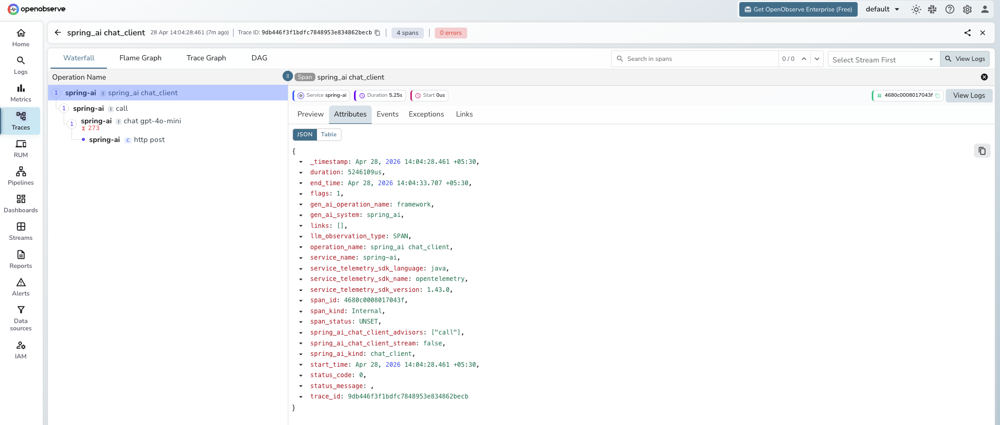

# **Spring AI → OpenObserve**

Capture LLM call latency, model name, token usage, and request parameters for every Spring AI chat call. Spring AI integrates with Spring Boot's Micrometer observability stack. Add the `micrometer-tracing-bridge-otel` and `opentelemetry-exporter-otlp` dependencies, configure your OTLP endpoint, and every `ChatClient` call is automatically traced with a full span hierarchy.

## **Prerequisites**

* Java 17+
* Maven 3.9+
* An [OpenObserve](https://openobserve.ai/) account (cloud or self-hosted)
* Your OpenObserve **organisation ID** and **Base64-encoded auth token**
* An OpenAI API key

## **Installation**

Add the following to your `pom.xml`:

```xml
<parent>
  <groupId>org.springframework.boot</groupId>
  <artifactId>spring-boot-starter-parent</artifactId>
  <version>3.4.0</version>
</parent>

<properties>
  <java.version>17</java.version>
  <spring-ai.version>1.0.4</spring-ai.version>
</properties>

<dependencies>
  <dependency>
    <groupId>org.springframework.ai</groupId>
    <artifactId>spring-ai-starter-model-openai</artifactId>
    <version>${spring-ai.version}</version>
  </dependency>
  <dependency>
    <groupId>org.springframework.boot</groupId>
    <artifactId>spring-boot-starter-actuator</artifactId>
  </dependency>
  <dependency>
    <groupId>io.micrometer</groupId>
    <artifactId>micrometer-tracing-bridge-otel</artifactId>
  </dependency>
  <dependency>
    <groupId>io.opentelemetry</groupId>
    <artifactId>opentelemetry-exporter-otlp</artifactId>
  </dependency>
</dependencies>
```

## **Configuration**

Set the following in `src/main/resources/application.yml`:

```yaml
spring:
  main:
    web-application-type: none
  application:
    name: spring-ai
  ai:
    openai:
      api-key: ${OPENAI_API_KEY}
      chat:
        options:
          model: gpt-4o-mini
          max-tokens: 256

management:
  tracing:
    sampling:
      probability: 1.0
  otlp:
    tracing:
      endpoint: ${OPENOBSERVE_OTLP_URL:https://api.openobserve.ai/api/<your_org_id>/v1/traces}
      headers:
        Authorization: ${OPENOBSERVE_AUTH_TOKEN:Basic <your_base64_token>}
```

The `spring.application.name` value becomes the `service_name` in OpenObserve. Set `web-application-type: none` for command-line applications that do not serve HTTP traffic.

## **Instrumentation**

Inject `ChatClient.Builder`, build a `ChatClient`, and call `.prompt().call().content()`. Spring AI and Micrometer automatically trace each call with no additional code.

```java
import org.springframework.ai.chat.client.ChatClient;
import org.springframework.boot.CommandLineRunner;
import org.springframework.boot.SpringApplication;
import org.springframework.boot.autoconfigure.SpringBootApplication;
import org.springframework.context.annotation.Bean;

@SpringBootApplication
public class MyApp {

    public static void main(String[] args) {
        SpringApplication.run(MyApp.class, args);
    }

    @Bean
    CommandLineRunner runner(ChatClient.Builder builder) {
        return args -> {
            ChatClient client = builder.build();
            String response = client
                .prompt("What is distributed tracing?")
                .call()
                .content();
            System.out.println(response);
            System.exit(0);
        };
    }
}
```

Run with:

```shell
export OPENAI_API_KEY=your-key
mvn spring-boot:run
```

## **What Gets Captured**

Each `ChatClient` call produces a hierarchy of spans. The innermost LLM generation span carries model and token details.

**LLM generation span** (`chat gpt-4o-mini`):

| Attribute | Example Value |
| ----- | ----- |
| `operation_name` | `chat gpt-4o-mini` |
| `gen_ai_system` | `openai` |
| `gen_ai_operation_name` | `chat` |
| `gen_ai_request_model` | `gpt-4o-mini` |
| `gen_ai_response_model` | `gpt-4o-mini-2024-07-18` |
| `gen_ai_request_max_tokens` | `256` |
| `gen_ai_request_temperature` | `0.7` |
| `gen_ai_response_finish_reasons` | `["LENGTH"]` |
| `gen_ai_usage_input_tokens` | `15` |
| `gen_ai_usage_output_tokens` | `256` |
| `gen_ai_usage_total_tokens` | `271` |
| `llm_usage_tokens_input` | `15` |
| `llm_usage_tokens_output` | `256` |
| `llm_observation_type` | `GENERATION` |
| `span_status` | `UNSET` on success, `ERROR` on failure |
| `duration` | End-to-end LLM call latency in microseconds |

**Outer chat client span** (`spring_ai chat_client`):

| Attribute | Example Value |
| ----- | ----- |
| `operation_name` | `spring_ai chat_client` |
| `gen_ai_system` | `spring_ai` |
| `spring_ai_kind` | `chat_client` |
| `spring_ai_chat_client_advisors` | `["call"]` |
| `spring_ai_chat_client_stream` | `false` |

**HTTP client span** (`http post`):

| Attribute | Example Value |
| ----- | ----- |
| `operation_name` | `http post` |
| `http_url` | `https://api.openai.com/v1/chat/completions` |
| `method` | `POST` |
| `status` | `200` |
| `span_kind` | `Client` |

## **Viewing Traces**

1. Log in to OpenObserve and navigate to **Traces**
2. Filter by `service_name = spring-ai` to see all Spring AI calls
3. Click any trace to expand the full span hierarchy: `chat_client` → `advisor` → `chat` → `http post`
4. Inspect `gen_ai_request_model`, `gen_ai_usage_input_tokens`, and `gen_ai_usage_output_tokens` on the innermost `chat` span
5. Filter by `span_status = ERROR` to find failed chat calls



## **Next Steps**

With Spring AI instrumented, every `ChatClient` call is recorded in OpenObserve. From here you can track token consumption per endpoint, compare latency across models, and alert on error rates across Spring AI services.

## **Read More**

- [LLM Observability Overview](../llm-applications.md)
- [Traces Ingestion](../../../ingestion/traces/index.md)
- [Exploring Traces in OpenObserve](../../../user-guide/data-exploration/traces/)
- [Building Dashboards](../../../user-guide/analytics/dashboards/)
