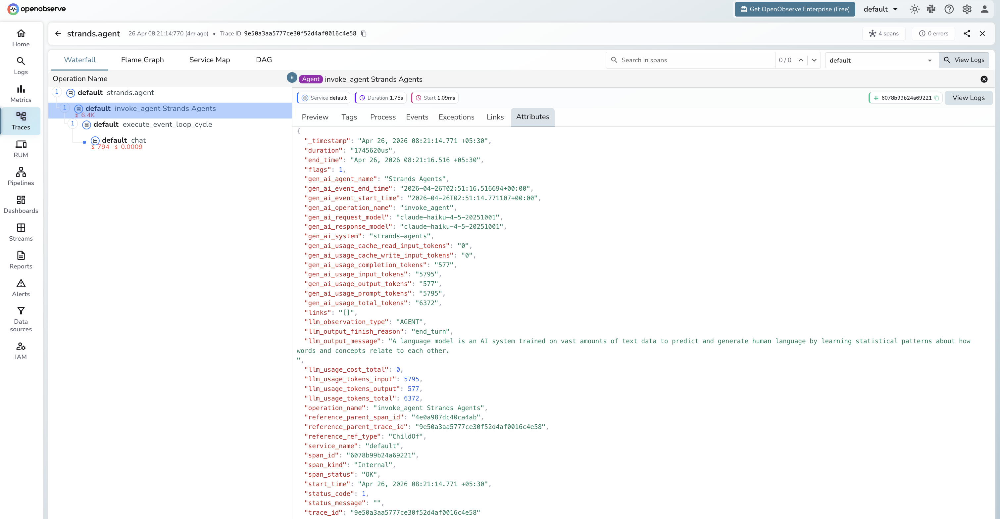

# **Strands Agents → OpenObserve**

Capture agent run timing, token usage, LLM call details, and event loop cycles for every Strands Agents invocation. Strands Agents emits OpenTelemetry spans automatically for each agent invocation, LLM call, and event loop cycle. Wrap agent calls in a manual root span to attach your own input and output attributes.

## **Prerequisites**

* Python 3.10+
* An [OpenObserve](https://openobserve.ai/) account (cloud or self-hosted)
* Your OpenObserve **organisation ID** and **Base64-encoded auth token**
* An Anthropic API key

## **Installation**

```shell
pip install openobserve-telemetry-sdk strands-agents python-dotenv
```

## **Configuration**

Create a `.env` file in your project root:

```
OPENOBSERVE_URL=https://api.openobserve.ai/
OPENOBSERVE_ORG=your_org_id
OPENOBSERVE_AUTH_TOKEN=Basic <your_base64_token>
ANTHROPIC_API_KEY=your-anthropic-api-key
```

## **Instrumentation**

Call `openobserve_init()` to set up the tracer provider, then wrap each agent call in a manual span. Strands Agents automatically creates child spans for the agent invocation, event loop cycle, and LLM call.

```python
from dotenv import load_dotenv
load_dotenv()

from openobserve import openobserve_init
openobserve_init()

from opentelemetry import trace
from strands import Agent
from strands.models.anthropic import AnthropicModel

tracer = trace.get_tracer(__name__)

model = AnthropicModel(model_id="claude-haiku-4-5-20251001", max_tokens=1000)
agent = Agent(model=model)

with tracer.start_as_current_span("strands.agent") as span:
    span.set_attribute("input_value", "What is OpenTelemetry?")
    response = agent("What is OpenTelemetry?")
    output = str(response)
    span.set_attribute("output_value", output[:200])

print(output)
```

## **What Gets Captured**

Each agent call produces a tree of four spans. The manual `strands.agent` span is the root; Strands Agents creates the remaining three automatically.

**`strands.agent` span (manual root)**

| Attribute | Description |
| ----- | ----- |
| `input_value` | Prompt passed to the agent |
| `output_value` | First 200 characters of the agent response |
| `duration` | End-to-end agent run latency |
| `span_status` | `UNSET` on success, error status on failure |

**`invoke_agent` span (Strands built-in)**

| Attribute | Description |
| ----- | ----- |
| `gen_ai_agent_name` | Agent name (e.g. `Strands Agents`) |
| `gen_ai_system` | `strands-agents` |
| `gen_ai_request_model` | Model ID sent in the request |
| `gen_ai_response_model` | Model ID that served the response |
| `gen_ai_usage_input_tokens` | Prompt tokens across all LLM calls in the run |
| `gen_ai_usage_output_tokens` | Completion tokens across all LLM calls |
| `gen_ai_usage_total_tokens` | Total tokens for the full agent run |
| `gen_ai_usage_cache_read_input_tokens` | Tokens served from prompt cache |
| `gen_ai_usage_cache_write_input_tokens` | Tokens written to prompt cache |
| `llm_observation_type` | `AGENT` |
| `llm_output_finish_reason` | Reason the agent stopped (e.g. `end_turn`) |
| `llm_output_message` | Final response text |
| `llm_usage_tokens_input` | Input tokens (mirrored from `gen_ai_usage_input_tokens`) |
| `llm_usage_tokens_output` | Output tokens (mirrored) |
| `llm_usage_tokens_total` | Total tokens (mirrored) |

**`execute_event_loop_cycle` span (Strands built-in)**

| Attribute | Description |
| ----- | ----- |
| `gen_ai_system` | `strands-agents` |
| `event_loop_cycle_id` | Unique ID for this reasoning cycle |
| `llm_observation_type` | `SPAN` |

**`chat` span (Strands built-in, one per LLM call)**

| Attribute | Description |
| ----- | ----- |
| `gen_ai_system` | `strands-agents` |
| `gen_ai_request_model` | Model ID sent in the request |
| `gen_ai_response_model` | Model ID that served the response |
| `gen_ai_server_time_to_first_token` | Time to first token in milliseconds |
| `gen_ai_usage_input_tokens` | Prompt tokens for this call |
| `gen_ai_usage_output_tokens` | Completion tokens for this call |
| `gen_ai_usage_total_tokens` | Total tokens for this call |
| `llm_observation_type` | `GENERATION` |
| `llm_output_finish_reason` | Stop reason (e.g. `end_turn`) |
| `llm_output_message` | Raw model output |
| `llm_usage_tokens_input` | Input tokens |
| `llm_usage_tokens_output` | Output tokens |
| `llm_usage_tokens_total` | Total tokens |
| `llm_usage_cost_input` | Estimated input cost |
| `llm_usage_cost_output` | Estimated output cost |

## **Viewing Traces**

1. Log in to OpenObserve and navigate to **Traces**
2. Filter by operation name `strands.agent` to find agent root spans
3. Expand any trace to see the full span tree: `strands.agent` > `invoke_agent` > `execute_event_loop_cycle` > `chat`
4. Click the `chat` span to inspect per-call token counts and time to first token
5. Click the `invoke_agent` span to see cumulative token usage across all LLM calls in the run



## **Next Steps**

With Strands Agents instrumented, every agent run is recorded in OpenObserve. From here you can track latency per agent, compare token usage across prompts, monitor cache hit rates via `gen_ai_usage_cache_read_input_tokens`, and set alerts on error spans.

## **Read More**

- [LLM Observability Overview](../llm-applications.md)
- [Anthropic (Python)](../providers/anthropic.md)
- [Traces Ingestion with Python](../../../ingestion/traces/python.md)
- [Exploring Traces in OpenObserve](../../../user-guide/data-exploration/traces/)
