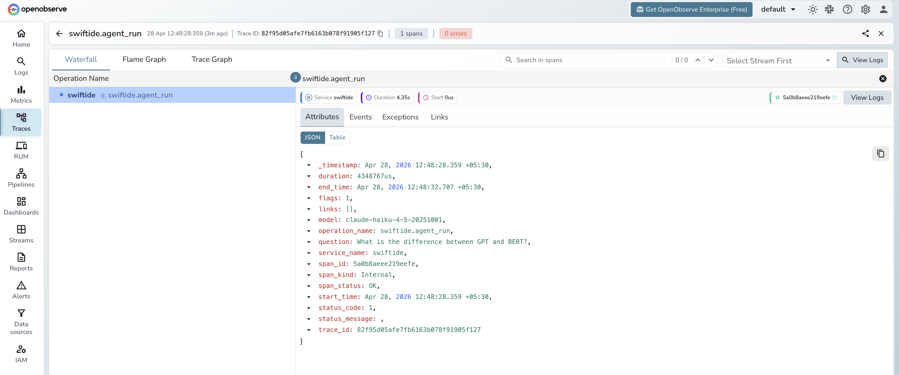

# **Swiftide → OpenObserve**

Capture query latency, pipeline step timings, and LLM call details for every Swiftide pipeline and agent run. Swiftide is a Rust-native AI pipeline and agent framework. Instrumentation uses `tracing-opentelemetry` to bridge Swiftide's `tracing` spans into OpenTelemetry, exported to OpenObserve via OTLP HTTP.

## **Prerequisites**

* Rust 1.75+ (stable toolchain)
* An [OpenObserve](https://openobserve.ai/) account (cloud or self-hosted)
* Your OpenObserve **organisation ID** and **Base64-encoded auth token**
* An OpenAI API key

## **Installation**

Add the following to your `Cargo.toml`:

```toml
[dependencies]
swiftide = { version = "0.19", features = ["openai"] }
swiftide-agents = "0.19"
opentelemetry = "0.27"
opentelemetry-otlp = { version = "0.27", features = ["http-proto"] }
opentelemetry_sdk = { version = "0.27", features = ["rt-tokio"] }
opentelemetry-semantic-conventions = "0.27"
tracing = "0.1"
tracing-opentelemetry = "0.28"
tracing-subscriber = { version = "0.3", features = ["env-filter", "fmt"] }
tokio = { version = "1", features = ["full"] }
dotenvy = "0.15"
```

## **Configuration**

Create a `.env` file in your project root:

```
OPENOBSERVE_URL=https://api.openobserve.ai/
OPENOBSERVE_ORG=your_org_id
OPENOBSERVE_AUTH_TOKEN=Basic <your_base64_token>
OPENAI_API_KEY=your-openai-api-key
```

## **Instrumentation**

Set up the OTLP exporter and wire it into a `tracing-opentelemetry` layer. Swiftide's internal `tracing` spans are automatically bridged to OTel spans and exported to OpenObserve.

```rust
use opentelemetry::global;
use opentelemetry::KeyValue;
use opentelemetry_otlp::WithExportConfig;
use opentelemetry_sdk::resource::Resource;
use opentelemetry_sdk::runtime;
use opentelemetry_sdk::trace::TracerProvider;
use opentelemetry_semantic_conventions::resource::SERVICE_NAME;
use tracing_opentelemetry::OpenTelemetryLayer;
use tracing_subscriber::layer::SubscriberExt;
use tracing_subscriber::Registry;

#[tokio::main]
async fn main() -> Result<(), Box<dyn std::error::Error>> {
    let _ = dotenvy::dotenv();

    let oo_url = std::env::var("OPENOBSERVE_URL")
        .unwrap_or_else(|_| "http://localhost:5080/".to_string());
    let oo_org = std::env::var("OPENOBSERVE_ORG")
        .unwrap_or_else(|_| "default".to_string());
    let oo_auth = std::env::var("OPENOBSERVE_AUTH_TOKEN").unwrap_or_default();

    let mut headers = std::collections::HashMap::new();
    headers.insert("Authorization".to_string(), oo_auth);

    let exporter = opentelemetry_otlp::SpanExporter::builder()
        .with_http()
        .with_endpoint(format!("{}api/{}/v1/traces", oo_url, oo_org))
        .with_headers(headers)
        .build()?;

    let provider = TracerProvider::builder()
        .with_batch_exporter(exporter, runtime::Tokio)
        .with_resource(Resource::new(vec![
            KeyValue::new(SERVICE_NAME, "swiftide-app"),
        ]))
        .build();

    global::set_tracer_provider(provider.clone());

    let tracer = provider.tracer("swiftide-app");
    let telemetry = OpenTelemetryLayer::new(tracer);
    let subscriber = Registry::default().with(telemetry);
    tracing::subscriber::set_global_default(subscriber)?;

    let openai = swiftide::integrations::openai::OpenAI::builder()
        .default_prompt_model("gpt-4o-mini")
        .build()?;

    let mut agent = swiftide_agents::Agent::builder()
        .llm(&openai)
        .build()?;

    let result = agent.query("What is distributed tracing?").await?;
    println!("{:?}", result);

    provider.shutdown()?;
    Ok(())
}
```

Run with:

```shell
cargo run
```

## **What Gets Captured**

| Attribute | Description |
| ----- | ----- |
| `swiftide_query` | The query passed to the agent or pipeline |
| `gen_ai_request_model` | Model requested |
| `gen_ai_usage_input_tokens` | Prompt tokens consumed |
| `gen_ai_usage_output_tokens` | Completion tokens generated |
| `duration` | Query or pipeline step latency |

## **Viewing Traces**

1. Log in to OpenObserve and navigate to **Traces**
2. Filter by service name `swiftide-app` to see all Swiftide spans
3. Expand any trace to see the full pipeline step span tree
4. Click any LLM span to inspect token usage and model details
5. Filter by `span_status` `ERROR` to find failed pipeline steps



## **Next Steps**

With Swiftide instrumented, every agent query and pipeline step is recorded in OpenObserve. From here you can track per-step latency across pipeline runs, monitor token consumption, and alert on failed pipeline stages.

## **Read More**

- [LLM Observability Overview](../llm-applications.md)
- [Exploring Traces in OpenObserve](../../../user-guide/data-exploration/traces/)
- [Building Dashboards](../../../user-guide/analytics/dashboards/)
- [Koog](./koog.md)
