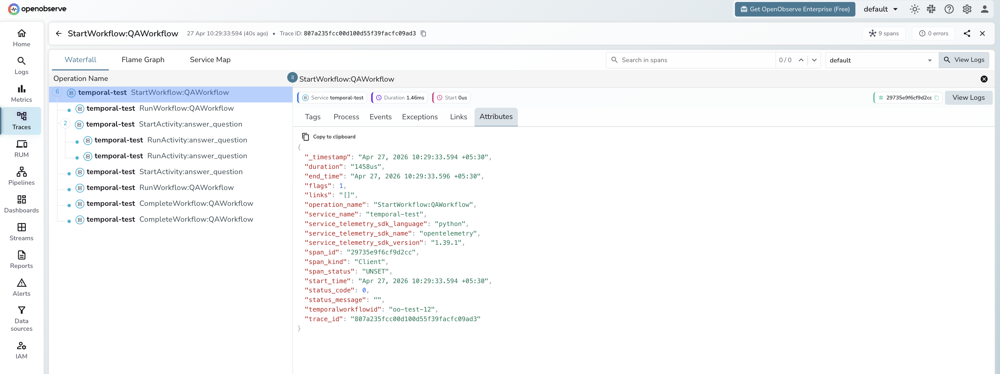

# **Temporal → OpenObserve**

Capture workflow execution spans for every Temporal workflow run. Temporal propagates OpenTelemetry trace context through the built-in `TracingInterceptor`, which emits spans for workflow starts, workflow runs, and activity executions.

## **Prerequisites**

* Python 3.9+
* An [OpenObserve](https://openobserve.ai/) account (cloud or self-hosted)
* Your OpenObserve **organisation ID** and **Base64-encoded auth token**
* Temporal server running locally (Temporal CLI dev server) or Temporal Cloud

Start a local dev server using the [Temporal CLI](https://docs.temporal.io/cli):

```shell
temporal server start-dev --port 7233 --headless
```

## **Installation**

```shell
pip install temporalio opentelemetry-sdk opentelemetry-exporter-otlp-proto-http python-dotenv
```

## **Configuration**

Create a `.env` file in your project root:

```
OPENOBSERVE_URL=https://api.openobserve.ai/
OPENOBSERVE_ORG=your_org_id
OPENOBSERVE_AUTH_TOKEN=Basic <your_base64_token>
TEMPORAL_HOST=localhost:7233
```

## **Instrumentation**

Configure an OTLP tracer provider and pass `TracingInterceptor` to both the client and the worker. Keep the OTel setup and `asyncio.run()` inside `main()` or under `if __name__ == "__main__":` — Temporal's workflow sandbox re-executes the module file during worker initialisation, and top-level side effects will cause errors.

```python
from dotenv import load_dotenv
load_dotenv()

import os
import asyncio
from datetime import timedelta

from temporalio import activity, workflow
from temporalio.client import Client
from temporalio.worker import Worker
from temporalio.worker.workflow_sandbox import SandboxedWorkflowRunner, SandboxRestrictions
from temporalio.contrib.opentelemetry import TracingInterceptor

@activity.defn
async def process(text: str) -> str:
    return f"Processed: {text[:30]}"

@workflow.defn
class TextWorkflow:
    @workflow.run
    async def run(self, text: str) -> str:
        return await workflow.execute_activity(
            process, text, start_to_close_timeout=timedelta(seconds=10)
        )

async def main():
    from opentelemetry import trace
    from opentelemetry.sdk.trace import TracerProvider
    from opentelemetry.sdk.trace.export import BatchSpanProcessor
    from opentelemetry.exporter.otlp.proto.http.trace_exporter import OTLPSpanExporter

    endpoint = os.environ["OPENOBSERVE_URL"].rstrip("/") + "/api/" + os.environ["OPENOBSERVE_ORG"] + "/v1/traces"
    provider = TracerProvider()
    provider.add_span_processor(BatchSpanProcessor(OTLPSpanExporter(
        endpoint=endpoint,
        headers={"Authorization": os.environ["OPENOBSERVE_AUTH_TOKEN"]},
    )))
    trace.set_tracer_provider(provider)

    client = await Client.connect(
        os.environ.get("TEMPORAL_HOST", "localhost:7233"),
        interceptors=[TracingInterceptor()],
    )

    sandbox = SandboxedWorkflowRunner(
        restrictions=SandboxRestrictions.default.with_passthrough_modules(
            "opentelemetry", "requests", "urllib3"
        )
    )

    async with Worker(
        client,
        task_queue="oo-queue",
        workflows=[TextWorkflow],
        activities=[process],
        interceptors=[TracingInterceptor()],
        workflow_runner=sandbox,
    ):
        result = await client.execute_workflow(
            TextWorkflow.run,
            "Explain distributed tracing.",
            id="oo-test-1",
            task_queue="oo-queue",
        )
        print(result)

    provider.shutdown()

if __name__ == "__main__":
    asyncio.run(main())
```

## **What Gets Captured**

| Attribute | Description |
| ----- | ----- |
| `operation_name` | Span name: `StartWorkflow:WorkflowType`, `RunWorkflow:WorkflowType`, or `ExecuteActivity:ActivityName` |
| `temporalworkflowid` | Unique workflow execution ID (e.g. `oo-test-1`) |
| `span_kind` | `Client` for workflow-start spans; `Server` for worker-side spans |
| `span_status` | `UNSET` on success, `ERROR` on failure |
| `service_telemetry_sdk_language` | `python` |
| `service_telemetry_sdk_name` | `opentelemetry` |
| `service_telemetry_sdk_version` | OTel SDK version in use |
| `duration` | Workflow or activity execution latency |

## **Viewing Traces**

1. Log in to OpenObserve and navigate to **Traces**
2. Workflow start spans appear with `operation_name: StartWorkflow:WorkflowType`
3. Worker-side spans appear as `RunWorkflow:WorkflowType` and `ExecuteActivity:ActivityName`
4. Filter by `temporalworkflowid` to follow a specific workflow execution end-to-end
5. Error spans appear with `span_status: ERROR` — use these to track workflow timeouts and failures



## **Next Steps**

With Temporal instrumented, every durable workflow execution is recorded in OpenObserve. From here you can monitor activity latency, track workflow IDs, and set alerts on error spans.

## **Read More**

- [LLM Observability Overview](../llm-applications.md)
- [Traces Ingestion with Python](../../../ingestion/traces/python.md)
- [Exploring Traces in OpenObserve](../../../user-guide/data-exploration/traces/)
- [Building Dashboards](../../../user-guide/analytics/dashboards/)
