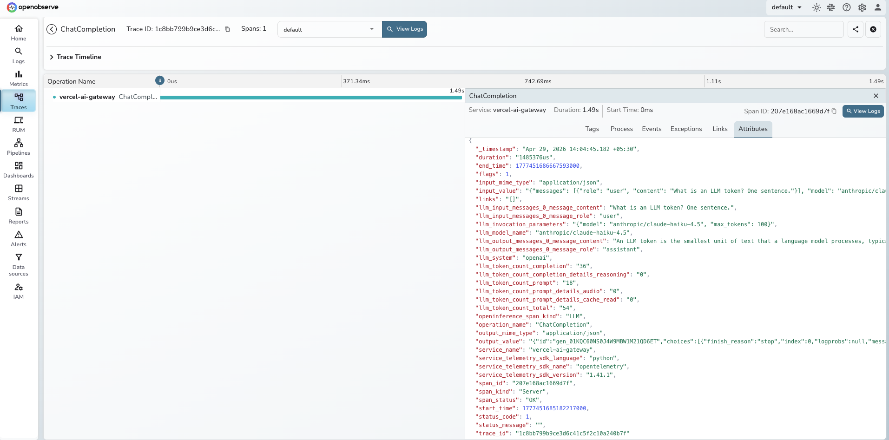

# **Vercel AI Gateway → OpenObserve**

Capture every LLM call routed through the Vercel AI Gateway: model name, token counts, full request and response payloads, latency, gateway routing decisions, and error status. Because the gateway exposes an OpenAI-compatible API, the `openinference-instrumentation-openai` library instruments it without any gateway-specific code.

## **Prerequisites**

* Python 3.8+
* An [OpenObserve](https://openobserve.ai/) account (cloud or self-hosted)
* Your OpenObserve **organisation ID** and **Base64-encoded auth token**
* A [Vercel AI Gateway](https://vercel.com/ai-gateway) API key (`vck_…`)

## **Installation**

```shell
pip install openai openinference-instrumentation-openai openobserve-telemetry-sdk python-dotenv
```

## **Configuration**

Add the following to your `.env` file:

```shell
OPENOBSERVE_URL=https://api.openobserve.ai
OPENOBSERVE_ORG=your_org_id
OPENOBSERVE_AUTH_TOKEN=Basic <your_base64_token>
VERCEL_AI_GATEWAY_API_KEY=vck_...
```

For self-hosted OpenObserve:

```shell
OPENOBSERVE_URL=http://localhost:5080
OPENOBSERVE_ORG=default
OPENOBSERVE_AUTH_TOKEN=Basic <your_base64_token>
```

## **Instrumentation**

Follow this import order exactly: load env vars first, then instrument, then initialise OpenObserve, then import the OpenAI client.

```python
import os
from dotenv import load_dotenv
load_dotenv()

from openinference.instrumentation.openai import OpenAIInstrumentor
OpenAIInstrumentor().instrument()

from openobserve import openobserve_init, openobserve_shutdown
openobserve_init(resource_attributes={"service.name": "vercel-ai-gateway"})

from openai import OpenAI

GATEWAY_URL = "https://ai-gateway.vercel.sh/v1"

client = OpenAI(
    api_key=os.environ["VERCEL_AI_GATEWAY_API_KEY"],
    base_url=GATEWAY_URL,
)

response = client.chat.completions.create(
    model="anthropic/claude-haiku-4.5",
    messages=[{"role": "user", "content": "What is distributed tracing?"}],
    max_tokens=100,
)
print(response.choices[0].message.content)

openobserve_shutdown()
```

The gateway accepts models in `provider/model-id` format (for example `anthropic/claude-haiku-4.5`, `openai/gpt-4o-mini`, `google/gemini-2.0-flash`). The `base_url` and `api_key` are the only gateway-specific settings; everything else is standard OpenAI SDK usage.

## **What Gets Captured**

Each `client.chat.completions.create()` call produces one span. All attributes below were verified from real traces.

| Attribute | Description |
| ----- | ----- |
| `operation_name` | Always `ChatCompletion` |
| `openinference_span_kind` | Always `LLM` |
| `llm_model_name` | Gateway model identifier (e.g. `anthropic/claude-haiku-4.5`) |
| `llm_system` | Always `openai` (gateway uses OpenAI-compatible protocol) |
| `llm_invocation_parameters` | JSON of model and generation parameters |
| `llm_input_messages_0_message_role` | Role of the first input message (`user`, `system`) |
| `llm_input_messages_0_message_content` | Text of the first input message |
| `llm_output_messages_0_message_role` | Role of the first output message (`assistant`) |
| `llm_output_messages_0_message_content` | Generated response text |
| `llm_token_count_prompt` | Input tokens consumed |
| `llm_token_count_completion` | Output tokens generated |
| `llm_token_count_total` | Total tokens (prompt + completion) |
| `llm_token_count_prompt_details_cache_read` | Tokens served from the provider's prompt cache |
| `llm_token_count_completion_details_reasoning` | Reasoning tokens (for models that support it) |
| `input_value` | Full request JSON including messages and parameters |
| `output_value` | Full response JSON including gateway routing metadata, provider selection, cost details, and fallback information |
| `input_mime_type` | Always `application/json` |
| `output_mime_type` | Always `application/json` |
| `span_status` | `OK` on success, `ERROR` on failure |
| `duration` | End-to-end latency in microseconds |

The `output_value` field contains the complete Vercel AI Gateway response, which embeds routing decisions (`gateway.routing.resolvedProvider`, `gateway.routing.fallbacksAvailable`, `gateway.routing.planningReasoning`) and cost data (`gateway.marketCost`) alongside the model output.

## **Viewing Traces**

1. Log in to OpenObserve and navigate to **Traces**
2. Filter by `service_name = vercel-ai-gateway`
3. Click any `ChatCompletion` span to inspect full request and response payloads
4. Use the `llm_model_name` attribute to compare latency and token usage across different models and providers
5. Filter by `span_status = ERROR` to find authentication failures and rate limit errors



## **Next Steps**

With the Vercel AI Gateway instrumented, every routed LLM call is recorded in OpenObserve. From here you can build dashboards tracking token consumption and cost per model, compare latency across providers using the `llm_model_name` dimension, and set alerts on error rates when gateway authentication or upstream provider calls fail.

## **Read More**

- [LLM Observability Overview](../llm-applications.md)
- [OpenAI (Python)](../providers/openai.md)
- [Exploring Traces in OpenObserve](../../../user-guide/data-exploration/traces/)
- [Building Dashboards](../../../user-guide/analytics/dashboards/)
