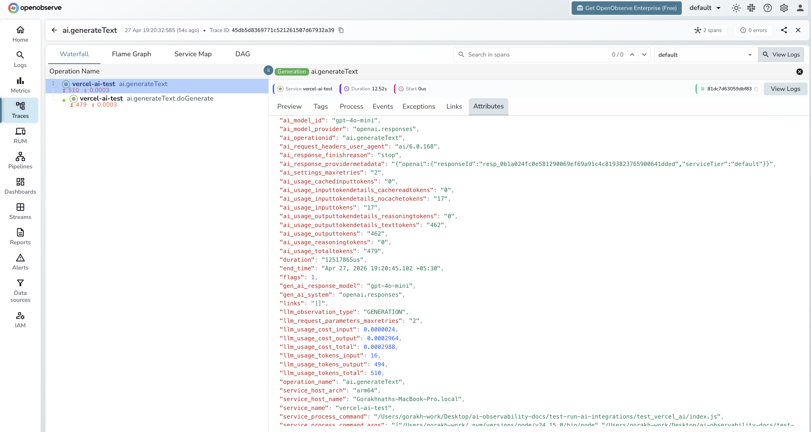

# **Vercel AI SDK → OpenObserve**

Capture LLM call latency, token usage, model name, and finish reason for every `generateText`, `streamText`, or `generateObject` call made with the Vercel AI SDK. The SDK has built-in OpenTelemetry support via an `experimental_telemetry` option — configure a standard OTLP exporter and every AI SDK call is automatically traced with no extra instrumentation package required.

## **Prerequisites**

* Node.js 18+
* An [OpenObserve](https://openobserve.ai/) account (cloud or self-hosted)
* Your OpenObserve **organisation ID** and **Base64-encoded auth token**
* An OpenAI API key (or another AI SDK provider)

## **Installation**

```shell
npm install ai @ai-sdk/openai \
  @opentelemetry/sdk-node @opentelemetry/exporter-trace-otlp-http \
  @opentelemetry/sdk-trace-node @opentelemetry/resources \
  @opentelemetry/semantic-conventions
```

## **Configuration**

Set the following environment variables before running your script:

```
OPENAI_API_KEY=your-openai-api-key
OTEL_EXPORTER_OTLP_ENDPOINT=https://api.openobserve.ai/api/your_org_id/v1/traces
OTEL_EXPORTER_OTLP_HEADERS=Authorization=Basic <your_base64_token>
```

## **Instrumentation**

Set up the NodeSDK with an OTLP exporter, then pass `experimental_telemetry: { isEnabled: true }` to any AI SDK call. The SDK emits spans automatically for each generation request.

```javascript
const { NodeSDK } = require("@opentelemetry/sdk-node");
const { OTLPTraceExporter } = require("@opentelemetry/exporter-trace-otlp-http");
const { SimpleSpanProcessor } = require("@opentelemetry/sdk-trace-node");
const { Resource } = require("@opentelemetry/resources");
const { SEMRESATTRS_SERVICE_NAME } = require("@opentelemetry/semantic-conventions");

const authHeader = process.env.OTEL_EXPORTER_OTLP_HEADERS.replace("Authorization=", "");

const sdk = new NodeSDK({
  resource: new Resource({ [SEMRESATTRS_SERVICE_NAME]: "my-app" }),
  spanProcessors: [
    new SimpleSpanProcessor(
      new OTLPTraceExporter({
        url: process.env.OTEL_EXPORTER_OTLP_ENDPOINT,
        headers: { Authorization: authHeader },
      })
    ),
  ],
});

sdk.start();

const { generateText } = require("ai");
const { createOpenAI } = require("@ai-sdk/openai");

const openai = createOpenAI({ apiKey: process.env.OPENAI_API_KEY });

async function main() {
  const result = await generateText({
    model: openai("gpt-4o-mini"),
    prompt: "What is distributed tracing?",
    maxTokens: 256,
    experimental_telemetry: { isEnabled: true },
  });

  console.log(result.text);
  console.log(`Tokens: ${result.usage.totalTokens}`);
  await sdk.shutdown();
}

main().catch(console.error);
```

Run with:

```shell
node index.js
```

Each `generateText` call produces two spans: an outer `ai.generateText` span and a child `ai.generateText.doGenerate` span for the actual provider request.

## **What Gets Captured**

**`ai.generateText` span (outer)**

| Attribute | Description |
| ----- | ----- |
| `ai_model_id` | Model ID passed to the call (e.g. `gpt-4o-mini`) |
| `ai_model_provider` | Provider name (e.g. `openai.responses`) |
| `ai_operationid` | Always `ai.generateText` |
| `ai_response_finishreason` | Why generation stopped (e.g. `stop`) |
| `ai_usage_inputtokens` | Input tokens consumed |
| `ai_usage_outputtokens` | Output tokens generated |
| `ai_usage_totaltokens` | Total tokens for the call |
| `gen_ai_response_model` | Resolved model name returned by the provider |
| `gen_ai_system` | Provider system (e.g. `openai.responses`) |
| `duration` | End-to-end generation latency |

**`ai.generateText.doGenerate` span (provider call)**

| Attribute | Description |
| ----- | ----- |
| `gen_ai_request_model` | Model requested |
| `gen_ai_response_model` | Model that served the response |
| `gen_ai_response_finish_reasons` | Array of finish reasons |
| `gen_ai_response_id` | Provider response ID |
| `gen_ai_usage_input_tokens` | Input tokens (numeric) |
| `gen_ai_usage_output_tokens` | Output tokens (numeric) |
| `ai_response_timestamp` | Timestamp of the provider response |

## **Viewing Traces**

1. Log in to OpenObserve and navigate to **Traces**
2. Filter by `service_name = vercel-ai-test` to isolate AI SDK spans
3. Filter by `operation_name = ai.generateText` to see the root span for each call
4. Expand a trace to see the nested `ai.generateText.doGenerate` provider span
5. Filter by `span_status = ERROR` to find failed calls



## **Next Steps**

With the Vercel AI SDK instrumented, every `generateText`, `streamText`, and `generateObject` call is recorded in OpenObserve. From here you can track token consumption per model, build cost dashboards, and alert on latency regressions.

## **Read More**

- [LLM Observability Overview](../llm-applications.md)
- [OpenAI (JS/TS)](../providers/openai-js.md)
- [Exploring Traces in OpenObserve](../../../user-guide/data-exploration/traces/)
- [Building Dashboards](../../../user-guide/analytics/dashboards/)
