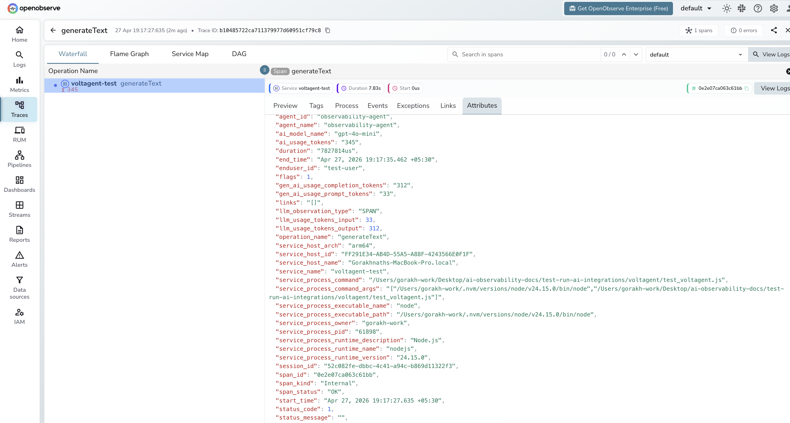

# **VoltAgent → OpenObserve**

Capture agent run latency, model name, token usage, user ID, and session ID for every VoltAgent invocation. VoltAgent is a TypeScript-first AI agent framework with built-in OpenTelemetry support. Configure a standard OTLP exporter before importing VoltAgent and spans are emitted automatically for every agent call.

## **Prerequisites**

* Node.js 18+
* An [OpenObserve](https://openobserve.ai/) account (cloud or self-hosted)
* Your OpenObserve **organisation ID** and **Base64-encoded auth token**
* An OpenAI API key

## **Installation**

```shell
npm install @voltagent/core @voltagent/vercel-ai "@ai-sdk/openai@^2" \
  @opentelemetry/sdk-node @opentelemetry/exporter-trace-otlp-http \
  @opentelemetry/sdk-trace-base @opentelemetry/resources dotenv
```

## **Configuration**

Create a `.env` file in your project root:

```
OPENOBSERVE_URL=http://localhost:5080/
OPENOBSERVE_ORG=default
OPENOBSERVE_AUTH_TOKEN=Basic <your_base64_token>
OPENAI_API_KEY=your-openai-api-key
```

## **Instrumentation**

Set up the OTel SDK with an OTLP exporter before requiring VoltAgent. VoltAgent reads the active OTel tracer provider and emits `generateText` spans automatically for each agent call.

```javascript
process.env.OTEL_SERVICE_NAME = 'voltagent-app';
require('dotenv').config();

const { NodeSDK } = require('@opentelemetry/sdk-node');
const { OTLPTraceExporter } = require('@opentelemetry/exporter-trace-otlp-http');
const { SimpleSpanProcessor } = require('@opentelemetry/sdk-trace-base');
const { resourceFromAttributes } = require('@opentelemetry/resources');

const sdk = new NodeSDK({
  resource: resourceFromAttributes({ 'service.name': 'voltagent-app' }),
  spanProcessors: [
    new SimpleSpanProcessor(
      new OTLPTraceExporter({
        url: `${process.env.OPENOBSERVE_URL}api/${process.env.OPENOBSERVE_ORG}/v1/traces`,
        headers: { Authorization: process.env.OPENOBSERVE_AUTH_TOKEN },
      })
    ),
  ],
});
sdk.start();

const { Agent } = require('@voltagent/core');
const { VercelAIProvider } = require('@voltagent/vercel-ai');
const { openai } = require('@ai-sdk/openai');

async function main() {
  const agent = new Agent({
    name: 'observability-agent',
    description: 'A helpful assistant that answers questions about observability.',
    llm: new VercelAIProvider(),
    model: openai('gpt-4o-mini'),
  });

  const result = await agent.generateText(
    'Explain distributed tracing in one sentence.',
    { userId: 'user-123' }
  );
  console.log(result);

  await sdk.shutdown();
}

main().catch(console.error);
```

Run with:

```shell
node your_script.js
```

## **What Gets Captured**

| Attribute | Description |
| ----- | ----- |
| `operation_name` | `generateText` for every agent call |
| `agent_id` | Internal agent identifier |
| `agent_name` | Agent name set in the `Agent` constructor |
| `ai_model_name` | Model used (e.g. `gpt-4o-mini`) |
| `ai_usage_tokens` | Total tokens consumed by the call |
| `gen_ai_usage_prompt_tokens` | Tokens in the input prompt |
| `gen_ai_usage_completion_tokens` | Tokens in the generated response |
| `enduser_id` | User ID passed in the call options |
| `session_id` | VoltAgent session identifier |
| `span_status` | `OK` on success, `ERROR` on failure |
| `status_message` | Error detail when the call fails |
| `duration` | End-to-end agent run latency |

## **Viewing Traces**

1. Log in to OpenObserve and navigate to **Traces**
2. Filter by `operation_name` = `generateText` to see all agent calls
3. Filter by `agent_name` to compare different agent configurations
4. Filter by `enduser_id` to trace calls for a specific user
5. Filter by `span_status` = `ERROR` to find failed runs



## **Next Steps**

With VoltAgent instrumented, every agent run is recorded in OpenObserve. From here you can track per-agent latency, monitor token usage by user ID, and alert on error rates.

## **Read More**

- [LLM Observability Overview](../llm-applications.md)
- [Traces Ingestion with Python](../../../ingestion/traces/python.md)
- [Exploring Traces in OpenObserve](../../../user-guide/data-exploration/traces/)
- [Building Dashboards](../../../user-guide/analytics/dashboards/)
