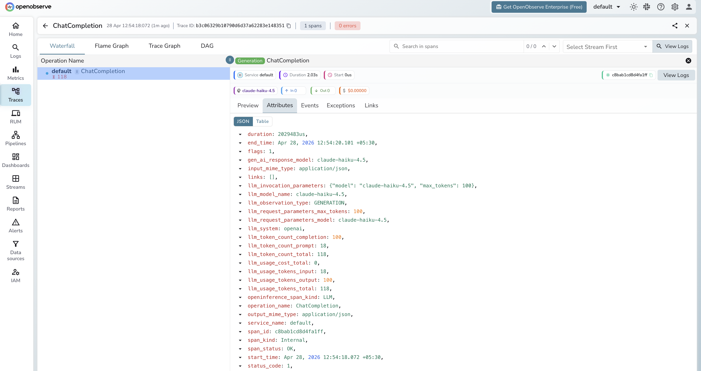

# **Anannas → OpenObserve**

Automatically capture token usage, latency, and model metadata for every Anannas inference call. Anannas is an LLM gateway providing access to 500+ models from OpenAI, Anthropic, Google, and other providers through a single OpenAI-compatible endpoint. Instrumentation uses the standard OpenAI instrumentor pointed at the Anannas base URL.

## **Prerequisites**

* Python 3.8+
* An [OpenObserve](https://openobserve.ai/) account (cloud or self-hosted)
* Your OpenObserve **organisation ID** and **Base64-encoded auth token**
* An [Anannas](https://anannas.ai/) account and API key
* A provider API key configured in your Anannas account (e.g. Anthropic, OpenAI)

## **Installation**

```shell
pip install openobserve-telemetry-sdk openinference-instrumentation-openai openai python-dotenv
```

## **Configuration**

Create a `.env` file in your project root:

```
OPENOBSERVE_URL=http://localhost:5080/
OPENOBSERVE_ORG=default
OPENOBSERVE_AUTH_TOKEN=Basic <your_base64_token>
ANANNAS_API_KEY=your-anannas-api-key
ANTHROPIC_API_KEY=your-anthropic-api-key
```

## **Instrumentation**

Call `OpenAIInstrumentor().instrument()` **before** creating the client. Pass your Anannas key as the API key and set the base URL to `https://anannas.ai/v1`. Use `default_headers` to forward your provider API key via `x-provider-api-key`.

```python
from dotenv import load_dotenv
load_dotenv()

from openinference.instrumentation.openai import OpenAIInstrumentor
from openobserve import openobserve_init

OpenAIInstrumentor().instrument()
openobserve_init(service_name="anannas")

import os
from openai import OpenAI

client = OpenAI(
    api_key=os.environ["ANANNAS_API_KEY"],
    base_url="https://anannas.ai/v1",
    default_headers={"x-provider-api-key": os.environ["ANTHROPIC_API_KEY"]},
)

response = client.chat.completions.create(
    model="claude-haiku-4.5",
    messages=[{"role": "user", "content": "Explain distributed tracing in one sentence."}],
)
print(response.choices[0].message.content)
```

## **What Gets Captured**

| Attribute | Description |
| ----- | ----- |
| `operation_name` | `ChatCompletion` |
| `llm_system` | `openai` (OpenAI-compatible client) |
| `llm_model_name` | Resolved model name (e.g. `claude-haiku-4.5`) |
| `llm_request_parameters_model` | Model name sent in the request |
| `llm_observation_type` | `GENERATION` |
| `llm_token_count_prompt` | Prompt tokens consumed |
| `llm_token_count_completion` | Completion tokens returned |
| `llm_token_count_total` | Total tokens consumed |
| `llm_usage_tokens_input` | Input tokens |
| `llm_usage_tokens_output` | Output tokens |
| `openinference_span_kind` | `LLM` |
| `duration` | End-to-end request latency |
| `span_status` | `OK` on success, `ERROR` on failure |

## **Viewing Traces**

1. Log in to OpenObserve and navigate to **Traces**
2. Filter by `operation_name` = `ChatCompletion` to see all inference calls
3. Use `llm_model_name` to identify which provider model handled each request
4. Filter by `span_status` = `ERROR` to find failed requests



## **Next Steps**

With Anannas instrumented, every inference call is recorded in OpenObserve regardless of which underlying model was used. From here you can compare latency across providers, monitor token usage, and set alerts on error rates.

## **Read More**

- [LLM Observability Overview](../llm-applications.md)
- [Traces Ingestion with Python](../../../ingestion/traces/python.md)
- [Exploring Traces in OpenObserve](../../../user-guide/data-exploration/traces/)
- [Building Dashboards](../../../user-guide/analytics/dashboards/)
