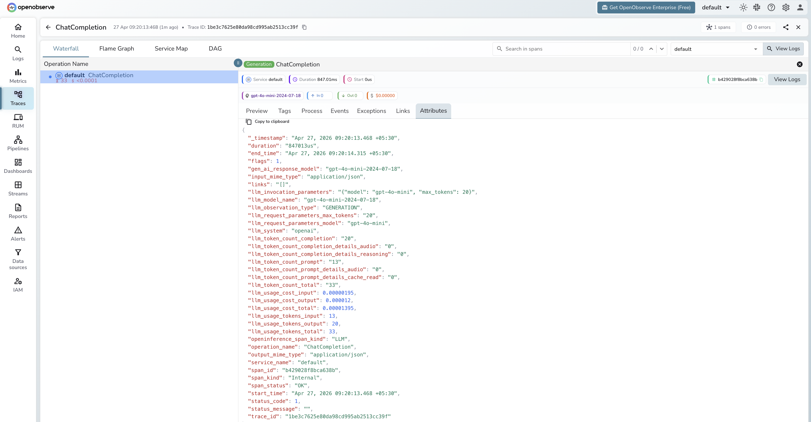

# **Kong AI Gateway → OpenObserve**

Automatically capture token usage, latency, and model metadata for every request routed through Kong AI Gateway. Kong acts as a transparent OpenAI-compatible proxy, so the standard OpenAI instrumentor captures spans with no additional configuration.

## **Prerequisites**

* Python 3.8+
* Kong Gateway running in DB-less mode with an OpenAI proxy route (Docker recommended)
* An [OpenObserve](https://openobserve.ai/) account (cloud or self-hosted)
* Your OpenObserve **organisation ID** and **Base64-encoded auth token**
* An OpenAI API key

## **Installation**

```shell
pip install openobserve openinference-instrumentation-openai openai python-dotenv
```

## **Configuration**

Start Kong in DB-less mode with a declarative config that proxies to OpenAI:

```yaml
# kong.yml
_format_version: "3.0"

services:
  - name: openai-service
    url: https://api.openai.com
    routes:
      - name: openai-route
        paths:
          - /openai
        strip_path: true
```

```shell
docker run -d --name kong \
  -e KONG_DATABASE=off \
  -e KONG_DECLARATIVE_CONFIG=/kong/declarative/kong.yml \
  -e KONG_PROXY_LISTEN=0.0.0.0:8000 \
  -v $(pwd)/kong.yml:/kong/declarative/kong.yml \
  -p 8000:8000 \
  kong:latest
```

Create a `.env` file in your project root:

```
OPENOBSERVE_URL=https://api.openobserve.ai/
OPENOBSERVE_ORG=your_org_id
OPENOBSERVE_AUTH_TOKEN=Basic <your_base64_token>
OPENAI_API_KEY=your-openai-api-key
KONG_GATEWAY_URL=http://localhost:8000/openai/v1
```

## **Instrumentation**

Call `OpenAIInstrumentor().instrument()` **before** creating the OpenAI client. Point the client at the Kong proxy URL and pass your OpenAI API key directly.

```python
from dotenv import load_dotenv
load_dotenv()

from openinference.instrumentation.openai import OpenAIInstrumentor
from openobserve import openobserve_init

OpenAIInstrumentor().instrument()
openobserve_init()

import os
from openai import OpenAI

client = OpenAI(
    api_key=os.environ["OPENAI_API_KEY"],
    base_url=os.environ.get("KONG_GATEWAY_URL", "http://localhost:8000/openai/v1"),
)

response = client.chat.completions.create(
    model="gpt-4o-mini",
    messages=[{"role": "user", "content": "Explain distributed tracing in one sentence."}],
    max_tokens=20,
)
print(response.choices[0].message.content)
```

## **What Gets Captured**

| Attribute | Description |
| ----- | ----- |
| `llm_system` | `openai` |
| `llm_model_name` | Resolved model returned by the API (e.g. `gpt-4o-mini-2024-07-18`) |
| `llm_request_parameters_model` | Model name sent in the request (e.g. `gpt-4o-mini`) |
| `llm_request_parameters_max_tokens` | `max_tokens` value from the request |
| `gen_ai_response_model` | Same as `llm_model_name` |
| `llm_observation_type` | `GENERATION` |
| `llm_token_count_prompt` | Prompt tokens consumed |
| `llm_token_count_completion` | Completion tokens returned |
| `llm_token_count_total` | Total tokens consumed |
| `llm_token_count_prompt_details_cache_read` | Cached prompt tokens |
| `llm_token_count_prompt_details_audio` | Audio prompt tokens |
| `llm_token_count_completion_details_reasoning` | Reasoning tokens |
| `llm_token_count_completion_details_audio` | Audio completion tokens |
| `llm_usage_tokens_input` | Input tokens (mirrors prompt count) |
| `llm_usage_tokens_output` | Output tokens (mirrors completion count) |
| `llm_usage_tokens_total` | Total tokens |
| `llm_usage_cost_input` | Estimated input cost in USD |
| `llm_usage_cost_output` | Estimated output cost in USD |
| `llm_invocation_parameters` | JSON string of model config sent with the request |
| `openinference_span_kind` | `LLM` |
| `operation_name` | `ChatCompletion` |
| `input_mime_type` | `application/json` |
| `output_mime_type` | `application/json` |
| `duration` | End-to-end latency including Kong proxy overhead |
| `span_status` | `OK` on success, `ERROR` on failure |

## **Viewing Traces**

1. Log in to OpenObserve and navigate to **Traces**
2. Spans appear with `operation_name: ChatCompletion` and `llm_system: openai`
3. Since Kong is a transparent proxy, spans look identical to direct OpenAI calls. Use `service_name` or a custom span attribute to tag Kong traffic separately
4. Use `duration` to measure Kong proxy overhead versus direct API latency



## **Next Steps**

With Kong AI Gateway instrumented, every proxied request is recorded in OpenObserve. From here you can monitor latency per route, track token usage across consumers, and set alerts on error rates.

## **Read More**

- [LLM Observability Overview](../llm-applications.md)
- [Traces Ingestion with Python](../../../ingestion/traces/python.md)
- [Exploring Traces in OpenObserve](../../../user-guide/data-exploration/traces/)
- [Building Dashboards](../../../user-guide/analytics/dashboards/)
