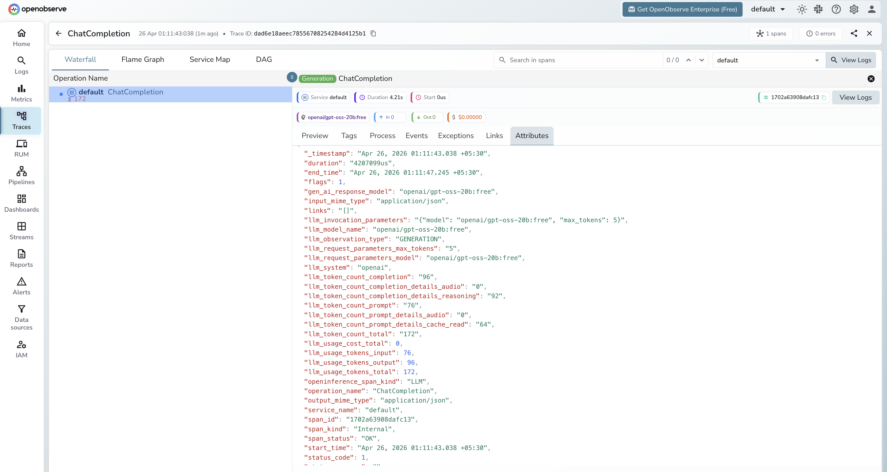

# **OpenRouter → OpenObserve**

Automatically capture token usage, latency, and model metadata for every OpenRouter request in your Python application. OpenRouter is a unified API gateway that routes to 200+ models from providers including OpenAI, Anthropic, Meta, Google, and Mistral. Instrumentation uses the standard OpenAI instrumentor pointed at the OpenRouter endpoint.

## **Prerequisites**

* Python 3.8+
* An [OpenObserve](https://openobserve.ai/) account (cloud or self-hosted)
* Your OpenObserve **organisation ID** and **Base64-encoded auth token**
* An [OpenRouter](https://openrouter.ai/) API key

## **Installation**

```shell
pip install openobserve-telemetry-sdk openinference-instrumentation-openai openai python-dotenv
```

## **Configuration**

Create a `.env` file in your project root:

```
# OpenObserve instance URL
# Default for self-hosted: http://localhost:5080
OPENOBSERVE_URL=https://api.openobserve.ai/

# Your OpenObserve organisation slug or ID
OPENOBSERVE_ORG=your_org_id

# Basic auth token — Base64-encoded "email:password"
OPENOBSERVE_AUTH_TOKEN=Basic <your_base64_token>

# OpenRouter API key
OPENROUTER_API_KEY=your-openrouter-api-key
```

## **Instrumentation**

Call `OpenAIInstrumentor().instrument()` **before** creating the OpenAI client. The two optional OpenRouter headers passed via `default_headers` are not required for requests to succeed, but they populate your OpenRouter usage dashboard.

```python
from dotenv import load_dotenv
load_dotenv()

from openinference.instrumentation.openai import OpenAIInstrumentor
from openobserve import openobserve_init

OpenAIInstrumentor().instrument()
openobserve_init()

import os
from openai import OpenAI

client = OpenAI(
    api_key=os.environ["OPENROUTER_API_KEY"],
    base_url="https://openrouter.ai/api/v1",
    default_headers={
        "HTTP-Referer": "https://your-app.com",
        "X-Title": "Your App Name",
    },
)

response = client.chat.completions.create(
    model="openai/gpt-oss-20b:free",
    messages=[{"role": "user", "content": "Explain distributed tracing in one sentence."}],
)
print(response.choices[0].message.content)
```

### Switching models

Because every request goes through the same OpenRouter endpoint, changing the `model` string is all it takes to route to a different provider. Each switch produces a separate span with its own `llm_model_name`, making cross-provider comparisons straightforward in OpenObserve.

```python
models = [
    "openai/gpt-oss-20b:free",
    "google/gemma-4-31b-it:free",
    "qwen/qwen3-coder:free",
]

for model in models:
    response = client.chat.completions.create(
        model=model,
        messages=[{"role": "user", "content": "What is OpenTelemetry?"}],
    )
    print(f"{model}: {response.choices[0].message.content}")
```

Free-tier models use the `:free` suffix and are rate-limited. OpenRouter's full model list is available at [openrouter.ai/models](https://openrouter.ai/models).

## **What Gets Captured**

| Attribute | Description |
| ----- | ----- |
| `llm_model_name` | Full model identifier including provider (e.g. `openai/gpt-oss-20b:free`) |
| `llm_request_parameters_model` | The model requested |
| `gen_ai_response_model` | The model that served the response |
| `llm_token_count_prompt` | Tokens in the prompt |
| `llm_token_count_completion` | Tokens in the response |
| `llm_token_count_total` | Total tokens consumed |
| `llm_system` | `openai` (the client library used) |
| `openinference_span_kind` | `LLM` |
| `duration` | End-to-end request latency |
| `span_status` | `OK` or error status |

## **Viewing Traces**

1. Log in to OpenObserve and navigate to **Traces**
2. Filter by `llm_model_name` to compare latency and token usage across different providers and models in a single dashboard
3. Click any span to inspect the full request and response payload



## **Next Steps**

With OpenRouter instrumented, every request is recorded in OpenObserve regardless of which underlying provider served it. From here you can build dashboards comparing cost and latency across providers, identify which model delivers the best performance for your workload, and set alerts on error spikes.

## **Read More**

- [LLM Observability Overview](../llm-applications.md)
- [Traces Ingestion with Python](../../../ingestion/traces/python.md)
- [Exploring Traces in OpenObserve](../../../user-guide/data-exploration/traces/)
- [Building Dashboards](../../../user-guide/analytics/dashboards/)
