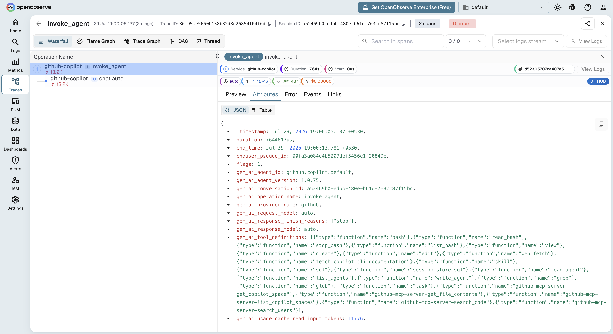

# GitHub Copilot → OpenObserve

Monitor [GitHub Copilot](https://github.com/features/copilot) agent sessions in [OpenObserve](https://openobserve.ai) using OpenTelemetry.

Both the **Copilot Chat extension in VS Code** and the **Copilot CLI** ship with a native OpenTelemetry exporter. Point it at OpenObserve's OTLP endpoint and every agent interaction — model calls, tool executions, token usage — streams in directly. No collector, no SDK, no custom code.

## What you get

| Signal | Examples | Stored in OpenObserve as |
|---|---|---|
| **Traces** | span tree per agent turn: `invoke_agent` → `chat`, `execute_tool`, `execute_hook`, following the OTel GenAI semantic conventions | A traces stream |
| **Metrics** | token-usage histograms, operation durations, tool call counts, edit acceptance | Metric streams |
| **Events** | inference details, session starts, tool invocations, agent turns | A log stream |

## Prerequisites

* GitHub Copilot with an active subscription — the [Copilot CLI](https://docs.github.com/en/copilot/concepts/agents/about-copilot-cli) (`npm install -g @github/copilot`) and/or VS Code with the Copilot Chat extension
* An [OpenObserve](https://openobserve.ai/) account (cloud or self-hosted)
* Your OpenObserve **organisation ID** and **Base64-encoded auth token**

## Setup

### 1. Get your OpenObserve endpoint and auth token

OpenObserve accepts OTLP over HTTP at `https://<your-openobserve-host>/api/<your-org>`. The exporter appends `/v1/traces`, `/v1/metrics`, and `/v1/logs` itself, so configure the **base** endpoint with no trailing slash.

Generate the `Authorization` value (`Basic <base64(email:password)>`):

```bash
echo -n 'your-email:your-password' | base64
```

### 2. Configure GitHub Copilot

=== "Copilot CLI"

    Export the OTLP environment variables before starting `copilot` (add to your shell profile to persist):

    ```bash
    export COPILOT_OTEL_ENABLED=true
    export COPILOT_OTEL_EXPORTER_TYPE=otlp-http
    export OTEL_EXPORTER_OTLP_PROTOCOL=http/protobuf
    export OTEL_EXPORTER_OTLP_ENDPOINT="https://<your-openobserve-host>/api/<your-org>"
    export OTEL_EXPORTER_OTLP_HEADERS="Authorization=Basic <base64-token>"
    export OTEL_SERVICE_NAME=github-copilot
    ```

    All three of the first variables matter: without `COPILOT_OTEL_EXPORTER_TYPE=otlp-http` the CLI writes telemetry to a local file exporter instead of sending OTLP, and without `OTEL_EXPORTER_OTLP_PROTOCOL=http/protobuf` it sends OTLP JSON, which OpenObserve rejects with a `400`.

=== "VS Code (Copilot Chat)"

    Add to VS Code `settings.json`:

    ```json
    {
      "github.copilot.chat.otel.enabled": true,
      "github.copilot.chat.otel.exporterType": "otlp-http",
      "github.copilot.chat.otel.otlpEndpoint": "https://<your-openobserve-host>/api/<your-org>"
    }
    ```

    The auth header cannot be set in `settings.json` — it comes from the environment, so launch VS Code with the variable set:

    ```bash
    export OTEL_EXPORTER_OTLP_HEADERS="Authorization=Basic <base64-token>"
    code .
    ```

**Environment variables**

| Variable | Description | Default |
|---|---|---|
| `COPILOT_OTEL_ENABLED` | Enable OTel export | `false` |
| `COPILOT_OTEL_EXPORTER_TYPE` | Exporter backend — set to `otlp-http` (CLI defaults to a local `file` exporter) | `file` |
| `OTEL_EXPORTER_OTLP_ENDPOINT` | OpenObserve base endpoint, no trailing slash | — |
| `OTEL_EXPORTER_OTLP_HEADERS` | Auth headers (`Authorization=Basic <base64-token>`) | — |
| `OTEL_EXPORTER_OTLP_PROTOCOL` | Set to `http/protobuf` — required for OpenObserve | `http/json` |
| `OTEL_SERVICE_NAME` | Service name on all telemetry | `copilot-chat` |
| `OTEL_RESOURCE_ATTRIBUTES` | Extra resource attributes (`key1=val1,key2=val2`) | — |
| `COPILOT_OTEL_CAPTURE_CONTENT` | Capture full prompt/response text | `false` |
| `COPILOT_OTEL_LOG_LEVEL` | Minimum event level (`trace`…`error`) | `info` |

!!! note "OTLP over HTTP only for the CLI"
    The Copilot CLI exports over OTLP HTTP only — if `grpc` is configured it silently falls back to HTTP. Use the HTTP endpoint form shown above.

!!! warning "Prompt capture is off by default"
    `COPILOT_OTEL_CAPTURE_CONTENT=true` includes full prompt and response text in the telemetry. Leave it off unless you have a deliberate reason, and make sure OpenObserve retention and access controls match your data-handling policy.

### 3. Verify

1. Run a Copilot session — e.g. `copilot` in a terminal, ask it something — or use Copilot Chat in VS Code.
2. In OpenObserve, open **Traces** and filter by `service_name = 'github-copilot'` (or `copilot-chat` if you didn't set a service name). Each turn appears as an `invoke_agent` root span with a `chat <model>` child carrying `gen_ai_provider_name`, the model, and token usage.
3. Open **Metrics** and look for the Copilot token-usage and duration streams.



## What Gets Captured

| Attribute | Description |
|---|---|
| `gen_ai_operation_name` | Operation per span (`invoke_agent`, `chat`, `execute_tool`) |
| `gen_ai_provider_name` | Model provider behind the request |
| `gen_ai_request_model` / `gen_ai_response_model` | Model used for the turn |
| `gen_ai_usage_input_tokens` / `gen_ai_usage_output_tokens` | Token usage per model call |
| `gen_ai_tool_name` | Tool invoked in `execute_tool` spans |
| `github_copilot_agent_type` | Copilot agent surface (CLI, chat) |
| `github_copilot_git_repository` | Repository the session ran in |
| `span_status` | `OK` on success, `ERROR` on failure |
| `duration` | Latency of each agent step |

With `COPILOT_OTEL_CAPTURE_CONTENT=true`, prompt and response text are added to the inference spans.

## Org-wide rollout

GitHub Enterprise administrators can mandate the OTel destination centrally via the `telemetry` block in [enterprise-managed settings](https://github.blog/changelog/2026-07-08-enterprise-managed-opentelemetry-export-for-vs-code-and-cli/), so telemetry from every developer's VS Code and Copilot CLI flows to OpenObserve without per-user environment variables.

## Troubleshooting

The CLI logs its OTel state to `~/.copilot/logs/` — set `COPILOT_OTEL_LOG_LEVEL=debug` for detail. On startup you should see `OpenTelemetry enabled: exporter=otlp-http`.

| Symptom | Cause | Fix |
|---|---|---|
| No data at all | Exporter not enabled | Set `COPILOT_OTEL_ENABLED=true` and restart the session |
| Log shows `exporter=file` | Default exporter is a local file | Set `COPILOT_OTEL_EXPORTER_TYPE=otlp-http` |
| Log shows `HTTP export failed: network error` | OTLP JSON payload rejected by OpenObserve (`400`) | Set `OTEL_EXPORTER_OTLP_PROTOCOL=http/protobuf` |
| `404` on export | Trailing slash on the endpoint | Use `.../api/<org>` with no trailing `/` |
| `401`/`403` errors | Wrong auth header | Re-encode `email:password`; header is `Authorization=Basic <base64>` |
| Traces but no content | Content capture disabled (default) | Set `COPILOT_OTEL_CAPTURE_CONTENT=true` if you need it |
| VS Code sends nothing | Env var not visible to the app | Launch VS Code from a shell that has `OTEL_EXPORTER_OTLP_HEADERS` exported |

## Read More

- [Claude Code](claude-code-tracing.md)
- [LLM Observability Overview](llm-applications.md)
- [OTLP / OpenTelemetry ingestion](../../ingestion/logs/otlp.md)
- [Exploring Traces in OpenObserve](../../user-guide/data-exploration/traces/index.md)
- [Building Dashboards](../../user-guide/analytics/dashboards/index.md)
